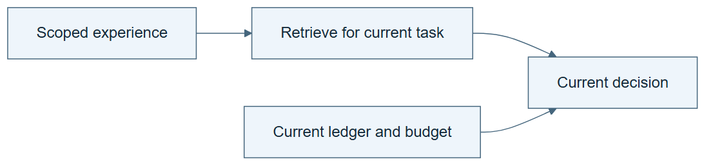

# 05.03 · Retrieve what matters and retain task state

[Course](../../README.md) · [Theme](../README.md)

## What you will build

A context packet that separates task rules, relevant knowledge, and current execution state.

## Why this matters

More text can add contradictions and stale instructions. Useful context is selected for a decision.

## Before you start

Complete [05.02: Choose a skill for the task](../step_02_route_tasks/README.md). You need the concepts and the reports named below, not its old chat. If you start here directly, ask the tutor to prepare the listed starting state and explain the missing prerequisite first.

Open the coding agent at the repository root. Read [the tutor skill](../../skills/rsi-tutor/SKILL.md) and this lab's [brief](BRIEF.md). The agent creates a separate sibling workspace named <code>rsi-work/05-03</code> and reports its absolute path. It checks local Python and the [tool requirements](../../tools/README.md) before execution. You do not write code or configuration.

**Starting state:** The two data cards, a bike task brief, and a partially completed run ledger.

**Budget:** No fits. Two context-selection checks. Plan about 20–35 minutes of reading and discussion; this is an author estimate, not a measured student duration. Coding-agent inference may use a paid online service. Record its cost separately when available.

## How it works

Task rules define the current problem. Reference knowledge explains how to act. State records what has already happened. A retrieval step should select relevant references without overwriting current state. A past experiment’s final score is not a new task’s target to imitate.

**A concrete example.** In the [executed context check](../../evidence/2026-09-20/loops-and-systems/05-03/CONFLICT-AND-RECOVERY.md), a labelled stale note says “three attempts remain.” The real contract allows two and the ledger has charged one. One attempt remains. Copying the note into a new context cannot refund the spent attempt. The summary should help locate the contract and ledger, then defer to their verified current state.



*Read the diagram:* Retrieve relevant reusable knowledge, but initialize current state from the active task.

## Run the lab

Start with this prompt. The tutor pauses for your prediction before it runs the next step.

```text
Read rsi/AGENTS.md and
rsi/skills/rsi-tutor/SKILL.md.
Guide me through lab 05.03, Retrieve what
matters and retain task state, one step at a
time.
Read its README and BRIEF. Prepare its
separate workspace.
You write and run the implementation. Keep
the reports and failures.
Ask me to predict the result before the
experiment.
```

**Make a prediction:** Which is more important for resuming: a long generic ML article or the current candidate ledger?

### 1. Build the packet

Separate information by role.

```text
Create CONTEXT.md for resuming the bike run.
Include current contract, candidate state,
remaining budget, and the relevant data-card
passages. Exclude wine-specific metric
instructions and unrelated history.
```

**Observe:** The packet is short enough to inspect and sufficient for the next action.

### 2. Test stale context

Make a conflict visible.

```text
Supply a labelled stale note that says the
run has three attempts left when the ledger
shows one. Have the state check reject the
conflict and identify the authoritative
record.
```

**Observe:** Retrieval cannot silently reset spent budget.

## Check your result

The packet preserves current task identity and ledger state. A stale budget note produces a visible conflict.

### Open these outputs

The agent keeps these in your lab workspace or records the original experiment path when reusing evidence.

| Output | What to inspect |
|---|---|
| CONTEXT.md | Separates the active contract, current state, and relevant reference knowledge, with links back to their sources. |
| Two selection checks | Show appropriate bike context and a conflict caused by the labelled stale budget note. |
| Conflict record | Names the outdated statement and the authoritative evidence used to resolve it. |

Ask the agent to open the actual files and show the command exit status. A written description of a run is not a run. Keep a short <code>LAB-NOTE.md</code> with your prediction, measured observation, explanation, and one limit. The tutor must mark skipped learner responses as skipped.

## Try one change

Remove the data card’s input-availability rule and ask which next decision becomes unsafe to infer.

## If something goes wrong

If the packet includes wine-specific metric instructions for the bike task, remove them from the active instructions and retain their provenance as unrelated context. If a summary and ledger disagree, inspect the ledger’s contract and run identity before trusting either. Do not resolve the conflict by silently editing past attempts.

Say “Stop this lab” to stop further work. Ask the agent to save <code>PROGRESS.md</code> with the last completed step and remaining budget. To resume, have it read that file and inspect active processes first. A reset creates a new sibling workspace; it does not erase failures or alter the source data. See the [recovery rules](../../tools/README.md) for interrupted tool runs.

## Key takeaways

- Knowledge and state serve different roles.
- Retrieved text can be stale or irrelevant.
- Authoritative state must survive context summarization.

## Check your understanding

Answer before opening the explanation. You can ask the tutor for a hint.

1. Is a context summary the original evidence?
2. Can more context reduce reliability?
3. Which budget should the agent trust in the conflict?
4. Does saving context establish learning?

<details>
<summary>Hint</summary>

Put each statement into one of three roles: rule for this task, general reference, or fact about this run. The authority and expiry of a statement depend on its role.

</details>

<details>
<summary>Explained answers</summary>

1. No. It is a derived aid that should link back to authoritative artifacts.

2. Yes, through irrelevant instructions, contradictions, or stale state.

3. The current verified experiment ledger, while recording the conflict.

4. It establishes persistence. A behavior change and evidence of benefit require separate checks.

</details>

## What's next

Coordinate the whole run, including conditions that need human judgment. Continue to [05.04: Coordinate planning, execution, and checking](../step_04_coordinate/README.md).
