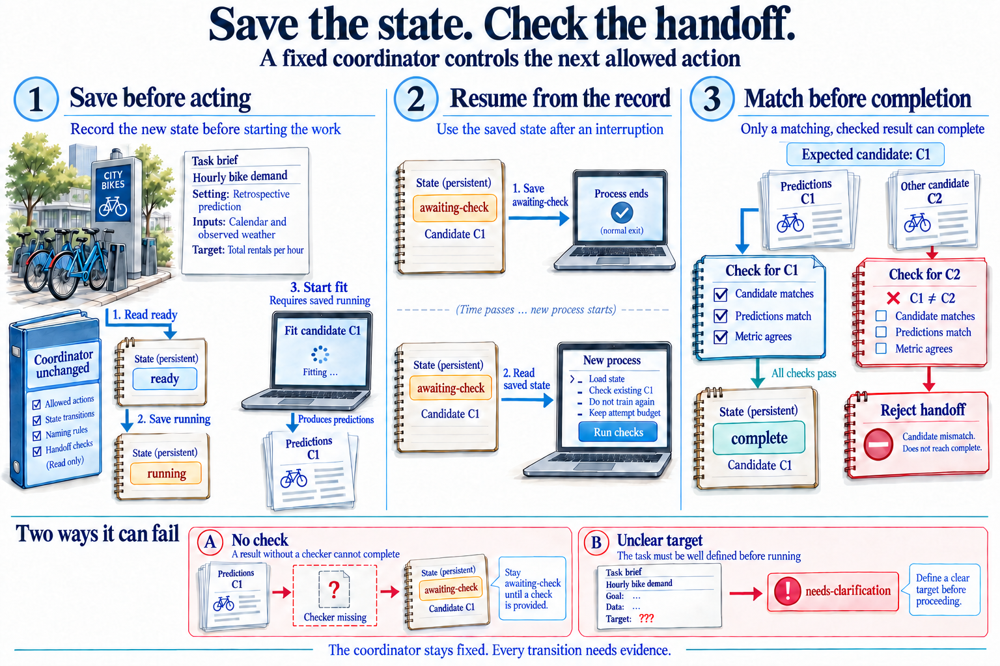
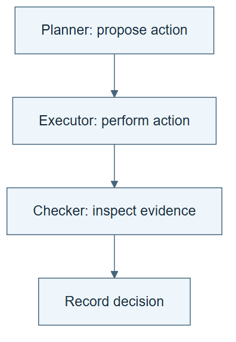

# 05.04 · Coordinate planning, execution, and checking

[Course](../../README.md) · [Theme](../README.md)

## What you will build

A coordinator that advances work only when the required artifacts and checks are present.

## Why this matters

Good individual tools can still produce a weak system if nobody checks their handoffs.

## Before you start

Complete [05.03: Retrieve what matters and retain task state](../step_03_context_and_state/README.md). You need the concepts and the reports named below, not its old chat. If you start here directly, ask the tutor to prepare the listed starting state and explain the missing prerequisite first.

Open the coding agent at the repository root. Read [the tutor skill](../../skills/rsi-tutor/SKILL.md) and this lab's [brief](BRIEF.md). The agent creates a separate sibling workspace named <code>rsi-work/05-04</code> and reports its absolute path. It checks local Python and the [tool requirements](../../tools/README.md) before execution. You do not write code or configuration.

**Starting state:** The fixed workflow, context packet, and matching candidate checks.

**Budget:** One baseline fit; two simulated handoff failures. Plan about 20–35 minutes of reading and discussion; this is an author estimate, not a measured student duration. Coding-agent inference may use a paid online service. Record its cost separately when available.

## How it works

The coordinator tracks task state, chooses the next allowed action, and handles incomplete evidence. It should stop when the scientific brief is ambiguous or a required check is missing. It does not acquire evaluator independence by naming a “reviewer” role in the same conversation.

**A concrete example.** The [live coordinator run](../../evidence/2026-09-20/live-coordinator/README.md) saved awaiting-check after fitting, exited, and read that state in a new process before checking. One fixture supplied a valid check for a different baseline. Even its prediction bytes matched, but its candidate identity did not. The handoff was rejected. Only a matching check let the actual run enter complete; a later fit request was refused.



*Read steps 1, 2, and 3 in order: starting the fit requires running to be saved first. Matching C1 labels connect the scenes across the process boundary. The checkmarks illustrate a possible accepted handoff, not a new measured run. A missing check leaves work pending; a wrong candidate is refused. The coordinator remains fixed. Its read-only label describes the procedure, not an independently enforced permission boundary.*

[Open the illustration at full size](../../assets/illustrations/system-coordination-v3.png).

<details>
<summary>See the step diagram</summary>



*Read the diagram:* Planning, execution, and checking have different responsibilities. Separate boxes alone do not enforce separate access.

</details>

## Run the lab

Start with this prompt. The tutor pauses for your prediction before it runs the next step.

```text
Read rsi/AGENTS.md and
rsi/skills/rsi-tutor/SKILL.md.
Guide me through lab 05.04, Coordinate
planning, execution, and checking, one step
at a time.
Read its README and BRIEF. Prepare its
separate workspace.
You write and run the implementation. Keep
the reports and failures.
Ask me to predict the result before the
experiment.
```

**Make a prediction:** Should a coordinator repair an ambiguous target definition automatically?

### 1. Define the handoffs

Make completion requirements explicit.

```text
Create a coordinator procedure with states
ready, running, awaiting-check, complete,
and needs-clarification. Define the artifact
and condition for each transition. Save and
read state before its permitted action, not
only in a report afterward.
```

**Observe:** The next action follows a visible condition.

### 2. Run and interrupt handoffs

Test more than a successful path.

```text
Run one baseline through the coordinator.
Save awaiting-check and end the process.
Resume from that state to check the result.
Then test a missing checker result and an
ambiguous target brief using fixtures. Save
transitions and stop reasons. Do not invent
human approval.
```

**Observe:** Incomplete evidence and scientific ambiguity take explicit stop paths.

## Check your result

The coordinator never marks incomplete work complete. Its report states that role separation is organizational unless an actual access boundary exists.

### Open these outputs

The agent keeps these in your lab workspace or records the original experiment path when reusing evidence.

| Output | What to inspect |
|---|---|
| Coordinator procedure and saved state | Define ready, running, awaiting-check, complete, and needs-clarification, and read the saved state before acting. |
| Ordered event trace | Shows state saved before command start, actual exit, and a later process reading awaiting-check. |
| Two main failure records and the additional identity fixture | Preserve missing-check, ambiguous-target, and wrong-candidate refusals without inventing approval. |

Ask the agent to open the actual files and show the command exit status. A written description of a run is not a run. Keep a short <code>LAB-NOTE.md</code> with your prediction, measured observation, explanation, and one limit. The tutor must mark skipped learner responses as skipped.

## Try one change

Have a tool return a valid score for the wrong candidate. Require the coordinator to reject that handoff.

## If something goes wrong

If transitions appear only in a report written after the run, they describe history but do not establish control. Save state before the action and verify that execution reads it. If complete appears immediately after fitting, restore the missing checker requirement in a new controlled run. If the target brief has incompatible interpretations, identify the scientific decision that needs clarification. Preserve prior evidence and costs; do not invent approval.

Say “Stop this lab” to stop further work. Ask the agent to save <code>PROGRESS.md</code> with the last completed step and remaining budget. To resume, have it read that file and inspect active processes first. A reset creates a new sibling workspace; it does not erase failures or alter the source data. See the [recovery rules](../../tools/README.md) for interrupted tool runs.

## Key takeaways

- Reliable coordination checks both content and identity.
- Some ambiguity changes the scientific task and needs clarification.
- Role names do not create technical isolation.

## Check your understanding

Answer before opening the explanation. You can ask the tutor for a hint.

1. Why distinguish running from awaiting-check?
2. Can a coordinator invent an approval to proceed?
3. What should happen to a wrong-candidate score?
4. Does this fixed coordinator recursively improve?

<details>
<summary>Hint</summary>

Ask what new evidence permits each state change. Finishing an operation and accepting its result are two separate transitions.

</details>

<details>
<summary>Explained answers</summary>

1. Computation may be finished while acceptance evidence is still missing.

2. No. It must record the actual decision or the unresolved need.

3. Reject the handoff and preserve the mismatch for diagnosis.

4. No. Its control procedure remains unchanged.

</details>

## What's next

Remove one component to test which benefits depend on it. Continue to [05.05: Find which component makes the difference](../step_05_ablate_system/README.md).
