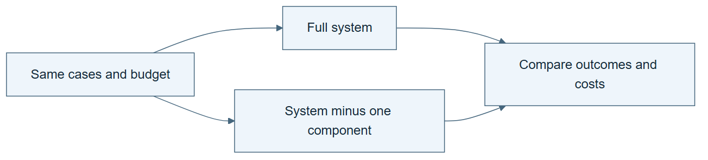

# 05.05 · Find which component makes the difference

[Course](../../README.md) · [Theme](../README.md)

**You are here:** Theme 05, A system and its builder → lab 5 of 5. [Find this theme in the course map](../../COURSE-MAP.md#theme-05) · [Whole-course mindmap](../../COURSE-MAP.md#whole-course-mindmap).

## What you will build

An ablation that compares the system with and without one domain check.

## Why this matters

A successful full system does not reveal which component caused the benefit.

## Before you start

Complete [05.04: Coordinate planning, execution, and checking](../step_04_coordinate/README.md). You need the concepts and the reports named below, not its old chat. If you start here directly, ask the tutor to prepare the listed starting state and explain the missing prerequisite first.

Open the coding agent at the repository root. Read [the tutor skill](../../skills/rsi-tutor/SKILL.md) and this lab's [brief](BRIEF.md). The agent keeps this lab's notes in <code>rsi-work/05-05</code>, outside the repository, and reports the absolute path. If the lab continues an earlier experiment, keep that experiment in its original workspace with its existing budget and locks. A new notes folder does not reset an experiment. The agent checks local Python and the [tool requirements](../../tools/README.md) before execution. You do not write code or configuration.

**Starting state:** The fixed coordinator and the leaked-feature fixture used earlier.

**Budget:** No fits. Four main fixture executions: two inputs under each of two system versions. The separate change below adds two more fixture executions. Plan about 20–35 minutes of reading and discussion; this is an author estimate, not a measured student duration. Coding-agent inference may use a paid online service. Record its cost separately when available.

## How it works

An ablation removes one component while holding the rest as steady as possible. Here the outcome is whether an invalid proposal reaches fitting. Use a dry-run fitting stub so the ablated system cannot accidentally train a leaked model. Reliability is the measured property, not prediction quality.

**A concrete example.** The [four main fixture executions](../../evidence/2026-09-20/loops-and-systems/05-05/INTERPRETATION.md) produced a null effect: the leaked proposal was blocked with or without the domain check. The remaining tool allowlist still rejected casual. In a separately declared two-case follow-up, removing both protections let the leaked proposal reach the fit stub. No leaked model was trained. The first removal looked harmless because the protections overlapped.


*The circuits show configured routes, not proof that an input traversed every module. Each fixture runs separately. The expected table applies to the depicted overlapping guards; preserve your actual outcomes even if they differ. Here casual is an outcome component excluded by the task contract. Four main executions isolate removal of the domain check. Two separate follow-up executions remove both protections and answer a different question. The red Yes means an invalid request reached the stub, not successful learning. No real fit or prediction-quality comparison occurs.*

[Open the illustration at full size](../../assets/illustrations/ablation-overlapping-checks-v1.png).

<details>
<summary>See the step diagram</summary>



*Read the diagram:* An ablation removes one component under matched conditions. Its effect may depend on the other components.

</details>

## Run the lab

Start with this prompt. The tutor pauses for your prediction before it runs the next step.

```text
Read rsi/AGENTS.md and
rsi/skills/rsi-tutor/SKILL.md.
Guide me through lab 05.05, Find which
component makes the difference, one step at
a time.
Read its README and BRIEF. Prepare its
separate workspace.
You write and run the implementation. Keep
the reports and failures.
Ask me to predict the result before the
experiment.
```

**Make a prediction:** Will removing the domain check change the valid case, the invalid case, or both?

### 1. Predeclare the outcome

Avoid choosing the metric after the result.

```text
Write ABLATION-PLAN.md comparing full system
and system without the domain check. Use the
same valid and leaked-feature fixtures.
Measure whether each reaches the fit stub.
```

**Observe:** The test targets the check’s specific job.

### 2. Run both versions

Measure the component’s contribution.

```text
Execute both systems on both fixtures.
Preserve the versions and outcomes. Explain
any overlapping protection from another
component rather than forcing the expected
result.
```

**Observe:** Redundant checks may hide the effect of removing one component.

## Check your result

Only one component differs. The report accounts for redundant checks and does not claim a predictive-performance gain.

### Open these outputs

The agent keeps these in your lab workspace or records the original experiment path when reusing evidence.

| Output | What to inspect |
|---|---|
| ABLATION-PLAN.md | Declares the one removed component, fixed fixtures, and whether the fit stub is reached. |
| Four main fixture outcomes | Cover valid/invalid inputs under full/ablated systems, with no model training. |
| Separate two-case follow-up | Records both fixtures with both guards removed, labelled as a different ablation and kept separate from the four main cases. |
| Interpretation | Names redundant protections and limits the conclusion to the tested reliability behavior. |

Ask the agent to open the actual files and show the command exit status. A written description of a run is not a run. Keep a short <code>LAB-NOTE.md</code> with your prediction, measured observation, explanation, and one limit. The tutor must mark skipped learner responses as skipped.

## Try one change

Remove both overlapping checks in a separate declared ablation. Run the same valid and leaked fixtures through the fit stub, for two additional executions and no model fits. Explain why this answers a different causal question.

## If something goes wrong

If a real fit starts, stop the diagnostic and inspect why the fitting action was not replaced by the declared stub. If the result differs from your prediction, trace all remaining guards rather than weakening them to make the expected effect appear. Removing another guard requires a separately labelled ablation.

Say “Stop this lab” to stop further work. Ask the agent to save <code>PROGRESS.md</code> with the last completed step and remaining budget. To resume, have it read that file and inspect active processes first. A reset creates a new sibling workspace; it does not erase failures or alter the source data. See the [recovery rules](../../tools/README.md) for interrupted tool runs.

## Key takeaways

- Ablation tests dependence on a component.
- Redundancy can make one removal appear harmless.
- The outcome must match the component’s purpose.

## Check your understanding

Answer before opening the explanation. You can ask the tutor for a hint.

1. Why use a fit stub?
2. Does no effect prove the component useless?
3. Why not remove several components at once first?
4. Can this establish language-model improvement?

<details>
<summary>Hint</summary>

Compare one fixture across the two system versions before comparing different fixtures. Only the component removal should explain that paired difference.

</details>

<details>
<summary>Explained answers</summary>

1. It records whether execution would proceed without training on an intentionally invalid fixture.

2. No. Another component may provide the same protection or the test may miss relevant cases.

3. That makes their individual contributions harder to separate.

4. No. It measures a system-level reliability mechanism with fixed model weights.

</details>

## What's next

You can describe a useful harness. Ask a builder to generate one from a task brief. Continue to [06.01: Describe the harness you need](../../06_meta_harness_engineering/step_01_write_a_brief/README.md).
