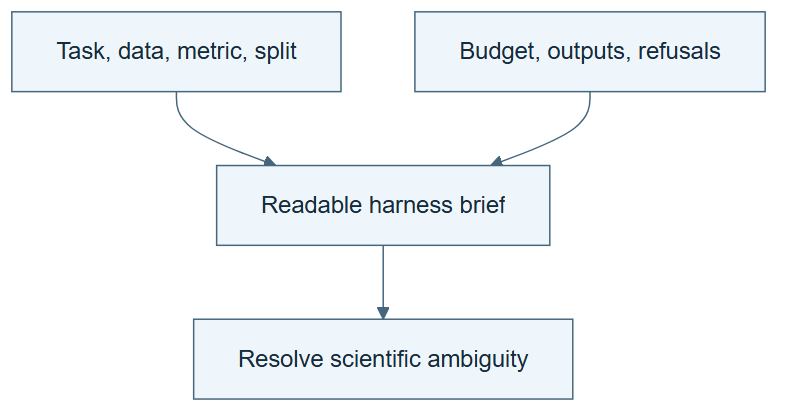

# 06.01 · Describe the harness you need

[Course](../../README.md) · [Theme](../README.md)

## What you will build

A plain-language specification for a small bike-research harness.

## Why this matters

A generator needs the scientific and operating requirements, not just “make an intelligent agent.”

## Before you start

Complete [05.05: Find which component makes the difference](../../05_system_intelligence/step_05_ablate_system/README.md). You need the concepts and the reports named below, not its old chat. If you start here directly, ask the tutor to prepare the listed starting state and explain the missing prerequisite first.

Open the coding agent at the repository root. Read [the tutor skill](../../skills/rsi-tutor/SKILL.md) and this lab's [brief](BRIEF.md). The agent creates a separate sibling workspace named <code>rsi-work/06-01</code> and reports its absolute path. It checks local Python and the [tool requirements](../../tools/README.md) before execution. You do not write code or configuration.

**Starting state:** The bike task, fixed system, and its observed failure cases.

**Budget:** No fits. One brief and one ambiguity review. Plan about 20–35 minutes of reading and discussion; this is an author estimate, not a measured student duration. Coding-agent inference may use a paid online service. Record its cost separately when available.

## How it works

A harness organizes an agent’s instructions, tools, state, evaluation, and limits. A harness brief states the task and required behavior while leaving implementation syntax to the coding agent. A good brief includes what must fail, not only what should succeed.



*Read the diagram:* The brief fixes scientific choices and required behavior. The builder supplies implementation details.

## Run the lab

Start with this prompt. The tutor pauses for your prediction before it runs the next step.

```text
Read rsi/AGENTS.md and rsi/skills/rsi-tutor/SKILL.md.
Guide me through lab 06.01, Describe the harness you need, one step at a time.
Read its README and BRIEF. Prepare its separate workspace.
You write and run the implementation. Keep the reports and failures.
Ask me to predict the result before the experiment.
```

**Make a prediction:** Which missing choice would make two generated harnesses incomparable?

### 1. Write the intent

State scientific and operating rules.

```text
Create HARNESS-BRIEF.md for bike regression. Include prediction setting, source, permitted inputs, split, MAE, baseline, two-attempt limit, outputs, stop rules, and refusal of leakage. Use prose and a small table only.
```

**Observe:** The brief is readable without knowing a configuration language.

### 2. Review ambiguity

Find missing decisions before generation.

```text
Use build-ml-harness to inspect the brief without building yet. List ambiguous scientific choices and routine implementation choices separately. Resolve the scientific choices from the existing task contract.
```

**Observe:** The generator can proceed without guessing the definition of success.

## Check your result

The brief fixes target, inputs, metric, partitions, resources, and required rejection. It does not require the student to write code or schemas.

Ask the agent to open the actual files and show the command exit status. A written description of a run is not a run. Keep a short <code>LAB-NOTE.md</code> with your prediction, measured observation, explanation, and one limit. The tutor must mark skipped learner responses as skipped.

## Try one change

Remove the metric and ask two plausible alternatives. Explain why choosing one after seeing results would be invalid.

## If something goes wrong

If the expected artifact is missing, inspect the last command and its exit status before running again. If a check fails, preserve the failing result and diagnose that check; do not weaken it to obtain a pass.

Say “Stop this lab” to stop further work. Ask the agent to save <code>PROGRESS.md</code> with the last completed step and remaining budget. To resume, have it read that file and inspect active processes first. A reset creates a new sibling workspace; it does not erase failures or alter the source data. See the [recovery rules](../../tools/README.md) for interrupted tool runs.

## Key takeaways

- A readable brief can control a generated system.
- Scientific choices belong in the specification.
- Required failures make acceptance testable.

## Check your understanding

Answer before opening the explanation. You can ask the tutor for a hint.

1. What is a harness in this course?
2. What does the builder decide?
3. Why specify a refusal?
4. Does the brief need JSON?

<details>
<summary>Hint</summary>

Trace what changed, what stayed fixed, and which observation supports the conclusion. A filename or a confident explanation is not enough evidence.

</details>

<details>
<summary>Explained answers</summary>

1. The organized instructions, tools, state, checks, and limits around task execution.

2. Implementation details consistent with the brief, while surfacing unresolved scientific choices.

3. It lets you verify that the generated system respects a meaningful boundary.

4. No. The agent can translate clear prose into any machine representation it needs.

</details>

## What's next

Use the builder skill to turn that brief into actual files and behavior. Continue to [06.02: Generate a first harness](../step_02_generate/README.md).
