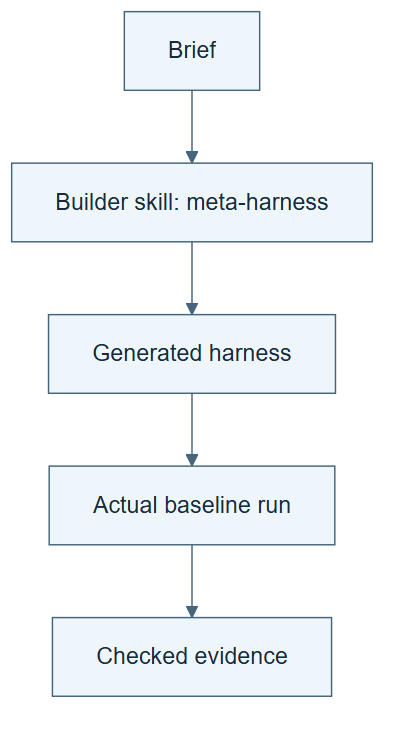

# 06.02 · Generate a first harness

[Course](../../README.md) · [Theme](../README.md)

**You are here:** Theme 06, A system and its builder → lab 2 of 6. [Find this theme in the course map](../../COURSE-MAP.md#theme-06) · [Whole-course mindmap](../../COURSE-MAP.md#whole-course-mindmap).

## What you will build

A generated harness with a runnable entry point, checks, and readable instructions.

## Why this matters

A specification is not executable until a builder turns it into tools and a workflow.

## Before you start

Complete [06.01: Describe the harness you need](../step_01_write_a_brief/README.md). You need the concepts and the reports named below, not its old chat. If you start here directly, ask the tutor to prepare the listed starting state and explain the missing prerequisite first.

Open the coding agent at the repository root. Read [the tutor skill](../../skills/rsi-tutor/SKILL.md) and this lab's [brief](BRIEF.md). The agent creates a separate sibling workspace named <code>rsi-work/06-02</code> and reports its absolute path. It checks local Python and the [tool requirements](../../tools/README.md) before execution. You do not write code or configuration.

**Starting state:** HARNESS-BRIEF.md from 06.01 and a fresh generated-harness folder.

**Budget:** One baseline fit; no autonomous search. The dedicated refusal tests follow in 06.04. Plan about 20–35 minutes of reading and discussion; this is an author estimate, not a measured student duration. Coding-agent inference may use a paid online service. Record its cost separately when available.

## How it works

The builder is a meta-harness: it creates another harness. The generated harness performs the task. They have separate responsibilities and versions. The builder can stay fixed while producing different systems. Generation by itself does not imply self-improvement.

**A concrete example.** Think of a builder that reads “binary classification” and produces a classifier, suitable splits, and a balanced-accuracy report. The same unchanged builder reads “hourly count regression” and produces a different harness. Its outputs differ because its inputs differ. To claim that the builder improved, you must change and evaluate the builder itself.


*In this example the builder stays fixed. It creates a package that must then run under the brief’s limits. Files alone do not show that the package works. A checked execution provides evidence about the generated harness; it does not establish that the builder improved itself.*

[Open the illustration at full size](../../assets/illustrations/meta-harness-v2.png).

<details>
<summary>See the step diagram</summary>



*Read the diagram:* The builder produces the harness. The harness then runs the task. These are different objects.

</details>

## Run the lab

Start with this prompt. The tutor pauses for your prediction before it runs the next step.

```text
Read rsi/AGENTS.md and
rsi/skills/rsi-tutor/SKILL.md.
Guide me through lab 06.02, Generate a first
harness, one step at a time.
Read its README and BRIEF. Prepare its
separate workspace.
You write and run the implementation. Keep
the reports and failures.
Ask me to predict the result before the
experiment.
```

**Make a prediction:** What output would distinguish a finished harness from a folder of plans?

### 1. Generate the system

Let the agent supply implementation syntax.

```text
Use build-ml-harness with HARNESS-BRIEF.md.
Generate a README, task contract, workflow,
tools, checks, dependency record, and
recovery guide in my workspace. Prefer the
supplied ML tools where appropriate.
```

**Observe:** The generated entry point names concrete operations.

### 2. Run the baseline

Prove that the generated system executes.

```text
Run its one-attempt baseline from a clean
subfolder. Save commands, exit status,
predictions, and the checked result. Do not
mark generation complete until the run
finishes or a specific failure is recorded.
```

**Observe:** A real result supports the generated instructions.

## Check your result

The generated system executes its baseline. The result follows the original brief. Missing capabilities are reported, not replaced with simulated success.

### Open these outputs

The agent keeps these in your lab workspace or records the original experiment path when reusing evidence.

| Output | What to inspect |
|---|---|
| Generated package | Contains its README, task contract, workflow, executable entry, checks, dependencies, and recovery instructions. |
| Generation record | Links the brief, builder version, and generated files. |
| Baseline execution record | Retains the real command result, predictions, measured metric, and check under the brief’s task contract. |

Ask the agent to open the actual files and show the command exit status. A written description of a run is not a run. Keep a short <code>LAB-NOTE.md</code> with your prediction, measured observation, explanation, and one limit. The tutor must mark skipped learner responses as skipped.

## Try one change

Ask what would happen if the builder were removed after generation. The generated harness should still have its required task instructions and dependencies.

## If something goes wrong

If the entry point is only pseudocode, generation has not produced an executable harness. Have the agent implement it and retain any failed attempt. If imports or data paths fail, inspect whether the generated package declares its dependency on the course tools and pinned data. Do not describe a package as standalone when it imports the repository.

Say “Stop this lab” to stop further work. Ask the agent to save <code>PROGRESS.md</code> with the last completed step and remaining budget. To resume, have it read that file and inspect active processes first. A reset creates a new sibling workspace; it does not erase failures or alter the source data. See the [recovery rules](../../tools/README.md) for interrupted tool runs.

## Key takeaways

- A meta-harness generates a harness.
- Generated files need an actual run.
- The generator and generated system are distinct objects.

## Check your understanding

Answer before opening the explanation. You can ask the tutor for a hint.

1. Which object is the meta-harness?
2. Can the builder remain unchanged?
3. Does a successful generated baseline establish RSI?
4. What if code exists but dependencies are missing?

<details>
<summary>Hint</summary>

Remove the builder from your imagined run. Which saved instructions and executable files must still exist for the generated harness to do the task?

</details>

<details>
<summary>Explained answers</summary>

1. The builder procedure that turns a brief into a runnable harness.

2. Yes. A fixed generator can produce many task-specific systems.

3. No. It establishes generation and execution, not inherited improvement of the builder.

4. The execution requirement remains incomplete until setup works or the limitation is stated.

</details>

## What's next

Inspect the generated decisions before trusting more of its behavior. Continue to [06.03: Inspect what the builder decided](../step_03_inspect_generated/README.md).
