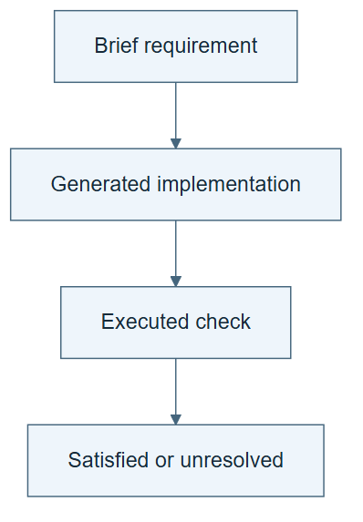

# 06.03 · Inspect what the builder decided

[Course](../../README.md) · [Theme](../README.md)

**You are here:** Theme 06, A system and its builder → lab 3 of 6. [Find this theme in the course map](../../COURSE-MAP.md#theme-06) · [Whole-course mindmap](../../COURSE-MAP.md#whole-course-mindmap).

## What you will build

A review that maps each important generated behavior back to the brief.

## Why this matters

A generator can quietly invent a split, skip a check, or increase the budget. Review should expose those choices.

## Before you start

Complete [06.02: Generate a first harness](../step_02_generate/README.md). You need the concepts and the reports named below, not its old chat. If you start here directly, ask the tutor to prepare the listed starting state and explain the missing prerequisite first.

Open the coding agent at the repository root. Read [the tutor skill](../../skills/rsi-tutor/SKILL.md) and this lab's [brief](BRIEF.md). The agent keeps this lab's notes in <code>rsi-work/06-03</code>, outside the repository, and reports the absolute path. If the lab continues an earlier experiment, keep that experiment in its original workspace with its existing budget and locks. A new notes folder does not reset an experiment. The agent checks local Python and the [tool requirements](../../tools/README.md) before execution. You do not write code or configuration.

**Starting state:** The generated harness and its first run.

**Budget:** No new fits. Inspect generated files and one trace. Plan about 20–35 minutes of reading and discussion; this is an author estimate, not a measured student duration. Coding-agent inference may use a paid online service. Record its cost separately when available.

## How it works

Trace requirements forward to implementation and evidence backward to requirements. For example, “two attempts maximum” should appear in control logic and an over-budget refusal. A sentence in the README alone does not show the limit runs.

**A concrete example.** The README says “two attempts,” but a loop in the generated code permits ten. The requirement is stated, implementation disagrees, and no two-attempt refusal has yet run. Keep those three evidence states distinct in the review. A row saying “budget: checked” would conceal the exact gap.


*The two-versus-ten mismatch is a diagnostic example, not a report that your generated code has that defect. One successful baseline cannot establish an attempt limit. Trace the actual requirement into code and its relevant records; leave unexecuted behavior unverified for the later refusal lab. A failing case and an absent case need different explanations, even though neither establishes acceptance. The documentation-only change leaves code untouched and should expose disagreement. Inspect real preprocessing inputs and selection partitions without another fit.*

[Open the illustration at full size](../../assets/illustrations/requirements-implementation-evidence-v1.png).

<details>
<summary>See the step diagram</summary>



*Read the diagram:* Trace each important requirement to implementation and then to observed behavior.

</details>

## Run the lab

Start with this prompt. The tutor pauses for your prediction before it runs the next step.

```text
Read rsi/AGENTS.md and
rsi/skills/rsi-tutor/SKILL.md.
Guide me through lab 06.03, Inspect what the
builder decided, one step at a time.
Read its README and BRIEF. Prepare its
separate workspace.
You write and run the implementation. Keep
the reports and failures.
Ask me to predict the result before the
experiment.
```

**Make a prediction:** Where would you look to verify the attempt limit?

### 1. Map requirements

Connect intent to actual behavior.

```text
Create REVIEW.md mapping target, features,
split, metric, budget, refusal, and outputs
to generated files and runtime evidence.
Mark undocumented builder choices.
```

**Observe:** Every key requirement has an implementation location or a visible gap.

### 2. Inspect one hidden assumption

Find a plausible failure before it scales.

```text
Inspect preprocessing and candidate
selection. Verify transformations fit only
on training data and selection uses the
declared partition. Save the evidence and
any repair needed.
```

**Observe:** The review reaches operations, not only documentation.

## Check your result

The review distinguishes stated, implemented, and executed requirements. Any generated assumption is explicit.

### Open these outputs

The agent keeps these in your lab workspace or records the original experiment path when reusing evidence.

| Output | What to inspect |
|---|---|
| REVIEW.md | Maps each scientific and operating requirement to implementation and actual evidence, marking untested behavior separately. |
| Preprocessing and selection inspection | Shows where transforms fit and which partition drives candidate selection. |
| Assumption and repair notes | Preserve any undocumented choice, its effect, and the correction required before acceptance. |

Ask the agent to open the actual files and show the command exit status. A written description of a run is not a run. Keep a short <code>LAB-NOTE.md</code> with your prediction, measured observation, explanation, and one limit. The tutor must mark skipped learner responses as skipped.

## Try one change

In a diagnostic copy, alter the README’s budget while leaving code unchanged. Explain why a documentation-only review misses the mismatch.

## If something goes wrong

If a requirement points only to another sentence in the README, trace it into the running operation or leave it unverified. If train-only preprocessing is unclear, inspect the actual fit inputs, not just the estimator name. Preserve the first generated version before repairing it so the builder’s mistake remains visible.

Say “Stop this lab” to stop further work. Ask the agent to save <code>PROGRESS.md</code> with the last completed step and remaining budget. To resume, have it read that file and inspect active processes first. A reset creates a new sibling workspace; it does not erase failures or alter the source data. See the [recovery rules](../../tools/README.md) for interrupted tool runs.

## Key takeaways

- Generated implementation can drift from intent.
- A requirement needs both code and behavioral evidence when applicable.
- Readable documentation is not enforcement.

## Check your understanding

Answer before opening the explanation. You can ask the tutor for a hint.

1. What is traceability here?
2. Why inspect train-only preprocessing?
3. Does a README limit constrain execution by itself?
4. What should happen to an undocumented scientific assumption?

<details>
<summary>Hint</summary>

For one requirement, find three locations: where it is requested, where it is implemented, and where its behavior was observed. Missing one is a useful finding.

</details>

<details>
<summary>Explained answers</summary>

1. The connection from requirement to implementation to observed check result.

2. Evaluation information can leak through transformations even without using labels directly.

3. No. The running procedure or tool must apply it.

4. Make it explicit and resolve it against the brief before accepting the result.

</details>

## What's next

Test the generated system with an input it is supposed to refuse. Continue to [06.04: Test the generated harness’s boundaries](../step_04_test_refusal/README.md).
