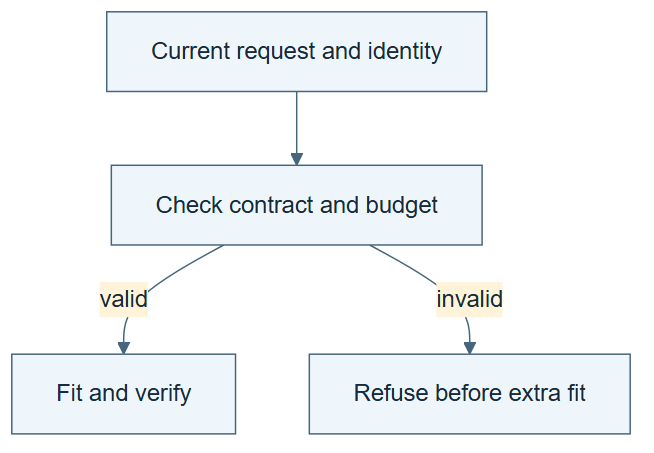

# 06.04 · Test the generated harness’s boundaries

[Course](../../README.md) · [Theme](../README.md)

**You are here:** Theme 06, A system and its builder → lab 4 of 6. [Find this theme in the course map](../../COURSE-MAP.md#theme-06) · [Whole-course mindmap](../../COURSE-MAP.md#whole-course-mindmap).

## What you will build

A retained valid run and two meaningful refusals from the generated harness.

## Why this matters

A system that only succeeds on valid inputs may still accept the mistakes it claims to prevent.

## Before you start

Complete [06.03: Inspect what the builder decided](../step_03_inspect_generated/README.md). You need the concepts and the reports named below, not its old chat. If you start here directly, ask the tutor to prepare the listed starting state and explain the missing prerequisite first.

Open the coding agent at the repository root. Read [the tutor skill](../../skills/rsi-tutor/SKILL.md) and this lab's [brief](BRIEF.md). The agent creates a separate sibling workspace named <code>rsi-work/06-04</code> and reports its absolute path. It checks local Python and the [tool requirements](../../tools/README.md) before execution. You do not write code or configuration.

**Starting state:** The reviewed harness and a fresh test workspace.

**Budget:** Two admitted attempts: one valid fit and one leaked-input failure before fitting. A third distinct request must be refused on budget. No extra fit for either refusal. Plan about 20–35 minutes of reading and discussion; this is an author estimate, not a measured student duration. Coding-agent inference may use a paid online service. Record its cost separately when available.

## How it works

A negative test supplies a specific forbidden request and checks the resulting behavior. The requested action, candidate, run, and contract must match the evidence used to decide it. An unrelated old approval or successful report must not authorize this request.

**A concrete example.** The brief permits two admitted attempts. A valid baseline consumes one. A leaked-feature request is admitted for validation, rejected before fitting, and consumes the second. A third distinct recipe must then fail on the budget. An unrelated old success report changes none of those identities or counts.


*The fit-column icons denote one fit for the first request and zero for the other two; record actual counts and exit statuses. These are expected outcomes for this declared admitted-attempt policy. An invalid request can consume a slot even though no model fit starts. The old pass may remain valid for its original run; the red mark rejects its use for this request. Keep the unrelated-report and missing-ID fixtures separate from real model execution. These local checks do not establish isolation from a host agent that can edit the workspace.*

[Open the illustration at full size](../../assets/illustrations/request-bound-refusal-v1.png).

<details>
<summary>See the step diagram</summary>



*Read the diagram:* A boundary is demonstrated by a meaningful refusal tied to the current request.

</details>

## Run the lab

Start with this prompt. The tutor pauses for your prediction before it runs the next step.

```text
Read rsi/AGENTS.md and
rsi/skills/rsi-tutor/SKILL.md.
Guide me through lab 06.04, Test the
generated harness’s boundaries, one step at
a time.
Read its README and BRIEF. Prepare its
separate workspace.
You write and run the implementation. Keep
the reports and failures.
Ask me to predict the result before the
experiment.
```

**Make a prediction:** Could an old successful result from another run accidentally satisfy a weak check?

### 1. Run a valid case

Establish the intended path.

```text
Execute one valid baseline and retain its
exact run and candidate identity. Save the
completed checks.
```

**Observe:** The success evidence belongs to this run.

### 2. Attempt two violations

Check request-specific enforcement.

```text
Submit a leaked-feature request and an
over-budget request. Also place an unrelated
successful report in a separate fixture
folder. Confirm it cannot authorize either
request. Keep refusals and fit counts.
```

**Observe:** Rejection depends on the current request and contract.

## Check your result

Invalid requests do not fit models. An unrelated result cannot satisfy the current candidate’s check. All attempts and refusal costs remain visible.

### Open these outputs

The agent keeps these in your lab workspace or records the original experiment path when reusing evidence.

| Output | What to inspect |
|---|---|
| Valid candidate record | Binds its predictions and checks to the current run and contract. |
| Leakage and budget refusals | Identify the current requests, failed checks, and fit counts. |
| Unrelated-report fixture | Demonstrates that another run’s success cannot satisfy this request’s acceptance checks. |

Ask the agent to open the actual files and show the command exit status. A written description of a run is not a run. Keep a short <code>LAB-NOTE.md</code> with your prediction, measured observation, explanation, and one limit. The tutor must mark skipped learner responses as skipped.

## Try one change

Remove candidate identity from a check fixture and verify that the system treats it as incomplete evidence.

## If something goes wrong

If an invalid request is given a model score without a fit, inspect whether an old report was reused. If the budget refusal occurs at an unexpected time, distinguish admitted attempts from fits: the leaked request consumes an attempt while performing no fit. A missing candidate identity should produce incomplete evidence, not a search for any available success file.

Say “Stop this lab” to stop further work. Ask the agent to save <code>PROGRESS.md</code> with the last completed step and remaining budget. To resume, have it read that file and inspect active processes first. A reset creates a new sibling workspace; it does not erase failures or alter the source data. See the [recovery rules](../../tools/README.md) for interrupted tool runs.

## Key takeaways

- Checks must bind to the action they authorize.
- Old success evidence is not a general permission token.
- Refusal behavior needs execution tests.

## Check your understanding

Answer before opening the explanation. You can ask the tutor for a hint.

1. Why test an unrelated old report?
2. Should a missing candidate ID be accepted?
3. Does a local refusal prove an adversarial sandbox?
4. What is a useful failure result?

<details>
<summary>Hint</summary>

Trace the exact request that needs authorization. Neither a pass for another candidate nor an unspent model-fit count replaces this experiment’s admitted-attempt ledger.

</details>

<details>
<summary>Explained answers</summary>

1. It catches a broad search that treats any success file as sufficient evidence.

2. No. The checker cannot establish which object the result describes.

3. No. A host agent with write access can bypass local logic. State that boundary.

4. A clear refusal tied to the actual request, with no unauthorized fit and a retained record.

</details>

## What's next

Generate a harness for a different task to test whether the builder adapts. Continue to [06.05: Generate a classification harness](../step_05_second_task/README.md).
