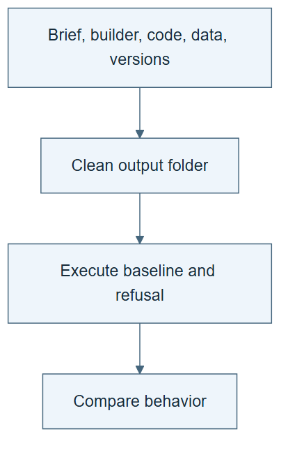

# 06.06 · Recreate and compare generated harnesses

[Course](../../README.md) · [Theme](../README.md)

**You are here:** Theme 06, A system and its builder → lab 6 of 6. [Find this theme in the course map](../../COURSE-MAP.md#theme-06) · [Whole-course mindmap](../../COURSE-MAP.md#whole-course-mindmap).

## What you will build

A clean-start reproducibility report for two generated harnesses.

## Why this matters

A generated system that depends on hidden local state is difficult to share or evaluate.

## Before you start

Complete [06.05: Generate a classification harness](../step_05_second_task/README.md). You need the concepts and the reports named below, not its old chat. If you start here directly, ask the tutor to prepare the listed starting state and explain the missing prerequisite first.

Open the coding agent at the repository root. Read [the tutor skill](../../skills/rsi-tutor/SKILL.md) and this lab's [brief](BRIEF.md). The agent keeps this lab's notes in <code>rsi-work/06-06</code>, outside the repository, and reports the absolute path. If the lab continues an earlier experiment, keep that experiment in its original workspace with its existing budget and locks. A new notes folder does not reset an experiment. The agent checks local Python and the [tool requirements](../../tools/README.md) before execution. You do not write code or configuration.

**Starting state:** Both briefs, generated harnesses, dependency records, and prior results.

**Budget:** Two baseline fits and two wrong-task refusal checks, one of each per task. Refusals add no model fits. No new search. Plan about 20–35 minutes of reading and discussion; this is an author estimate, not a measured student duration. Coding-agent inference may use a paid online service. Record its cost separately when available.

## How it works

Recreation uses the saved brief, builder version, generated files, dependencies, and data versions. Different source code can implement the same contract, so compare behavior and evidence as well as file hashes. If generation is stochastic, do not assume byte-identical output.

**A concrete example.** Running a saved generated package in a new output folder tests whether its recorded files and dependencies are sufficient. Asking the builder to generate another package from prose is a different test. This lab performs the first. Equal baseline predictions support repeatability of that package; they do not prove independent regeneration or a better builder.


*Create new output folders; the broom is a clean-state symbol, not an instruction to erase prior evidence. Package tabs identify required provenance and dependencies, which may include the course repository rather than a self-contained archive. Run one baseline and one wrong-task refusal per package; the refusal adds no model fit. Compare actual predictions, metrics, contracts, and environments without replacing the original result. The other two cards describe separate experiments: a fair builder comparison needs prespecified tasks, matched budgets, and candidate-specific evidence. A fresh output folder alone does not create an independent agent context.*

[Open the illustration at full size](../../assets/illustrations/repeat-saved-harnesses-v1.png).

<details>
<summary>See the step diagram</summary>



*Read the diagram:* Recreate behavior from saved inputs and dependencies. Generated source need not be byte-identical to satisfy the same contract.

</details>

## Run the lab

Start with this prompt. The tutor pauses for your prediction before it runs the next step.

```text
Read rsi/AGENTS.md and
rsi/skills/rsi-tutor/SKILL.md.
Guide me through lab 06.06, Recreate and
compare generated harnesses, one step at a
time.
Read its README and BRIEF. Prepare its
separate workspace.
You write and run the implementation. Keep
the reports and failures.
Ask me to predict the result before the
experiment.
```

**Make a prediction:** Must two valid generated harnesses have identical code?

### 1. Prepare the clean starts

Remove dependence on the old chat.

```text
Write a handoff for each harness with brief,
builder version, generated entry point,
pinned data, setup, and acceptance checks.
Create clean output folders.
```

**Observe:** A reader can locate every dependency.

### 2. Reproduce and explain

Compare behavior under the same task contract.

```text
Run each baseline from the saved generated
system in a new output folder. Submit one
wrong-task request to each package and
retain its refusal without another fit.
Compare predictions, metric, refusal
behavior, and versions with the earlier run.
Record any difference without selecting the
most favorable rerun.
```

**Observe:** The report distinguishes reproduction of behavior from identical generated text.

## Check your result

Both task contracts remain intact. Actual runs and negative checks are recorded. The report does not confuse generator output diversity with improvement.

### Open these outputs

The agent keeps these in your lab workspace or records the original experiment path when reusing evidence.

| Output | What to inspect |
|---|---|
| Two handoffs | Identify brief, builder, generated entry, data, environment, and acceptance checks for bike and wine. |
| Two recreated baseline runs | Use clean output state and preserve their predictions, metrics, and negative checks. |
| Reproducibility report | Compares behavior and versions without replacing an unfavorable original run. |

Ask the agent to open the actual files and show the command exit status. A written description of a run is not a run. Keep a short <code>LAB-NOTE.md</code> with your prediction, measured observation, explanation, and one limit. The tutor must mark skipped learner responses as skipped.

## Try one change

Change the builder’s proposal instructions and label it a new builder version. State the comparison needed before calling it a better builder.

## If something goes wrong

If the run needs a file from an undeclared absolute path, add the dependency to the handoff and record the failed clean start. If predictions differ, compare environment and contract before selecting a preferred result. If you also regenerate from prose, label that extra experiment and declare its own budget rather than merging it into this reproduction.

Say “Stop this lab” to stop further work. Ask the agent to save <code>PROGRESS.md</code> with the last completed step and remaining budget. To resume, have it read that file and inspect active processes first. A reset creates a new sibling workspace; it does not erase failures or alter the source data. See the [recovery rules](../../tools/README.md) for interrupted tool runs.

## Key takeaways

- Saved generation inputs support reproducibility.
- Behavioral equivalence can matter more than identical code.
- Improving a builder requires comparing builders, not just their artifacts.

## Check your understanding

Answer before opening the explanation. You can ask the tutor for a hint.

1. What must be versioned?
2. Is differing code automatically a failure?
3. Can a favorable rerun replace an unfavorable original silently?
4. What would test a better builder?

<details>
<summary>Hint</summary>

Name what was repeated: execution of saved code, generation from a saved brief, or improvement of the builder. Each requires different evidence.

</details>

<details>
<summary>Explained answers</summary>

1. Brief, builder, generated harness, data, dependencies, and evaluator contract.

2. No. Check whether it satisfies the same declared behavior and evidence requirements.

3. No. Preserve both and account for the additional selection opportunity and cost.

4. Matched-budget comparisons of harnesses it produces across prespecified fresh tasks and failure cases.

</details>

## What's next

Before changing the system itself, distinguish the different self-* mechanisms. Continue to [07.01: Correct one result](../../07_understanding_self_star/step_01_correction/README.md).
