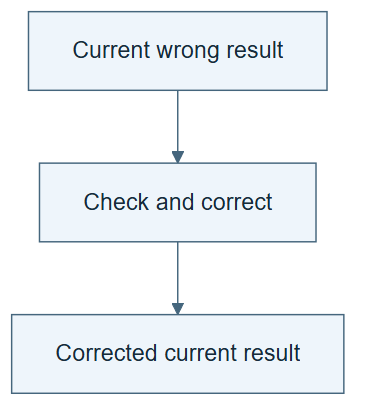

# 07.01 · Correct one result

[Course](../../README.md) · [Theme](../README.md)

**You are here:** Theme 07, Changes and their evidence → lab 1 of 8. [Find this theme in the course map](../../COURSE-MAP.md#theme-07) · [Whole-course mindmap](../../COURSE-MAP.md#whole-course-mindmap).

## What you will build

A corrected experiment summary with the original mistake preserved.

## Why this matters

A system can repair an answer during a task without retaining any new method.

## Before you start

Complete [06.06: Recreate and compare generated harnesses](../../06_meta_harness_engineering/step_06_recreate/README.md). You need the concepts and the reports named below, not its old chat. If you start here directly, ask the tutor to prepare the listed starting state and explain the missing prerequisite first.

Open the coding agent at the repository root. Read [the tutor skill](../../skills/rsi-tutor/SKILL.md) and this lab's [brief](BRIEF.md). The agent keeps this lab's notes in <code>rsi-work/07-01</code>, outside the repository, and reports the absolute path. If the lab continues an earlier experiment, keep that experiment in its original workspace with its existing budget and locks. A new notes folder does not reset an experiment. The agent checks local Python and the [tool requirements](../../tools/README.md) before execution. You do not write code or configuration.

**Starting state:** A labelled copy of a baseline report containing an incorrect MAE.

**Budget:** No fits; one main recomputation and report correction, followed by one fresh-session report check for the additional exercise. Plan about 20–35 minutes of reading and discussion; this is an author estimate, not a measured student duration. Coding-agent inference may use a paid online service. Record its cost separately when available.

## How it works

Self-correction revises a current output using feedback. Here the checker exposes a wrong summary number and the agent replaces it with the value computed from predictions. When the session ends, no procedure has changed unless you explicitly retain one.

**A concrete example.** In the [author correction exercise](../../evidence/2026-09-20/self-star-and-measurement/07-01/CORRECTION.md), a labelled report claims MAE 1. Its saved bike predictions give 159.947912. Replacing the claim corrects that output. A later process uses the unchanged weak reporting rule and repeats another wrong supplied score. The lesson is about the lifetime of a change: a corrected answer does not automatically become a rule for writing future answers. This replay did not test a fresh LLM session.


*The later-session panel depicts a conditional example in which only the unchanged procedure is reused. Inspect the host’s actual context, saved memory, and available files; a new process or chat is not proof that the correction was forgotten. The table headings name conceptual row identities and values, not the complete prediction-file schema. Recompute from the actual matched rows and reference targets, then correct conclusions that depended on the wrong number. The blank value is not an experimental result, and the illustration’s checkmarks show the intended corrected state.*

[Open the illustration at full size](../../assets/illustrations/local-output-correction-v1.png).

<details>
<summary>See the step diagram</summary>



*Read the diagram:* Correction repairs the current output. It need not create a lasting instruction for future tasks.

</details>

## Run the lab

Start with this prompt. The tutor pauses for your prediction before it runs the next step.

```text
Read rsi/AGENTS.md and
rsi/skills/rsi-tutor/SKILL.md.
Guide me through lab 07.01, Correct one
result, one step at a time.
Read its README and BRIEF. Prepare its
separate workspace.
You write and run the implementation. Keep
the reports and failures.
Ask me to predict the result before the
experiment.
```

**Make a prediction:** Will correcting this report prevent the same mistake in a new session?

### 1. Expose the mismatch

Make correction depend on evidence.

```text
Recompute MAE from the copied report’s
predictions. Show the mismatch and preserve
the original report.
```

**Observe:** The correction has a concrete reason.

### 2. Correct the output

Change only the current artifact.

```text
Write a corrected report and a short
correction note. Do not edit or save a
reusable skill. Explain what changed and
what did not.
```

**Observe:** The current report improves while the future procedure stays fixed.

## Check your result

The corrected number matches the predictions. The original and correction note remain. No retained skill change is claimed.

### Open these outputs

The agent keeps these in your lab workspace or records the original experiment path when reusing evidence.

| Output | What to inspect |
|---|---|
| Original and corrected reports | Preserve the incorrect claim and the evidence-backed replacement. |
| Metric recomputation | Uses the same predictions, targets, and rows as the report. |
| Correction note | Names the changed output and confirms that no reusable procedure was revised. |

Ask the agent to open the actual files and show the command exit status. A written description of a run is not a run. Keep a short <code>LAB-NOTE.md</code> with your prediction, measured observation, explanation, and one limit. The tutor must mark skipped learner responses as skipped.

## Try one change

Start a fresh session, where available, with the same fixed procedure and another labelled wrong summary. Inspect and record whether the host also exposes the earlier correction or saved memory. Check the later report without a new model fit and explain why the first correction alone did not guarantee prevention. Label a same-context exercise if a fresh session is unavailable.

## If something goes wrong

If the recomputed number differs from both reports, first align prediction rows with target rows and check the metric definition. Do not select the number that looks more favorable. If the agent also edits a saved skill, record that as a separate retained change; it is no longer only the correction experiment.

Say “Stop this lab” to stop further work. Ask the agent to save <code>PROGRESS.md</code> with the last completed step and remaining budget. To resume, have it read that file and inspect active processes first. A reset creates a new sibling workspace; it does not erase failures or alter the source data. See the [recovery rules](../../tools/README.md) for interrupted tool runs.

## Key takeaways

- Correction can be local to one task.
- A better output does not imply retained learning.
- Feedback should be connected to the corrected fact.

## Check your understanding

Answer before opening the explanation. You can ask the tutor for a hint.

1. What changed?
2. What survived automatically?
3. Is self-correction necessarily successful?
4. What would add persistence?

<details>
<summary>Hint</summary>

Ask what changed now and what a later session would actually read. A corrected answer and a retained prevention rule have different lifetimes.

</details>

<details>
<summary>Explained answers</summary>

1. The current report, not the model weights or reusable procedure.

2. Only saved artifacts; future use still needs an explicit mechanism.

3. No. A revision can introduce a new mistake; check it.

4. A retained, versioned rule that a later session reads and applies.

</details>

## What's next

A reflection can propose that rule, but it needs its own test. Continue to [07.02: Test a reflection before trusting it](../step_02_reflection/README.md).
