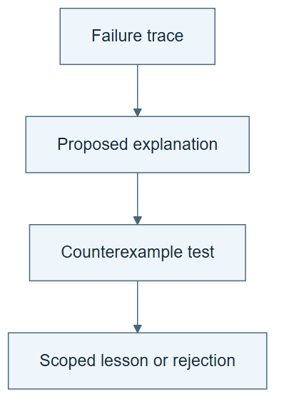

# 07.02 · Test a reflection before trusting it

[Course](../../README.md) · [Theme](../README.md)

## What you will build

A reflection that separates observation, explanation, and a proposed future rule.

## Why this matters

A plausible story about a failure can be wrong. The story must earn its place in the procedure.

## Before you start

Complete [07.01: Correct one result](../step_01_correction/README.md). You need the concepts and the reports named below, not its old chat. If you start here directly, ask the tutor to prepare the listed starting state and explain the missing prerequisite first.

Open the coding agent at the repository root. Read [the tutor skill](../../skills/rsi-tutor/SKILL.md) and this lab's [brief](BRIEF.md). The agent creates a separate sibling workspace named <code>rsi-work/07-02</code> and reports its absolute path. It checks local Python and the [tool requirements](../../tools/README.md) before execution. You do not write code or configuration.

**Starting state:** A failed or weak experiment and its trace.

**Budget:** At most two targeted checks or fits, declared before running. Plan about 20–35 minutes of reading and discussion; this is an author estimate, not a measured student duration. Coding-agent inference may use a paid online service. Record its cost separately when available.

## How it works

Reflection interprets an attempt. It may identify a failure, suggest a cause, and propose an action. Those are different epistemic roles: the trace is observed; the cause may be inferred; the action is a hypothesis. A useful reflection changes a later decision and survives a test.

**A concrete example.** The [replayed regression case](../../evidence/2026-09-20/self-star-and-measurement/07-02/TWO-CHECKS.csv) has tree training MAE 0, yet selection MAE is 71.88 versus 24.20 for the linear model. “Never use trees” still goes too far: the classification case favors the tree, with balanced accuracy 0.88 versus 0.86. These known cases support a narrower rule: compare valid candidates using the declared selection metric. They do not prove that a plausible explanation of the failure is its sole cause.



*Read the diagram:* A reflection is a hypothesis about the failure. Test it before treating it as a reliable lesson.

## Run the lab

Start with this prompt. The tutor pauses for your prediction before it runs the next step.

```text
Read rsi/AGENTS.md and
rsi/skills/rsi-tutor/SKILL.md.
Guide me through lab 07.02, Test a
reflection before trusting it, one step at a
time.
Read its README and BRIEF. Prepare its
separate workspace.
You write and run the implementation. Keep
the reports and failures.
Ask me to predict the result before the
experiment.
```

**Make a prediction:** Can an eloquent explanation reduce performance when followed?

### 1. Write a testable reflection

Avoid treating explanation as proof.

```text
Create REFLECTION.md with observed facts,
one causal hypothesis, an alternative
explanation, and a proposed procedural rule.
Use the actual failed trace.
```

**Observe:** The note makes uncertainty visible.

### 2. Test the rule

Compare behavior on a new case.

```text
Predeclare one case where the rule should
help and one where it might hurt. Execute
the relevant check or bounded fit in each.
Keep both outcomes before deciding whether
to retain the rule.
```

**Observe:** A reflection can be rejected even when it sounds sensible.

## Check your result

The proposed rule has a falsifying case. Actual outcomes determine retention. The note does not rewrite the history of the failure.

### Open these outputs

The agent keeps these in your lab workspace or records the original experiment path when reusing evidence.

| Output | What to inspect |
|---|---|
| REFLECTION.md | Separates observed failure, proposed cause, alternative explanation, and bounded future rule. |
| Two predeclared checks | Include a case expected to help and a case that could expose harm. |
| Retention decision | Uses both outcomes and preserves a rejected explanation. |

Ask the agent to open the actual files and show the command exit status. A written description of a run is not a run. Keep a short <code>LAB-NOTE.md</code> with your prediction, measured observation, explanation, and one limit. The tutor must mark skipped learner responses as skipped.

## Try one change

Compare “always use a tree” with the narrow rule on the same two checked cases. Explain any contradiction without adding undeclared fits.

## If something goes wrong

If the note claims a cause from one correlation, rewrite that sentence as a hypothesis and specify what could contradict it. If both checks reuse the exact evidence that inspired the rule, acknowledge the lack of a new test. Keep the two-check budget; further diagnoses need a separate declared follow-up.

Say “Stop this lab” to stop further work. Ask the agent to save <code>PROGRESS.md</code> with the last completed step and remaining budget. To resume, have it read that file and inspect active processes first. A reset creates a new sibling workspace; it does not erase failures or alter the source data. See the [recovery rules](../../tools/README.md) for interrupted tool runs.

## Key takeaways

- Reflection is a hypothesis about behavior.
- Useful advice has conditions and limits.
- A convincing narrative is not an experimental result.

## Check your understanding

Answer before opening the explanation. You can ask the tutor for a hint.

1. Which part of a reflection is directly observed?
2. Why test a harmful case?
3. Can a rejected reflection still be useful?
4. Does writing the reflection train weights?

<details>
<summary>Hint</summary>

Underline what the trace proves. Circle what the author inferred. The test must challenge the circled statement, not merely repeat the observed failure.

</details>

<details>
<summary>Explained answers</summary>

1. The trace and measured outcome; inferred causes require further evidence.

2. It exposes overgeneralization and tradeoffs that a favorable case can hide.

3. Yes. Its failure narrows what the evidence supports and can guide a better hypothesis.

4. No. It creates text; parameter learning is a separate mechanism.

</details>

## What's next

Retain a checked lesson and inspect whether a later task actually uses it. Continue to [07.03: Retain and use a lesson](../step_03_persistent_learning/README.md).
