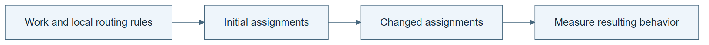

# 07.05 · Let work reorganize under local rules

[Course](../../README.md) · [Theme](../README.md)

**You are here:** Theme 07, Changes and their evidence → lab 5 of 8. [Find this theme in the course map](../../COURSE-MAP.md#theme-07) · [Whole-course mindmap](../../COURSE-MAP.md#whole-course-mindmap).

## What you will build

A small simulation in which queued checks redistribute between two workers.

## Why this matters

A system can change its organization without changing any worker’s skill or improving its final quality.

## Before you start

Complete [07.04: Improve a task skill with a fixed procedure](../step_04_self_improvement/README.md). You need the concepts and the reports named below, not its old chat. If you start here directly, ask the tutor to prepare the listed starting state and explain the missing prerequisite first.

Open the coding agent at the repository root. Read [the tutor skill](../../skills/rsi-tutor/SKILL.md) and this lab's [brief](BRIEF.md). The agent creates a separate sibling workspace named <code>rsi-work/07-05</code> and reports its absolute path. It checks local Python and the [tool requirements](../../tools/README.md) before execution. You do not write code or configuration.

**Starting state:** A generated local simulation with two workers and six labelled check jobs. No agent subworkers are required.

**Budget:** Two main simulations and one optional overhead counterexample; no model fits. Plan about 20–35 minutes of reading and discussion; this is an author estimate, not a measured student duration. Coding-agent inference may use a paid online service. Record its cost separately when available.

## How it works

Give each simulated worker the same fixed rule: take an available job when idle. A shared queue and different job durations produce a changing assignment. Organization emerges from local scheduling rules. Measure completion time and correctness separately; redistribution can help one and harm another.

**A concrete example.** The saved simulation gives six jobs invented durations of 8, 1, 7, 1, 6, and 1 ticks. Alternating fixed assignments leaves one worker with 21 ticks of work and the other with 3. Letting idle workers pull from a shared queue finishes at tick 14. Add three coordination ticks per dynamic assignment and completion moves to tick 23. No worker learned a new skill. The arrangement helped under one cost assumption and hurt under another.


*The duration cards define this teaching fixture; ticks are simulation units, not wall-clock seconds. FCFS means first come, first served; with all jobs arriving together, the listed input order breaks the tie. Both workers can do the same jobs. The machines represent simulated workers, not launched coding agents. Define simultaneous-event tie handling before execution and preserve every job ID. A speed difference matters only after completion and correctness checks. An optional coordination-delay run changes a declared cost assumption and may reverse the result; it does not make the workers learn.*

[Open the illustration at full size](../../assets/illustrations/organization-shared-queue-v1.png).

<details>
<summary>See the step diagram</summary>



*Read the diagram:* Local assignment rules can change who does which work. Reorganization alone does not establish a performance gain.

</details>

## Run the lab

Start with this prompt. The tutor pauses for your prediction before it runs the next step.

```text
Read rsi/AGENTS.md and
rsi/skills/rsi-tutor/SKILL.md.
Guide me through lab 07.05, Let work
reorganize under local rules, one step at a
time.
Read its README and BRIEF. Prepare its
separate workspace.
You write and run the implementation. Keep
the reports and failures.
Ask me to predict the result before the
experiment.
```

**Make a prediction:** Will dynamic assignment always beat a fixed assignment?

### 1. Run fixed assignment

Create a baseline organization.

```text
Generate a deterministic queue simulation
with job durations and expected results. Run
a fixed assignment and save the event trace.
Label durations as synthetic.
```

**Observe:** The baseline organization is visible.

### 2. Allow local reassignment

Observe organization without changing skills.

```text
Run the same jobs with idle workers taking
the next available job. Compare assignment,
completion time, and lost or duplicate jobs.
Keep worker rules fixed.
```

**Observe:** The organization changes through local interaction, not a rewritten ML solver.

## Check your result

Both runs use the same synthetic jobs and worker capabilities. The trace shows reassignment. Any speed claim is confined to this simulation.

### Open these outputs

The agent keeps these in your lab workspace or records the original experiment path when reusing evidence.

| Output | What to inspect |
|---|---|
| Synthetic job specification | Fixes six jobs, durations, expected outputs, and two worker capabilities. |
| Fixed and dynamic event traces | Show assignments, start/finish times, and every completed job. |
| Comparison and overhead case | Report completion time separately from lost, duplicate, or incorrect work; label synthetic timing. |

Ask the agent to open the actual files and show the command exit status. A written description of a run is not a run. Keep a short <code>LAB-NOTE.md</code> with your prediction, measured observation, explanation, and one limit. The tutor must mark skipped learner responses as skipped.

## Try one change

Add a shared-resource bottleneck or communication delay. Predict when dynamic reassignment loses its advantage.

## If something goes wrong

If dynamic routing looks faster because it skipped a job, reconcile job IDs before interpreting time. If the simulation uses random durations, reuse the same generated jobs across policies. If communication delay was added only to one policy, state that assumption and explain why it is part of that policy’s modeled cost.

Say “Stop this lab” to stop further work. Ask the agent to save <code>PROGRESS.md</code> with the last completed step and remaining budget. To resume, have it read that file and inspect active processes first. A reset creates a new sibling workspace; it does not erase failures or alter the source data. See the [recovery rules](../../tools/README.md) for interrupted tool runs.

## Key takeaways

- Self-organization concerns changing arrangement or coordination.
- Organization and capability improvement are different properties.
- Local rules can have global costs.

## Check your understanding

Answer before opening the explanation. You can ask the tutor for a hint.

1. Did the worker skill improve?
2. Why label synthetic durations?
3. Does a new arrangement guarantee improvement?
4. Is this evidence of RSI?

<details>
<summary>Hint</summary>

Keep the work and workers fixed. The property under test is who receives which job, not whether a worker learned a better way to do it.

</details>

<details>
<summary>Explained answers</summary>

1. No. The scheduling arrangement changed while worker rules remained fixed.

2. They are constructed teaching inputs, not measured production performance.

3. No. Bottlenecks, communication, or contention can make it worse.

4. No. No improvement procedure was revised and inherited.

</details>

## What's next

Study a collective pattern and distinguish emergence from improved intelligence. Continue to [07.06: Observe a collective pattern](../step_06_emergence/README.md).
