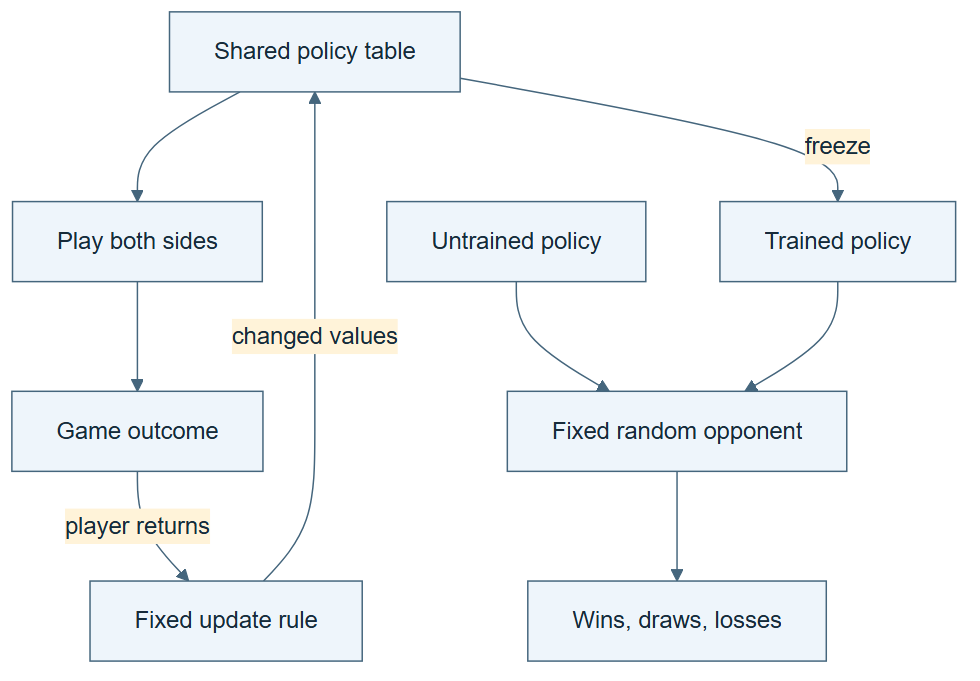

# 07.07 · Learn what self-play does and does not provide

[Course](../../README.md) · [Theme](../README.md)

## What you will build

A bounded proposer–critic exchange and a clear account of what a self-play learning system would add.

## Why this matters

Two interacting roles can expose mistakes, but agreement between them is not a source of ground truth.

## Before you start

Complete [07.06: Observe a collective pattern](../step_06_emergence/README.md). You need the concepts and the reports named below, not its old chat. If you start here directly, ask the tutor to prepare the listed starting state and explain the missing prerequisite first.

Open the coding agent at the repository root. Read [the tutor skill](../../skills/rsi-tutor/SKILL.md) and this lab's [brief](BRIEF.md). The agent creates a separate sibling workspace named <code>rsi-work/07-07</code> and reports its absolute path. It checks local Python and the [tool requirements](../../tools/README.md) before execution. You do not write code or configuration.

**Starting state:** Three labelled experiment proposals: valid, leaked-feature, and final-set selection. Use sequential role passes, not extra agent processes.

**Budget:** Two exchange rounds per proposal, no fits or weight updates. Plan about 20–35 minutes of reading and discussion; this is an author estimate, not a measured student duration. Coding-agent inference may use a paid online service. Record its cost separately when available.

## How it works

In self-play, a system generates experience by playing against versions of itself or by coupling challenge generation with solving. Learning systems use that experience in a declared update. Here you run only a small interaction analogy: one role proposes an ML recipe and another challenges it. You do not train either role, generate a learned curriculum, or establish independent judgment. The domain checker supplies the declared validity check. Separate interaction, feedback, retained change, and evidence of benefit.



*Read the diagram:* This role exchange illustrates interaction. It contains no training update and does not establish self-play learning.

## Run the lab

Start with this prompt. The tutor pauses for your prediction before it runs the next step.

```text
Read rsi/AGENTS.md and rsi/skills/rsi-tutor/SKILL.md.
Guide me through lab 07.07, Learn what self-play does and does not provide, one step at a time.
Read its README and BRIEF. Prepare its separate workspace.
You write and run the implementation. Keep the reports and failures.
Ask me to predict the result before the experiment.
```

**Make a prediction:** Could both roles confidently endorse the same invalid proposal?

### 1. Run the exchange

Make the interaction visible.

```text
Generate three proposal fixtures. For each, run a short proposer explanation and critic response in the current agent. Save the visible arguments and label the shared context. Do not expose or invent hidden reasoning.
```

**Observe:** The exchange produces hypotheses and objections.

### 2. Use an external rule check

Separate debate from validity.

```text
Run the domain rules against each final proposal. Compare the roles’ claims with executable verdicts and record false approvals.
```

**Observe:** Agreement can conflict with the rule-based outcome.

## Check your result

The exchange is bounded. The report labels the interaction analogy and shared context, retains mistakes, and states that no self-play training occurred. Debate does not override the checker.

Ask the agent to open the actual files and show the command exit status. A written description of a run is not a run. Keep a short <code>LAB-NOTE.md</code> with your prediction, measured observation, explanation, and one limit. The tutor must mark skipped learner responses as skipped.

## Try one change

Remove the checker in a labelled simulation and inspect how an unsupported agreement could be accepted.

## If something goes wrong

If the expected artifact is missing, inspect the last command and its exit status before running again. If a check fails, preserve the failing result and diagnose that check; do not weaken it to obtain a pass.

Say “Stop this lab” to stop further work. Ask the agent to save <code>PROGRESS.md</code> with the last completed step and remaining budget. To resume, have it read that file and inspect active processes first. A reset creates a new sibling workspace; it does not erase failures or alter the source data. See the [recovery rules](../../tools/README.md) for interrupted tool runs.

## Key takeaways

- Interaction can generate useful challenges.
- A role exchange alone does not demonstrate self-play learning.
- Correctness needs evidence beyond role agreement.

## Research connection

[SQL-Zero, 4 September 2026](https://arxiv.org/html/2609.04697v1), offers a recent contrast: a challenger generates tasks, database execution supplies feedback, and alternating GRPO steps update the challenger and solver.

This lab illustrates interaction and checking only. It omits SQL generation, curriculum learning, and parameter training. It does not reproduce SQL-Zero or establish the benefits of self-play.

## Check your understanding

Answer before opening the explanation. You can ask the tutor for a hint.

1. Does this exchange demonstrate self-play training?
2. Are the two roles independent evaluators?
3. Can self-play learning occur without RSI?
4. What should resolve an invalid proposal?

<details>
<summary>Hint</summary>

Trace what changed, what stayed fixed, and which observation supports the conclusion. A filename or a confident explanation is not enough evidence.

</details>

<details>
<summary>Explained answers</summary>

1. No. It illustrates challenge and response without an executed training update.

2. No. They share the same context and host unless a real separate boundary is created.

3. Yes. A fixed training procedure can update players without revising the improvement procedure itself.

4. The task’s actual evidence and declared checks, not the number of agreeing roles.

</details>

## What's next

Allow a system to edit its own procedure, then ask whether the edit helps. Continue to [07.08: Make a self-modification inspectable](../step_08_modification/README.md).
