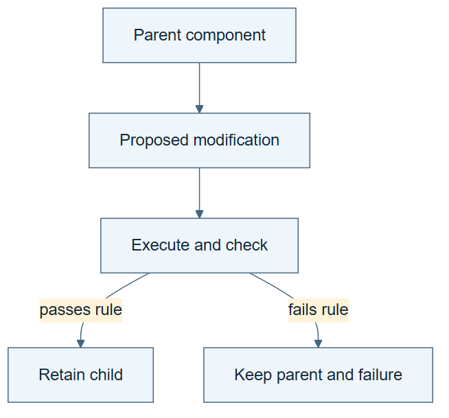

# 07.08 · Make a self-modification inspectable

[Course](../../README.md) · [Theme](../README.md)

## What you will build

A versioned edit to a learner-owned procedure with tests and rollback.

## Why this matters

Writing a change is a capability. Improving the system is a separate result.

## Before you start

Complete [07.07: Learn what self-play does and does not provide](../step_07_self_play/README.md). You need the concepts and the reports named below, not its old chat. If you start here directly, ask the tutor to prepare the listed starting state and explain the missing prerequisite first.

Open the coding agent at the repository root. Read [the tutor skill](../../skills/rsi-tutor/SKILL.md) and this lab's [brief](BRIEF.md). The agent creates a separate sibling workspace named <code>rsi-work/07-08</code> and reports its absolute path. It checks local Python and the [tool requirements](../../tools/README.md) before execution. You do not write code or configuration.

**Starting state:** A learner-owned task skill and its passing and failing cases. Preserve canonical course files.

**Budget:** One edit, two relevant checks, at most two fits. Plan about 20–35 minutes of reading and discussion; this is an author estimate, not a measured student duration. Coding-agent inference may use a paid online service. Record its cost separately when available.

## How it works

Self-modification means the system changes part of its own implementation or instructions. The target can be a prompt, skill, tool, route, or model parameters. The name says what can change, not whether the change is good. Versioning and rollback make the consequence inspectable.

**A concrete example.** An agent changes its learner-owned skill from “report the model score” to “recompute the score from saved predictions before reporting.” That is an inspectable self-modification of its instructions. If the new check rejects a valid result because it aligns rows incorrectly, the modification is real but harmful. Restore the parent while retaining the child and failure.



*Read the diagram:* Self-modification changes a component. Keep its parent and evaluate the change before retaining it.

## Run the lab

Start with this prompt. The tutor pauses for your prediction before it runs the next step.

```text
Read rsi/AGENTS.md and
rsi/skills/rsi-tutor/SKILL.md.
Guide me through lab 07.08, Make a
self-modification inspectable, one step at a
time.
Read its README and BRIEF. Prepare its
separate workspace.
You write and run the implementation. Keep
the reports and failures.
Ask me to predict the result before the
experiment.
```

**Make a prediction:** Can a modification make the system worse while still being genuine self-modification?

### 1. Apply one bounded edit

Identify the mutable surface.

```text
Ask the current agent to revise one
learner-owned task skill using a recorded
failure. Preserve parent and child versions,
explain the changed instruction, and keep
the evaluator fixed.
```

**Observe:** The change has a clear target and ancestry.

### 2. Check and roll back if needed

Separate modification from acceptance.

```text
Run the relevant passing and failing cases.
Use the declared acceptance rule. If the
child regresses, restore the parent as
active while keeping the child and its
evidence.
```

**Observe:** A rejection is retained as part of the history.

## Check your result

The changed surface, parent, child, checks, and active version are recorded. The outcome does not receive an automatic improvement label.

### Open these outputs

The agent keeps these in your lab workspace or records the original experiment path when reusing evidence.

| Output | What to inspect |
|---|---|
| Parent/child skill files and change note | Identify the agent-owned surface, exact edit, and reason. |
| Two check outcomes | Cover a valid case and the failure that motivated the edit. |
| Active-version record | Shows which version remains active and links any rejected child to its evidence. |

Ask the agent to open the actual files and show the command exit status. A written description of a run is not a run. Keep a short <code>LAB-NOTE.md</code> with your prediction, measured observation, explanation, and one limit. The tutor must mark skipped learner responses as skipped.

## Try one change

Propose deleting a check to make more candidates pass. Explain why that changes acceptance rather than demonstrating better task performance.

## If something goes wrong

If the agent edits a canonical course skill, preserve the diff and move the experiment to a learner-owned copy. If it removes an external success criterion to make the child pass, reject that comparison. An internal selection change is a different candidate procedure; it still needs unchanged external evaluation.

Say “Stop this lab” to stop further work. Ask the agent to save <code>PROGRESS.md</code> with the last completed step and remaining budget. To resume, have it read that file and inspect active processes first. A reset creates a new sibling workspace; it does not erase failures or alter the source data. See the [recovery rules](../../tools/README.md) for interrupted tool runs.

## Key takeaways

- Self-modification describes a change mechanism.
- Improvement requires an evaluation beyond the edit itself.
- Rollback preserves a usable system without erasing evidence.

## Check your understanding

Answer before opening the explanation. You can ask the tutor for a hint.

1. Is every self-modification an improvement?
2. Does changing a prompt train model weights?
3. Why keep the evaluator fixed?
4. When does recursion enter?

<details>
<summary>Hint</summary>

Self-modification answers “what can change?” Improvement answers “did that change help under the declared test?” Neither word supplies the other’s evidence.

</details>

<details>
<summary>Explained answers</summary>

1. No. It can be neutral, harmful, or invalid.

2. No. It changes an external instruction surface.

3. Otherwise apparent improvement may come from weakening the definition of success.

4. When an improvement procedure itself changes and that changed procedure governs later improvement work.

</details>

## What's next

You can name the mechanisms. Now strengthen the comparisons used to judge them. Continue to [08.01: Distinguish a result from a reliable comparison](../../08_measuring_improvement/step_01_repeat_measurement/README.md).
