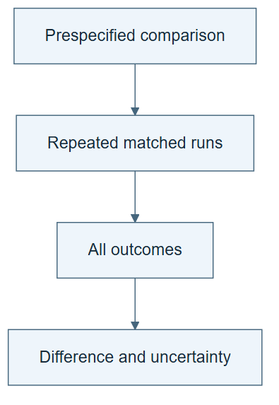

# 08.01 · Distinguish a result from a reliable comparison

[Course](../../README.md) · [Theme](../README.md)

## What you will build

A repeated comparison with paired seeds and an explicit uncertainty statement.

## Why this matters

One favorable result can reflect randomness or a convenient sample. Repetition helps reveal instability.

## Before you start

Complete [07.08: Make a self-modification inspectable](../../07_understanding_self_star/step_08_modification/README.md). You need the concepts and the reports named below, not its old chat. If you start here directly, ask the tutor to prepare the listed starting state and explain the missing prerequisite first.

Open the coding agent at the repository root. Read [the tutor skill](../../skills/rsi-tutor/SKILL.md) and this lab's [brief](BRIEF.md). The agent creates a separate sibling workspace named <code>rsi-work/08-01</code> and reports its absolute path. It checks local Python and the [tool requirements](../../tools/README.md) before execution. You do not write code or configuration.

**Starting state:** Two frozen model recipes and one fixed task contract.

**Budget:** Six fits: three paired seeds for two small tree-based recipes. No seed selection after results. Plan about 20–35 minutes of reading and discussion; this is an author estimate, not a measured student duration. Coding-agent inference may use a paid online service. Record its cost separately when available.

## How it works

Use the same prespecified seeds for both recipes. Compare paired differences, retain all runs, and report their spread. Three seeds are a small demonstration, not a precise population estimate. Deterministic recipes may show no seed variation; that does not eliminate uncertainty from data choice.

**A concrete example.** Suppose the illustrative paired differences, forest MAE minus tree MAE, are −8, +2, and −6. The mean is −4: forest is better on average because lower MAE is better. The positive pair still matters. Showing only −8 would hide instability, and all three pairs still use only one dataset and partition.



*Read the diagram:* A repeated comparison reveals variation. One favorable run cannot establish a reliable advantage.

## Run the lab

Start with this prompt. The tutor pauses for your prediction before it runs the next step.

```text
Read rsi/AGENTS.md and
rsi/skills/rsi-tutor/SKILL.md.
Guide me through lab 08.01, Distinguish a
result from a reliable comparison, one step
at a time.
Read its README and BRIEF. Prepare its
separate workspace.
You write and run the implementation. Keep
the reports and failures.
Ask me to predict the result before the
experiment.
```

**Make a prediction:** If all three differences favor one recipe, what uncertainty remains?

### 1. Predeclare repetitions

Prevent favorable seed selection.

```text
Write a plan comparing tree and forest on
calendar inputs with seeds 17, 29, and 43.
Fix the split and metric. Explain that model
and complexity differ and that the goal is
stability of this comparison.
```

**Observe:** Every planned run is named before results.

### 2. Run and summarize

Show the whole distribution of outcomes.

```text
Execute all six fits in separate or
compatible bounded workspaces. Report paired
MAE differences, mean, range, and total
measured fit time. Generate a plot from
actual values. Do not claim statistical
certainty from three seeds.
```

**Observe:** The report includes unfavorable pairs as well as favorable ones.

## Check your result

All six planned runs appear, or missing runs are explained. No seed is discarded. Uncertainty includes task and data limitations.

### Open these outputs

The agent keeps these in your lab workspace or records the original experiment path when reusing evidence.

| Output | What to inspect |
|---|---|
| Repetition plan | Freezes two recipes, calendar inputs, the split, MAE, and seeds 17, 29, and 43. |
| Six run records and paired plot | Keep every attempted pair, signs, failures, and actual measured costs. |
| Uncertainty statement | Separates seed variation from uncertainty about tasks, data, and model choices. |

Ask the agent to open the actual files and show the command exit status. A written description of a run is not a run. Keep a short <code>LAB-NOTE.md</code> with your prediction, measured observation, explanation, and one limit. The tutor must mark skipped learner responses as skipped.

## Try one change

Calculate how the conclusion changes if only the best seed is shown. Label that selection as misleading.

## If something goes wrong

If a paired difference has an unclear sign, write the subtraction order and metric direction beside the table. If one fit fails, retain the missing pair and report why; do not replace its seed after seeing the other scores. Identical predictions across seeds can be correct for a deterministic operation, not proof of universal stability.

Say “Stop this lab” to stop further work. Ask the agent to save <code>PROGRESS.md</code> with the last completed step and remaining budget. To resume, have it read that file and inspect active processes first. A reset creates a new sibling workspace; it does not erase failures or alter the source data. See the [recovery rules](../../tools/README.md) for interrupted tool runs.

## Key takeaways

- Repeated paired comparisons expose some variability.
- Best-run reporting hides selection opportunities.
- Seed stability does not establish task generality.

## Check your understanding

Answer before opening the explanation. You can ask the tutor for a hint.

1. Why pair seeds?
2. Can three seeds prove a universal gain?
3. What if predictions are identical across seeds?
4. Why count failed runs?

<details>
<summary>Hint</summary>

Ask what varied and what never varied. Repeating seeds cannot answer a question about a dataset that was never changed.

</details>

<details>
<summary>Explained answers</summary>

1. It makes the comparison conditions more similar and can reduce irrelevant variation.

2. No. They provide a small stability check on one task and split.

3. The recipe may be deterministic; uncertainty from datasets and task choice remains.

4. They consume resources and affect reliability, even without a valid score.

</details>

## What's next

Separate selection feedback from the final check. Continue to [08.02: Freeze selection before final evaluation](../step_02_final_boundary/README.md).
