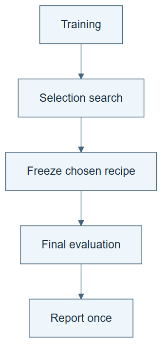

# 08.02 · Freeze selection before final evaluation

[Course](../../README.md) · [Theme](../README.md)

## What you will build

A selected recipe evaluated once on the final public partition, with further search closed.

## Why this matters

A test repeatedly used to choose changes becomes part of the selection process.

## Before you start

Complete [08.01: Distinguish a result from a reliable comparison](../step_01_repeat_measurement/README.md). You need the concepts and the reports named below, not its old chat. If you start here directly, ask the tutor to prepare the listed starting state and explain the missing prerequisite first.

Open the coding agent at the repository root. Read [the tutor skill](../../skills/rsi-tutor/SKILL.md) and this lab's [brief](BRIEF.md). The agent creates a separate sibling workspace named <code>rsi-work/08-02</code> and reports its absolute path. It checks local Python and the [tool requirements](../../tools/README.md) before execution. You do not write code or configuration.

Use 08-02 for the selection decision and lesson notes. Run final evaluation in the original experiment workspace, where its contract and candidate ledger already exist. Do not create a replacement experiment or reset its attempts.

**Starting state:** A completed selection ledger and one preselected candidate. Use its original workspace.

**Budget:** One final evaluation; no subsequent selection in that workspace. Plan about 20–35 minutes of reading and discussion; this is an author estimate, not a measured student duration. Coding-agent inference may use a paid online service. Record its cost separately when available.

## How it works

Selection chooses a recipe using development feedback. Final evaluation measures that frozen choice on another partition. The local tool locks selection before final scoring. This enforces a workflow for a cooperative agent, but the source remains public and readable. An adversarial or truly hidden evaluation needs separate control.




*Read the diagram:* Freeze selection before final evaluation. Final feedback does not flow back into ordinary selection.


## Run the lab

Start with this prompt. The tutor pauses for your prediction before it runs the next step.

```text
Read rsi/AGENTS.md and rsi/skills/rsi-tutor/SKILL.md.
Guide me through lab 08.02, Freeze selection before final evaluation, one step at a time.
Read its README and BRIEF. Prepare its separate workspace.
You write and run the implementation. Keep the reports and failures.
Ask me to predict the result before the experiment.
```

**Make a prediction:** What should happen if you request a new candidate after seeing the final score?

### 1. Freeze the choice

Commit before observing final outcomes.

```text
Write SELECTION-DECISION.md with the chosen candidate, recipe, reason, and source contract. Confirm no final results were used to choose it.
```

**Observe:** The retained object is unambiguous.

### 2. Evaluate once

Test the lock as well as the score.

```text
Run the supplied final evaluation for that candidate. Inspect FINAL.md and predictions. Then attempt another selection fit and retain the refusal. Do not reopen the workspace.
```

**Observe:** The score exists and post-final search is blocked.

## Check your result

Final evaluation uses the recorded recipe and original training rows. A later fit request is rejected. The report states that the source is public.

Ask the agent to open the actual files and show the command exit status. A written description of a run is not a run. Keep a short <code>LAB-NOTE.md</code> with your prediction, measured observation, explanation, and one limit. The tutor must mark skipped learner responses as skipped.

## Try one change

Describe a separate evaluation service where the candidate cannot read cases or edit scoring. List which boundary is stronger than the local exercise.

## If something goes wrong

If the expected artifact is missing, inspect the last command and its exit status before running again. If a check fails, preserve the failing result and diagnose that check; do not weaken it to obtain a pass.

Say “Stop this lab” to stop further work. Ask the agent to save <code>PROGRESS.md</code> with the last completed step and remaining budget. To resume, have it read that file and inspect active processes first. A reset creates a new sibling workspace; it does not erase failures or alter the source data. See the [recovery rules](../../tools/README.md) for interrupted tool runs.

## Key takeaways

- Data roles depend on how information is used.
- Final evaluation follows a frozen choice.
- A workflow lock is different from access isolation.

## Check your understanding

Answer before opening the explanation. You can ask the tutor for a hint.

1. What happens when final feedback guides another edit?
2. Why lock before evaluation rather than after?
3. Does a filename called heldout make data secret?
4. Can the public-data result still be useful?

<details>
<summary>Hint</summary>

Trace what changed, what stayed fixed, and which observation supports the conclusion. A filename or a confident explanation is not enough evidence.

</details>

<details>
<summary>Explained answers</summary>

1. Those cases have become development information for that edit; a fresh final test is needed.

2. An interrupted final run may already expose information. The lock prevents unnoticed reuse.

3. No. Actual permissions and context boundaries determine access.

4. Yes, as a reproducible teaching comparison with its exposure limits stated.

</details>

## What's next

Measure the resources used to obtain the retained result. Continue to [08.03: Count the cost of research](../step_03_cost/README.md).
