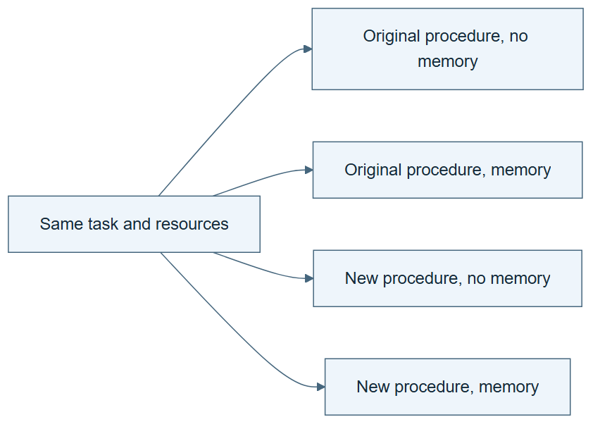

# 08.04 · Separate the effects of memory and procedure changes

[Course](../../README.md) · [Theme](../README.md)

**You are here:** Theme 08, Changes and their evidence → lab 4 of 6. [Find this theme in the course map](../../COURSE-MAP.md#theme-08) · [Whole-course mindmap](../../COURSE-MAP.md#whole-course-mindmap).

## What you will build

A small factorial comparison of memory and a task-skill revision.

## Why this matters

Changing two components at once makes it hard to know which helped or harmed.

## Before you start

Complete [08.03: Count the cost of research](../step_03_cost/README.md). You need the concepts and the reports named below, not its old chat. If you start here directly, ask the tutor to prepare the listed starting state and explain the missing prerequisite first.

Open the coding agent at the repository root. Read [the tutor skill](../../skills/rsi-tutor/SKILL.md) and this lab's [brief](BRIEF.md). The agent keeps this lab's notes in <code>rsi-work/08-04</code>, outside the repository, and reports the absolute path. If the lab continues an earlier experiment, keep that experiment in its original workspace with its existing budget and locks. A new notes folder does not reset an experiment. The agent checks local Python and the [tool requirements](../../tools/README.md) before execution. You do not write code or configuration.

**Starting state:** A frozen memory note, parent skill, child skill, and prespecified task fixtures.

**Budget:** Four main arms, each with one fit or one executable check. The separately declared follow-up adds one check, or one fit if needed. Plan about 20–35 minutes of reading and discussion; this is an author estimate, not a measured student duration. Coding-agent inference may use a paid online service. Record its cost separately when available.

## How it works

Compare parent without memory, parent with memory, child without memory, and child with memory. The combined effect can differ from the sum of separate effects. Keep starting state and resources matched. This tests the selected components on selected tasks, not all possible memories or skills.

**A concrete example.** In the [four-arm decision replay](../../evidence/2026-09-20/self-star-and-measurement/08-04/INTERPRETATION.md), the parent chooses the majority baseline, scoring 0.5. The changed skill chooses the checked linear candidate, scoring about 0.745. A restrictive memory says to keep majority until a slice note exists; this fixture has none. Memory changes nothing for the parent but blocks the child’s useful choice. This interaction depends on the declared rule order and cached candidates, not a measured LLM prompt conflict.


*Four deterministic choices over checked predictions. The fifth rule-removal follow-up is kept separate.*


*Keep the same memory version in both memory-present arms and the same parent or child instructions across its row. The blank records do not assume the child wins or memory helps. Differences between the two memory effects describe an interaction in these observations; noisy results need uncertainty analysis before a broader claim. The four main checks or fits and the separate follow-up have distinct budgets. Fresh folders do not isolate agent knowledge. The lesson’s archived worked example replays deterministic decisions over cached predictions; it is not an LLM training experiment.*

[Open the illustration at full size](../../assets/illustrations/memory-skill-factorial-v1.png).

<details>
<summary>See the step diagram</summary>



*Read the diagram:* The four conditions separate memory and procedure changes. They also reveal whether the changes interact.

</details>

## Run the lab

Start with this prompt. The tutor pauses for your prediction before it runs the next step.

```text
Read rsi/AGENTS.md and
rsi/skills/rsi-tutor/SKILL.md.
Guide me through lab 08.04, Separate the
effects of memory and procedure changes, one
step at a time.
Read its README and BRIEF. Prepare its
separate workspace.
You write and run the implementation. Keep
the reports and failures.
Ask me to predict the result before the
experiment.
```

**Make a prediction:** Could useful memory become harmful when paired with a changed skill?

### 1. Declare four arms

Separate main effects and interaction.

```text
Write ABLATION-PLAN.md with the four
component combinations, same task, same
budget, and fixed acceptance metric.
Identify possible conflicting instructions.
```

**Observe:** Each arm answers a distinct comparison.

### 2. Execute the comparison

Retain interactions and failures.

```text
Run all arms from clean starting state where
possible. Record context boundaries, actual
decisions, results, and costs. Explain
whether the combination behaves differently
from the individual changes.
```

**Observe:** A component’s effect can depend on the other component.

## Check your result

All arms are present and differ only in declared components. Shared-context limitations are stated. No favorable arm is relabelled as the only planned comparison.

### Open these outputs

The agent keeps these in your lab workspace or records the original experiment path when reusing evidence.

| Output | What to inspect |
|---|---|
| ABLATION-PLAN.md | Freezes all four memory/skill combinations, inputs, metric, and per-arm budget. |
| Four decision and outcome records | Include context boundaries, failures, and measured costs. |
| Effect comparison | Compares memory within each skill version and skill change within each memory condition. |
| Separate follow-up record | Preserves the removed rule, both memory versions, affected arm, outcome, and additional check or fit cost. |

Ask the agent to open the actual files and show the command exit status. A written description of a run is not a run. Keep a short <code>LAB-NOTE.md</code> with your prediction, measured observation, explanation, and one limit. The tutor must mark skipped learner responses as skipped.

## Try one change

Remove one conflicting memory rule and check one affected arm in a separately declared follow-up. Keep all other conditions fixed. Preserve both memory versions and the extra check or fit cost. Do not merge this fifth result into the original four-arm experiment.

## If something goes wrong

If one arm inherits an earlier arm’s conclusions through shared context, record that limitation before interpreting attribution. Fresh folders isolate artifacts, not the coding agent’s knowledge. If an arm crashes, retain the failure as an outcome. A repaired or newly edited memory is a follow-up, not a hidden substitution into the original four arms.

Say “Stop this lab” to stop further work. Ask the agent to save <code>PROGRESS.md</code> with the last completed step and remaining budget. To resume, have it read that file and inspect active processes first. A reset creates a new sibling workspace; it does not erase failures or alter the source data. See the [recovery rules](../../tools/README.md) for interrupted tool runs.

## Key takeaways

- Ablations help attribute an observed effect.
- Components can interact.
- Follow-up hypotheses need new records.

## Check your understanding

Answer before opening the explanation. You can ask the tutor for a hint.

1. Why use four arms instead of two?
2. What is an interaction here?
3. Does a small ablation identify every cause?
4. Why preserve an arm that crashes?

<details>
<summary>Hint</summary>

Compare memory on versus off twice: once for the parent, once for the child. Different effects reveal an interaction.

</details>

<details>
<summary>Explained answers</summary>

1. They separate the effects of memory, skill change, and their combination.

2. The effect of one component changes depending on whether the other is present.

3. No. It addresses the controlled components and can still have context or sampling confounds.

4. Reliability is part of the outcome and its resource use remains part of the comparison.

</details>

## What's next

Freeze a retained skill and test a task it did not help select. Continue to [08.05: Test whether the lesson transfers](../step_05_transfer/README.md).
