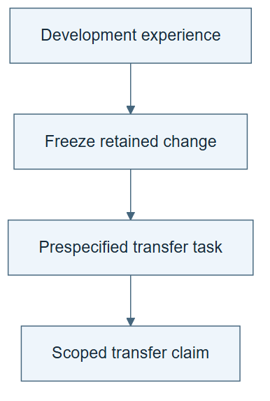

# 08.05 · Test whether the lesson transfers

[Course](../../README.md) · [Theme](../README.md)

## What you will build

A transfer report that applies a frozen research skill to wine classification.

## Why this matters

A procedure tuned on one regression dataset may encode assumptions that fail elsewhere.

## Before you start

Complete [08.04: Separate the effects of memory and procedure changes](../step_04_ablation/README.md). You need the concepts and the reports named below, not its old chat. If you start here directly, ask the tutor to prepare the listed starting state and explain the missing prerequisite first.

Open the coding agent at the repository root. Read [the tutor skill](../../skills/rsi-tutor/SKILL.md) and this lab's [brief](BRIEF.md). The agent creates a separate sibling workspace named <code>rsi-work/08-05</code> and reports its absolute path. It checks local Python and the [tool requirements](../../tools/README.md) before execution. You do not write code or configuration.

**Starting state:** A selected frozen research skill and the wine task brief. No wine results used to write that skill.

**Budget:** Four wine fits: two per parent and child procedure. Plan about 20–35 minutes of reading and discussion; this is an author estimate, not a measured student duration. Coding-agent inference may use a paid online service. Record its cost separately when available.

## How it works

Transfer asks whether a retained change helps in a different setting. Keep the skill frozen while adapting only task-specific interfaces required by the brief. Record any necessary adaptation. If you rewrite the skill after seeing wine outcomes, that becomes wine development, not the original transfer test.

**A concrete example.** A bike-derived rule says “prefer the lowest error.” Before the wine run, you map that interface to maximizing balanced accuracy while preserving the rule’s principle of using the declared metric. Changing the candidate policy after viewing wine failures is different: the target task has now supplied development feedback.



*Read the diagram:* Freeze the learned change before testing a new task. New-task feedback must not silently tune the candidate being evaluated.

## Run the lab

Start with this prompt. The tutor pauses for your prediction before it runs the next step.

```text
Read rsi/AGENTS.md and
rsi/skills/rsi-tutor/SKILL.md.
Guide me through lab 08.05, Test whether the
lesson transfers, one step at a time.
Read its README and BRIEF. Prepare its
separate workspace.
You write and run the implementation. Keep
the reports and failures.
Ask me to predict the result before the
experiment.
```

**Make a prediction:** Which bike-specific advice could fail on imbalanced classification?

### 1. Freeze and map

Separate general procedure from task-specific facts.

```text
Record parent and child hashes. Map their
instructions to the wine task without
reading new results. Flag bike-specific
assumptions, such as minimizing MAE, before
execution.
```

**Observe:** The transfer conditions are explicit.

### 2. Run both procedures

Observe generalization and negative transfer.

```text
Give each procedure two wine fits under the
same classification contract. Compare
retained balanced accuracy, both class
recalls, decisions, and costs. Keep any
failed transfer.
```

**Observe:** A useful regression procedure can be neutral or harmful here.

## Check your result

The procedure version is frozen before wine outcomes. Task-interface changes are documented. The result is not used to rewrite the original claim retroactively.

### Open these outputs

The agent keeps these in your lab workspace or records the original experiment path when reusing evidence.

| Output | What to inspect |
|---|---|
| Frozen skill hashes and interface map | Separate reusable procedure from predeclared target, metric, and model-interface changes. |
| Four wine fit records | Give each procedure two attempts under the same classification contract. |
| Transfer report | Includes balanced accuracy, both class recalls, known costs, and any harmful transfer. |

Ask the agent to open the actual files and show the command exit status. A written description of a run is not a run. Keep a short <code>LAB-NOTE.md</code> with your prediction, measured observation, explanation, and one limit. The tutor must mark skipped learner responses as skipped.

## Try one change

Use the observed failure to propose a new skill version, but label its evaluation as a new development round requiring fresh transfer cases.

## If something goes wrong

If the skill contains bike-only features, record the incompatibility before execution and decide the required interface adaptation openly. If wine outcomes were already used to write the skill, call this development or replay, not an unseen transfer test. Preserve failed transfer instead of quietly rewriting the candidate to make it succeed.

Say “Stop this lab” to stop further work. Ask the agent to save <code>PROGRESS.md</code> with the last completed step and remaining budget. To resume, have it read that file and inspect active processes first. A reset creates a new sibling workspace; it does not erase failures or alter the source data. See the [recovery rules](../../tools/README.md) for interrupted tool runs.

## Key takeaways

- Transfer tests the scope of a retained lesson.
- Necessary interface adaptation must be visible.
- Negative transfer is informative evidence.

## Check your understanding

Answer before opening the explanation. You can ask the tutor for a hint.

1. Why freeze the skill first?
2. Can a metric name be adapted without changing the research principle?
3. Does failure on wine invalidate the bike result?
4. What follows a transfer-informed edit?

<details>
<summary>Hint</summary>

Separate a predeclared adapter from a result-informed edit. Only the latter uses the transfer outcome to create a new procedure.

</details>

<details>
<summary>Explained answers</summary>

1. Otherwise the transfer cases can influence the candidate being tested.

2. Sometimes, if that interface adaptation is declared before results and the principle remains fixed.

3. No. It limits the result’s scope and reveals a transfer problem.

4. A new version and a new evaluation on cases not used for that edit.

</details>

## What's next

Practice rejecting an apparent improvement produced by a misleading metric. Continue to [08.06: Reject a misleading win and roll back](../step_06_rollback/README.md).
