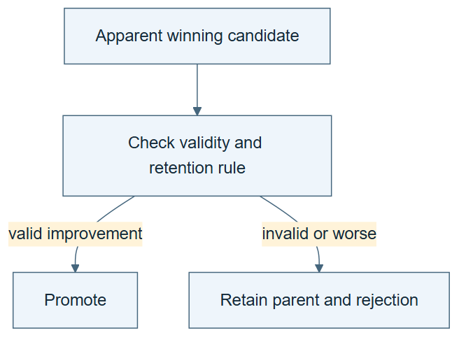

# 08.06 · Reject a misleading win and roll back

[Course](../../README.md) · [Theme](../README.md)

**You are here:** Theme 08, Changes and their evidence → lab 6 of 6. [Find this theme in the course map](../../COURSE-MAP.md#theme-08) · [Whole-course mindmap](../../COURSE-MAP.md#whole-course-mindmap).

## What you will build

A promotion decision that rejects a superficially strong but invalid candidate.

## Why this matters

A reliable improvement system must preserve its definition of success when a tempting result appears.

## Before you start

Complete [08.05: Test whether the lesson transfers](../step_05_transfer/README.md). You need the concepts and the reports named below, not its old chat. If you start here directly, ask the tutor to prepare the listed starting state and explain the missing prerequisite first.

Open the coding agent at the repository root. Read [the tutor skill](../../skills/rsi-tutor/SKILL.md) and this lab's [brief](BRIEF.md). The agent creates a separate sibling workspace named <code>rsi-work/08-06</code> and reports its absolute path. It checks local Python and the [tool requirements](../../tools/README.md) before execution. You do not write code or configuration.

**Starting state:** The wine baseline and a labelled report that emphasizes accuracy while omitting positive recall.

**Budget:** No new fits if predictions exist; one metric recomputation. Plan about 20–35 minutes of reading and discussion; this is an author estimate, not a measured student duration. Coding-agent inference may use a paid online service. Record its cost separately when available.

## How it works

A majority classifier can be accurate on imbalanced data while detecting no positive cases. The declared primary metric is balanced accuracy. Changing the promotion metric after observing results creates a different experiment. Rollback restores the retained valid version while preserving the rejected proposal and evidence.

**A concrete example.** The [rollback fixture](../../evidence/2026-09-20/self-star-and-measurement/08-06/PROMOTION.md) temporarily activates an instruction that promotes the majority model for its 87.1% ordinary accuracy. Recalculation shows positive recall 0 and balanced accuracy 0.5. The declared objective has not changed. Reject the promotion and restore the exact prior instruction, retaining the invalid version and its evidence. Choosing accuracy for a genuinely new task requires a separate objective and an explicit tradeoff.


*The constant predictor has recalls one and zero when both classes occur, giving balanced accuracy 0.5. The failure concerns this fixture's unsupported promotion and omitted evidence; a majority baseline is not invalid for every task and is not automatically worse than every candidate. Checklist marks describe required checks, not a new execution. Restore the prior valid version only if the fixture replaced it. A new accuracy objective requires an explicit new task and tradeoff; it cannot relabel the earlier comparison.*

[Open the illustration at full size](../../assets/illustrations/metric-switch-and-rollback-v1.png).

<details>
<summary>See the step diagram</summary>



*Read the diagram:* A lower reported error does not override invalid evidence. Rollback preserves both the parent and the rejected record.

</details>

## Run the lab

Start with this prompt. The tutor pauses for your prediction before it runs the next step.

```text
Read rsi/AGENTS.md and
rsi/skills/rsi-tutor/SKILL.md.
Guide me through lab 08.06, Reject a
misleading win and roll back, one step at a
time.
Read its README and BRIEF. Prepare its
separate workspace.
You write and run the implementation. Keep
the reports and failures.
Ask me to predict the result before the
experiment.
```

**Make a prediction:** Should a candidate with high ordinary accuracy but zero positive recall be promoted under the declared rule?

### 1. Audit the win

Recompute the metric that was promised.

```text
Calculate ordinary accuracy, both class
recalls, and balanced accuracy from the
majority baseline predictions. Compare the
promotional summary with the task contract.
```

**Observe:** The apparently strong accuracy coexists with balanced accuracy 0.5.

### 2. Reject and restore

Keep the evidence while restoring the active version.

```text
Write PROMOTION.md rejecting any unsupported
metric-switch claim. Restore the previously
valid active skill or recipe if it was
replaced in the fixture. Keep the rejected
version, reason, and cost.
```

**Observe:** Rollback changes the active choice without erasing history.

## Check your result

The decision uses the predeclared metric and validity rules. Rejected artifacts remain available. No performance claim comes from changing the evaluator.

### Open these outputs

The agent keeps these in your lab workspace or records the original experiment path when reusing evidence.

| Output | What to inspect |
|---|---|
| Metric audit | Recomputes accuracy, both recalls, and balanced accuracy from the same prediction rows. |
| PROMOTION.md | Uses the declared objective and rejects the unsupported metric-switch claim. |
| Rollback record | Restores the prior active version if the fixture replaced it, while retaining the rejected candidate. |

Ask the agent to open the actual files and show the command exit status. A written description of a run is not a run. Keep a short <code>LAB-NOTE.md</code> with your prediction, measured observation, explanation, and one limit. The tutor must mark skipped learner responses as skipped.

## Try one change

Create a genuinely new task where overall accuracy is the chosen objective. Explain why its results belong in a separate record with a stated tradeoff.

## If something goes wrong

If one class disappears from the prediction/target join, repair the diagnostic join before interpreting recall. Do not silently drop those rows. If no active version was actually changed, record a rejection without inventing a rollback event. Choosing accuracy for a genuinely new task requires a new stated objective and tradeoff.

Say “Stop this lab” to stop further work. Ask the agent to save <code>PROGRESS.md</code> with the last completed step and remaining budget. To resume, have it read that file and inspect active processes first. A reset creates a new sibling workspace; it does not erase failures or alter the source data. See the [recovery rules](../../tools/README.md) for interrupted tool runs.

## Key takeaways

- A metric switch can manufacture an apparent gain.
- Promotion rules should precede results.
- Rollback and retained failures are part of reliable improvement.

## Check your understanding

Answer before opening the explanation. You can ask the tutor for a hint.

1. Why can majority accuracy be high?
2. What does balanced accuracy expose?
3. Can the objective ever change legitimately?
4. Does rejecting a candidate mean the system failed?

<details>
<summary>Hint</summary>

Inspect the class the model never recognizes. Overall accuracy can conceal that failure; balanced accuracy gives each class recall equal weight.

</details>

<details>
<summary>Explained answers</summary>

1. Most rows belong to one class, so predicting it often is correct despite failing the minority.

2. The average of class recalls, including zero recall for the ignored class.

3. Yes, through a new declared task or protocol, not an unnoticed post-result switch.

4. No. Correct rejection can show that its evaluation and retention process worked.

</details>

## What's next

Use these evidence rules to distinguish solver improvement from improvement of the improver. Continue to [09.01: Identify the solver, improver, and evaluator](../../09_recursive_self_improvement/step_01_three_objects/README.md).
