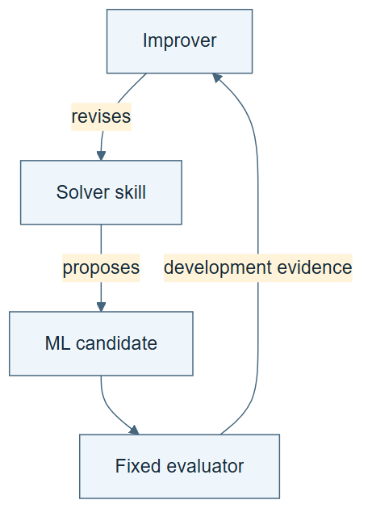

# 09.01 · Identify the solver, improver, and evaluator

[Course](../../README.md) · [Theme](../README.md)

## What you will build

A map of three distinct components and the changes each may make.

## Why this matters

“The system improved itself” is too vague to inspect until you identify the system boundary and mutable object.

## Before you start

Complete [08.06: Reject a misleading win and roll back](../../08_measuring_improvement/step_06_rollback/README.md). You need the concepts and the reports named below, not its old chat. If you start here directly, ask the tutor to prepare the listed starting state and explain the missing prerequisite first.

Open the coding agent at the repository root. Read [the tutor skill](../../skills/rsi-tutor/SKILL.md) and this lab's [brief](BRIEF.md). The agent creates a separate sibling workspace named <code>rsi-work/09-01</code> and reports its absolute path. It checks local Python and the [tool requirements](../../tools/README.md) before execution. You do not write code or configuration.

**Starting state:** The task skill, fixed improver, evaluator contract, and version history.

**Budget:** No fits. One component and permission map. Plan about 20–35 minutes of reading and discussion; this is an author estimate, not a measured student duration. Coding-agent inference may use a paid online service. Record its cost separately when available.

## How it works

The solver runs ML research. The improver proposes and tests changes to the solver’s procedure. The external evaluator measures outcomes under fixed rules. An improver may change its internal proposal-ranking or promotion rule; that changed procedure is still judged by the unchanged external comparison. Recursion concerns changes to an improvement procedure that later participates in improvement. An extra loop around a solver does not establish that relationship by itself.

**A concrete example.** Changing a tree depth changes the ML candidate. Adding “inspect error by hour” changes the research skill that proposes candidates. Adding “recompute every reported score before promoting a research-skill edit” changes the improver. The edit text can look small at all three levels. What matters is which later decisions it governs.



*Read the diagram:* The solver proposes task experiments. The improver changes that solver procedure. The evaluator measures outcomes.

## Run the lab

Start with this prompt. The tutor pauses for your prediction before it runs the next step.

```text
Read rsi/AGENTS.md and
rsi/skills/rsi-tutor/SKILL.md.
Guide me through lab 09.01, Identify the
solver, improver, and evaluator, one step at
a time.
Read its README and BRIEF. Prepare its
separate workspace.
You write and run the implementation. Keep
the reports and failures.
Ask me to predict the result before the
experiment.
```

**Make a prediction:** If only a tree depth changes, which component has changed?

### 1. Draw the boundaries

Name the objects before classifying the result.

```text
Create COMPONENTS.md with solver, improver,
evaluator, inputs, outputs, writable
artifacts, and version hashes. Identify who
or what currently supplies each role.
```

**Observe:** The word self has an explicit referent.

### 2. Classify three changes

Test the map on concrete examples.

```text
Classify a new model setting, a revised task
skill, and a revised improver rule. For each
state what later behavior would need to
change and what evidence would show it.
```

**Observe:** The three edits support different claims.

## Check your result

The evaluator is outside the ordinary mutable surface. The map distinguishes host model, task model, task skill, and improver procedure.

### Open these outputs

The agent keeps these in your lab workspace or records the original experiment path when reusing evidence.

| Output | What to inspect |
|---|---|
| COMPONENTS.md | Separates the host model, task model, research skill, improver, and external evaluator, with writable surfaces. |
| Three classified edits | Explain a model setting, task-skill revision, and improver-rule revision. |
| Boundary counterexample | Contrasts legitimate internal selection changes with an invalid post-result change to the external metric. |

Ask the agent to open the actual files and show the command exit status. A written description of a run is not a run. Keep a short <code>LAB-NOTE.md</code> with your prediction, measured observation, explanation, and one limit. The tutor must mark skipped learner responses as skipped.

## Try one change

In a labelled diagram, let a candidate change the external final metric after seeing its result. Explain why that invalidates the comparison. Contrast it with a candidate improver changing its internal proposal-selection rule while the external metric, final cases, and resource budget stay fixed.

## If something goes wrong

If the same agent performs several roles, name that shared authority rather than drawing an imaginary independent evaluator. If every promotion rule is marked immutable, distinguish the candidate improver’s internal rule from the external protocol that judges it. Recursion needs a changed improvement procedure to govern later work, not merely another nested loop.

Say “Stop this lab” to stop further work. Ask the agent to save <code>PROGRESS.md</code> with the last completed step and remaining budget. To resume, have it read that file and inspect active processes first. A reset creates a new sibling workspace; it does not erase failures or alter the source data. See the [recovery rules](../../tools/README.md) for interrupted tool runs.

## Key takeaways

- Name the mutable object before naming the mechanism.
- The task model and the coding agent are different models.
- Evaluation rules must remain stable for the claimed comparison.

## Check your understanding

Answer before opening the explanation. You can ask the tutor for a hint.

1. Is changing tree depth recursive improvement?
2. What does a revised task skill change?
3. What does a revised improver change?
4. Why keep evaluation separate?

<details>
<summary>Hint</summary>

Ask two questions for each rule: whose decision does it govern, and what unchanged evidence will judge the consequence of changing it?

</details>

<details>
<summary>Explained answers</summary>

1. It is ordinary task-model search under the current procedure.

2. How the solver carries out future task work.

3. How later procedure improvements are proposed, tested, allocated, or retained.

4. Otherwise a system can appear better by changing the external measurement or final acceptance criterion. Internal candidate-selection rules may change if the unchanged external evaluator judges the resulting procedure.

</details>

## What's next

Establish the fixed-improver baseline before letting that procedure change. Continue to [09.02: Run repeated improvement with an unchanged improver](../step_02_fixed_improver/README.md).
