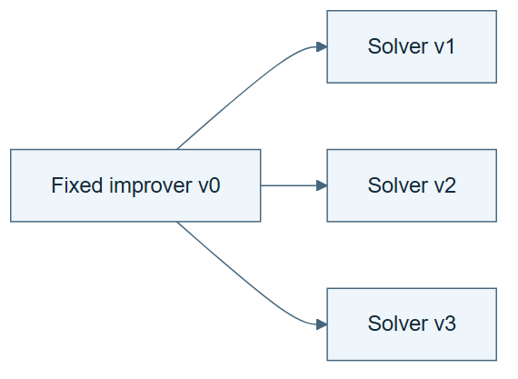

# 09.02 · Run repeated improvement with an unchanged improver

[Course](../../README.md) · [Theme](../README.md)

**You are here:** Theme 09, Changes and their evidence → lab 2 of 7. [Find this theme in the course map](../../COURSE-MAP.md#theme-09) · [Whole-course mindmap](../../COURSE-MAP.md#whole-course-mindmap).

## What you will build

Two generations of task-skill revision governed by one fixed improver.

## Why this matters

Repeated self-improvement is the comparison baseline for recursive improvement, not proof of it.

## Before you start

Complete [09.01: Identify the solver, improver, and evaluator](../step_01_three_objects/README.md). You need the concepts and the reports named below, not its old chat. If you start here directly, ask the tutor to prepare the listed starting state and explain the missing prerequisite first.

Open the coding agent at the repository root. Read [the tutor skill](../../skills/rsi-tutor/SKILL.md) and this lab's [brief](BRIEF.md). The agent creates a separate sibling workspace named <code>rsi-work/09-02</code> and reports its absolute path. It checks local Python and the [tool requirements](../../tools/README.md) before execution. You do not write code or configuration.

**Starting state:** A parent task skill, one fixed improver version, and development cases.

**Budget:** Two generations, at most two fits per generation. Include proposal and checking costs. Plan about 20–35 minutes of reading and discussion; this is an author estimate, not a measured student duration. Coding-agent inference may use a paid online service. Record its cost separately when available.

## How it works

Generation labels track ancestry. The improver reads a solver’s failures, proposes a child task skill, and applies the same acceptance procedure each time. The solver may change repeatedly while the improver remains identical. Numbering generations does not change that fact.

**A concrete example.** In the [recorded bike run](../../evidence/2026-09-20/two-generations/README.md), one unchanged improver rejected a tree in generation 1 and accepted weather features in generation 2. The retained selection MAE went from 109.81 to 109.81 to 99.18. The improver’s file and hash stayed the same. Two generations, including a useful task change, therefore did not establish a revised improver.



*Read the diagram:* Many solver revisions can come from one unchanged improver. Iteration count does not establish recursion in the improver.

## Run the lab

Start with this prompt. The tutor pauses for your prediction before it runs the next step.

```text
Read rsi/AGENTS.md and
rsi/skills/rsi-tutor/SKILL.md.
Guide me through lab 09.02, Run repeated
improvement with an unchanged improver, one
step at a time.
Read its README and BRIEF. Prepare its
separate workspace.
You write and run the implementation. Keep
the reports and failures.
Ask me to predict the result before the
experiment.
```

**Make a prediction:** Can the solver improve twice without the improver improving at all?

### 1. Freeze the improver

Make the baseline identifiable.

```text
Save IMPROVER-v0.md and its hash. Predeclare
two generations and a two-fit budget for
each. Write the task-skill acceptance rule
and permitted changes.
```

**Observe:** The control procedure is fixed before the run.

### 2. Run two generations

Preserve all proposals and decisions.

```text
Use the same improver for both rounds. Save
each parent and child skill, proposal,
evaluation, rejection or promotion, and
costs. Verify the improver hash stays
unchanged.
```

**Observe:** The lineage can show repeated solver changes under a fixed method.

## Check your result

Both rounds use the same improver. Every retained task skill has a corresponding evaluation. The conclusion says repeated self-improvement, not automatically RSI.

### Open these outputs

The agent keeps these in your lab workspace or records the original experiment path when reusing evidence.

| Output | What to inspect |
|---|---|
| Fixed improver identity | Shows the same file and hash governing both rounds. |
| Two generation records | Retain parent, proposal, checks, decision, cost, and resulting active skill. |
| Baseline account | Reports retained quality without equating two iterations with recursive procedure revision. |

Ask the agent to open the actual files and show the command exit status. A written description of a run is not a run. Keep a short <code>LAB-NOTE.md</code> with your prediction, measured observation, explanation, and one limit. The tutor must mark skipped learner responses as skipped.

## Try one change

Use a rejected child as the next parent in a labelled diagnostic replay. Explain why that would contradict the recorded promotion policy.

## If something goes wrong

If a rejected child becomes the next parent anyway, inspect and correct the active-version pointer while preserving the erroneous trace. If the improver was edited between rounds, this is no longer the fixed baseline. Keep the four-fit ceiling across both generations; a fresh folder does not reset the experiment’s total budget.

Say “Stop this lab” to stop further work. Ask the agent to save <code>PROGRESS.md</code> with the last completed step and remaining budget. To resume, have it read that file and inspect active processes first. A reset creates a new sibling workspace; it does not erase failures or alter the source data. See the [recovery rules](../../tools/README.md) for interrupted tool runs.

## Key takeaways

- Generations describe history, not necessarily recursion.
- A fixed improver can produce many solver revisions.
- Ancestry should follow actual promotion decisions.

## Check your understanding

Answer before opening the explanation. You can ask the tutor for a hint.

1. Which version stays fixed?
2. What can improve over generations here?
3. Does persistence of a child establish its benefit?
4. Why retain failed proposals?

<details>
<summary>Hint</summary>

Count versions of the improver separately from versions of the task skill. Multiple children do not imply multiple improvement procedures.

</details>

<details>
<summary>Explained answers</summary>

1. The improver procedure.

2. The task skill and resulting solver behavior, if measurements support it.

3. No. Persistence and evaluation are distinct.

4. They show the complete search and resource use behind the selected lineage.

</details>

## What's next

Use the baseline’s failures to propose a change to the improver itself. Continue to [09.03: Propose a change to the improver](../step_03_revise_improver/README.md).
