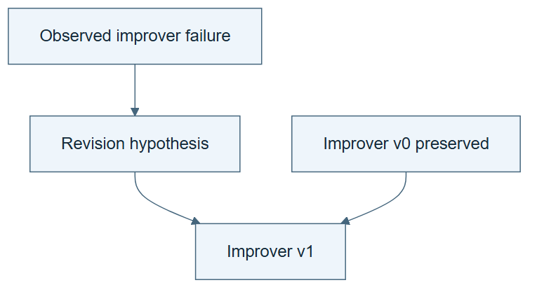

# 09.03 · Propose a change to the improver

[Course](../../README.md) · [Theme](../README.md)

**You are here:** Theme 09, Changes and their evidence → lab 3 of 7. [Find this theme in the course map](../../COURSE-MAP.md#theme-09) · [Whole-course mindmap](../../COURSE-MAP.md#whole-course-mindmap).

## What you will build

A child improver that changes how future task-skill revisions are chosen or tested.

## Why this matters

To improve the improvement process, the target of an edit must reach that process.

## Before you start

Complete [09.02: Run repeated improvement with an unchanged improver](../step_02_fixed_improver/README.md). You need the concepts and the reports named below, not its old chat. If you start here directly, ask the tutor to prepare the listed starting state and explain the missing prerequisite first.

Open the coding agent at the repository root. Read [the tutor skill](../../skills/rsi-tutor/SKILL.md) and this lab's [brief](BRIEF.md). The agent creates a separate sibling workspace named <code>rsi-work/09-03</code> and reports its absolute path. It checks local Python and the [tool requirements](../../tools/README.md) before execution. You do not write code or configuration.

**Starting state:** The fixed-improver lineage and its complete failure records.

**Budget:** One improver proposal and two small procedural checks; no broad search. Plan about 20–35 minutes of reading and discussion; this is an author estimate, not a measured student duration. Coding-agent inference may use a paid online service. Record its cost separately when available.

## How it works

Suppose the fixed improver promotes a skill after one favorable case and misses a known regression. A candidate improver can require a contrasting case before promotion. This changes the procedure for improving task skills. Its internal promotion rule is a legitimate target; the external cases, metric, and comparison budget used to judge that change stay fixed. The proposal remains a hypothesis until it governs later work and receives a fair comparison.

**A concrete example.** Improver v0 tests only the case that motivated a skill edit. A proposed v1 requires one contrasting case before promotion. On a fixture where the edit helps the first case but harms the second, v1 should make a different retention decision. That verifies the changed rule’s behavior; it does not yet show better future research at matched cost.


*This intentionally weak I0 is a classroom example. The added internal rule changes how task-skill proposals are tested; it does not change the external evaluation contract. Notebook marks identify actions, not successful measured fixture results. Keep both versions and compare actual decisions and overhead before making a benefit claim.*

[Open the illustration at full size](../../assets/illustrations/improver-proposal-v1.png).

<details>
<summary>See the step diagram</summary>



*Read the diagram:* An improver revision is a proposal about how to improve later work. It still needs inheritance and evaluation.

</details>

## Run the lab

Start with this prompt. The tutor pauses for your prediction before it runs the next step.

```text
Read rsi/AGENTS.md and
rsi/skills/rsi-tutor/SKILL.md.
Guide me through lab 09.03, Propose a change
to the improver, one step at a time.
Read its README and BRIEF. Prepare its
separate workspace.
You write and run the implementation. Keep
the reports and failures.
Ask me to predict the result before the
experiment.
```

**Make a prediction:** Could an extra regression check improve reliability while reducing the number of proposals tried?

### 1. Diagnose the improver

Target a procedural failure rather than a model setting.

```text
Use the full lineage to identify one
weakness in IMPROVER-v0. Write a proposal
changing one diagnosis, proposal,
allocation, or selection rule. State its
expected benefit, overhead, and falsifying
case.
```

**Observe:** The mutable target is the improvement procedure.

### 2. Create the child

Preserve a runnable version.

```text
Save IMPROVER-v1.md without overwriting v0.
Test its instructions on one favorable and
one regressing fixture. Keep the evaluator
unchanged and record the changed decision.
```

**Observe:** The candidate improver has a concrete behavioral difference.

## Check your result

The edit affects future skill improvement. Parent and child remain available. The report does not claim effectiveness from text quality alone.

### Open these outputs

The agent keeps these in your lab workspace or records the original experiment path when reusing evidence.

| Output | What to inspect |
|---|---|
| Improver failure diagnosis | Links one procedural weakness to the lineage that exposed it. |
| IMPROVER-v0.md and IMPROVER-v1.md | Preserve parent, one changed instruction, expected benefit, overhead, and falsifying case. |
| Two fixture decisions | Show favorable and regressing cases under the unchanged external evaluation contract. |

Ask the agent to open the actual files and show the command exit status. A written description of a run is not a run. Keep a short <code>LAB-NOTE.md</code> with your prediction, measured observation, explanation, and one limit. The tutor must mark skipped learner responses as skipped.

## Try one change

Compare “write more thoughtful proposals” with “test a contrasting case before promotion.” Explain which is easier to inspect and falsify.

## If something goes wrong

If the child only says “be more careful,” replace the vague aspiration with an observable action or decision rule. If it consumes more evaluation calls, record that cost rather than treating checks as free. Do not change the external final cases or metric to make the child’s internal rule look successful.

Say “Stop this lab” to stop further work. Ask the agent to save <code>PROGRESS.md</code> with the last completed step and remaining budget. To resume, have it read that file and inspect active processes first. A reset creates a new sibling workspace; it does not erase failures or alter the source data. See the [recovery rules](../../tools/README.md) for interrupted tool runs.

## Key takeaways

- An improver revision targets how improvements are produced.
- Added checks have resource costs.
- A better-looking procedure is still an unproven candidate.

## Check your understanding

Answer before opening the explanation. You can ask the tutor for a hint.

1. Why is this more than a task-model change?
2. What does the fixture test establish?
3. Does that prove a better improver?
4. What must remain outside the edit?

<details>
<summary>Hint</summary>

An inspectable revision predicts a decision difference on a named case. A plausible explanation alone does not supply that difference.

</details>

<details>
<summary>Explained answers</summary>

1. It changes how later task-skill changes are evaluated or selected.

2. That the new instruction can produce the intended decision difference on those fixtures.

3. No. Later matched comparisons are still required.

4. The evaluation contract used to judge the proposed improvement.

</details>

## What's next

Make the next improvement round actually inherit the child procedure. Continue to [09.04: Use the revised improver in the next round](../step_04_inherit/README.md).
