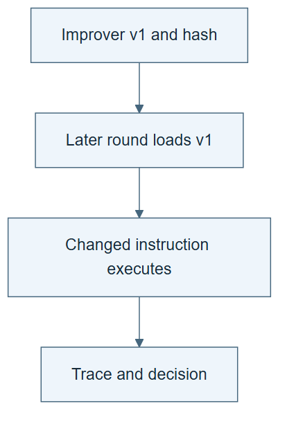

# 09.04 · Use the revised improver in the next round

[Course](../../README.md) · [Theme](../README.md)

**You are here:** Theme 09, Changes and their evidence → lab 4 of 7. [Find this theme in the course map](../../COURSE-MAP.md#theme-09) · [Whole-course mindmap](../../COURSE-MAP.md#whole-course-mindmap).

## What you will build

An inheritance trace from a changed improver to a later task-skill proposal and decision.

## Why this matters

A saved new improver can remain unused while the system silently follows the old procedure.

## Before you start

Complete [09.03: Propose a change to the improver](../step_03_revise_improver/README.md). You need the concepts and the reports named below, not its old chat. If you start here directly, ask the tutor to prepare the listed starting state and explain the missing prerequisite first.

Open the coding agent at the repository root. Read [the tutor skill](../../skills/rsi-tutor/SKILL.md) and this lab's [brief](BRIEF.md). The agent keeps this lab's notes in <code>rsi-work/09-04</code>, outside the repository, and reports the absolute path. If the lab continues an earlier experiment, keep that experiment in its original workspace with its existing budget and locks. A new notes folder does not reset an experiment. The agent checks local Python and the [tool requirements](../../tools/README.md) before execution. You do not write code or configuration.

**Starting state:** IMPROVER-v0, IMPROVER-v1, a fresh parent task skill, and new development cases.

**Budget:** One later improvement round, at most two fits or equivalent fixture evaluations. Plan about 20–35 minutes of reading and discussion; this is an author estimate, not a measured student duration. Coding-agent inference may use a paid online service. Record its cost separately when available.

## How it works

Structural recursion requires a path from a procedure revision into later improvement work. Record the inherited version and show a decision caused by its changed rule. A hash proves identity, not obedience. The trace must connect the rule to an executed proposal or check.

**A concrete example.** In the saved author-guided example, improver v1 requires recomputing the candidate score. A later round reads that version and rejects a report that claims MAE 9.0 while its predictions imply 159.95. The trace shows that the new instruction ran. It does not show that the system invented the instruction autonomously or that v1 is generally better across tasks.


*The highlighted instruction appears in proposed I1, active I1, and the later executed check. That connection matters more than a new filename. The image shows a possible accepted path; the course’s two-generation comparison rejected both improver proposals. An inherited change can also perform worse. Keep version identity, observed use, and measured benefit as separate claims.*

[Open the illustration at full size](../../assets/illustrations/inherited-improver-v1.png).

<details>
<summary>See the step diagram</summary>



*Read the diagram:* A later round must read the revised improver and execute an action it requires. A saved file alone is insufficient.

</details>

## Run the lab

Start with this prompt. The tutor pauses for your prediction before it runs the next step.

```text
Read rsi/AGENTS.md and
rsi/skills/rsi-tutor/SKILL.md.
Guide me through lab 09.04, Use the revised
improver in the next round, one step at a
time.
Read its README and BRIEF. Prepare its
separate workspace.
You write and run the implementation. Keep
the reports and failures.
Ask me to predict the result before the
experiment.
```

**Make a prediction:** What would show that the revised rule actually governed the next round?

### 1. Start from the inherited version

Make selection explicit.

```text
Read IMPROVER-v1 as the active improvement
procedure. Save its hash and parent link.
Create a fresh round with the same external
evaluator rules and the declared budget.
```

**Observe:** The active procedure is unambiguous.

### 2. Observe the changed action

Trace instructions into later improvement.

```text
Use v1 to propose and evaluate a new
task-skill revision. Record the check or
selection action required by the changed
rule, its actual result, and the promotion
decision. If v1 requires a contrasting case,
retain that check; if it changes which
partition governs promotion, retain both
partition scores and the applied rule. State
whether v0 would have required the same
action.
```

**Observe:** The inherited rule affects an executed improvement step.

## Check your result

The trace includes version identity and an observed decision difference. Merely copying the new file is not accepted as proof of use.

### Open these outputs

The agent keeps these in your lab workspace or records the original experiment path when reusing evidence.

| Output | What to inspect |
|---|---|
| Active improver and ancestry record | Identifies v1 and its parent before the new round. |
| New task-skill proposal and checks | Show an action required by the revised instruction. |
| Inheritance report | Connects identity to executed behavior and distinguishes a measured v0 comparison from an unexecuted counterfactual. |

Ask the agent to open the actual files and show the command exit status. A written description of a run is not a run. Keep a short <code>LAB-NOTE.md</code> with your prediction, measured observation, explanation, and one limit. The tutor must mark skipped learner responses as skipped.

## Try one change

Replace the active pointer with v0 in a labelled dry run. Identify which action should disappear and which evaluation rules remain fixed.

## If something goes wrong

If the record has a v1 hash but no action required by its changed rule, investigate whether the file was actually followed. A contrasting-case rule needs that check; a selection-partition rule needs the recorded scores and applied retention decision. Copying an instruction is not evidence of compliance. If the v0 alternative was only described, label it as predicted behavior. Preserve context limits when the same author or chat supplies both rounds.

Say “Stop this lab” to stop further work. Ask the agent to save <code>PROGRESS.md</code> with the last completed step and remaining budget. To resume, have it read that file and inspect active processes first. A reset creates a new sibling workspace; it does not erase failures or alter the source data. See the [recovery rules](../../tools/README.md) for interrupted tool runs.

## Key takeaways

- Inheritance must reach execution.
- File lineage and behavioral evidence complement each other.
- Structural recursion does not guarantee beneficial recursion.

## Check your understanding

Answer before opening the explanation. You can ask the tutor for a hint.

1. What does the hash establish?
2. What additional evidence supports use?
3. Can this loop still perform worse?
4. What claim is supported before a fair comparison?

<details>
<summary>Hint</summary>

Find a chain with three links: changed rule, later action, and recorded outcome. A version label supplies only the first link.

</details>

<details>
<summary>Explained answers</summary>

1. Which exact procedure file was selected or recorded.

2. An executed decision or check tied to the changed instruction.

3. Yes. A genuinely inherited change can consume more resources or choose worse revisions.

4. A bounded structural recursion demonstration, subject to the actual execution evidence and context limits.

</details>

## What's next

Compare the original and revised improvers under matched conditions. Continue to [09.05: Measure whether the revised improver helps](../step_05_compare_improvers/README.md).
