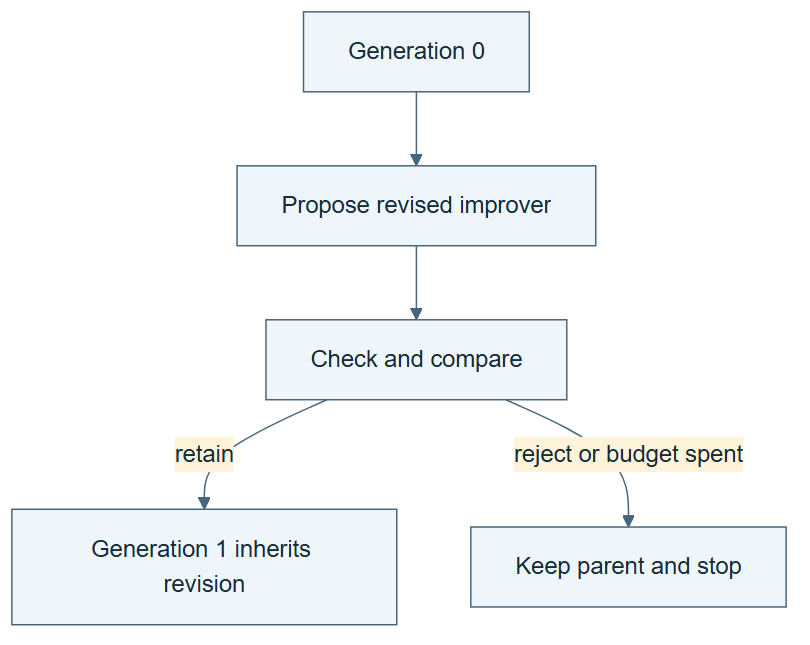

# 09.06 · Run bounded recursive generations

[Course](../../README.md) · [Theme](../README.md)

**You are here:** Theme 09, Changes and their evidence → lab 6 of 7. [Find this theme in the course map](../../COURSE-MAP.md#theme-09) · [Whole-course mindmap](../../COURSE-MAP.md#whole-course-mindmap).

## What you will build

A two-generation recursive lineage with promotion, rejection, checkpoint, and stop records.

## Why this matters

Recursion without explicit scope can turn into unlimited search or an unreadable history.

## Before you start

Complete [09.05: Measure whether the revised improver helps](../step_05_compare_improvers/README.md). You need the concepts and the reports named below, not its old chat. If you start here directly, ask the tutor to prepare the listed starting state and explain the missing prerequisite first.

Open the coding agent at the repository root. Read [the tutor skill](../../skills/rsi-tutor/SKILL.md) and this lab's [brief](BRIEF.md). The agent creates a separate sibling workspace named <code>rsi-work/09-06</code> and reports its absolute path. It checks local Python and the [tool requirements](../../tools/README.md) before execution. You do not write code or configuration.

**Starting state:** The tested improver versions, fixed evaluation protocol, and clean generation folders.

**Budget:** Two generations maximum; four fits per generation including comparisons. No automatic extension. Plan about 20–35 minutes of reading and discussion; this is an author estimate, not a measured student duration. Coding-agent inference may use a paid online service. Record its cost separately when available.

## How it works

Each generation records the active solver, active improver, proposal, evaluation, retained versions, and spent resources. The next generation inherits only the selected versions. A rejected change remains in the archive but does not become the active parent. Stop when the budget ends even if the last result is disappointing.

**A concrete example.** If generation 1 accepts improver v1, generation 2 must show v1 governing later improvement work. A rejected v2 must leave v1 active. The [actual bike run](../../evidence/2026-09-20/two-generations/README.md) illustrates the other possibility: both improver proposals were rejected, so v0 remained active even though the task score improved. Its saved proposals, hashes, and generation numbers did not establish successful improver replacement. Keep that negative result instead of adjusting the rule to force an upgrade.



*Read the diagram:* Each generation retains lineage and passes the declared checks. A failed revision can end the chain or keep the parent.

## Run the lab

Start with this prompt. The tutor pauses for your prediction before it runs the next step.

```text
Read rsi/AGENTS.md and
rsi/skills/rsi-tutor/SKILL.md.
Guide me through lab 09.06, Run bounded
recursive generations, one step at a time.
Read its README and BRIEF. Prepare its
separate workspace.
You write and run the implementation. Keep
the reports and failures.
Ask me to predict the result before the
experiment.
```

**Make a prediction:** What should the next generation inherit after an improver proposal is rejected?

### 1. Declare the lineage

Make inheritance and limits explicit.

```text
Create LINEAGE.md with two generation slots,
solver and improver parent IDs, acceptance
rules, cumulative budget, and stop
conditions. Keep evaluator version fixed.
```

**Observe:** The plan distinguishes proposed from active descendants.

### 2. Execute and checkpoint

Keep every transition reviewable.

```text
Run the bounded generations using the
selected active improver. Save proposals,
checks, costs, and promotion decisions. At
each boundary write PROGRESS.md. Stop at the
declared limit and audit inherited versions.
```

**Observe:** The lineage records both successful and rejected changes.

## Check your result

No hidden extra generation runs. Rejected versions do not become active accidentally. The total ledger includes all attempts and known costs.

### Open these outputs

The agent keeps these in your lab workspace or records the original experiment path when reusing evidence.

| Output | What to inspect |
|---|---|
| Two-generation protocol and lineage | Track both task-skill and improver parents, proposed children, external checks, and the eight-fit maximum. |
| Executed inheritance traces | Show the active improver affecting later improvement work, including rejection paths. |
| Checkpoint and quality/cost report | Preserve active pointers, consumed budget, improvements or regressions, and stop reason. |

Ask the agent to open the actual files and show the command exit status. A written description of a run is not a run. Keep a short <code>LAB-NOTE.md</code> with your prediction, measured observation, explanation, and one limit. The tutor must mark skipped learner responses as skipped.

## Try one change

Interrupt after a proposal but before promotion. Explain which version is active on resume and which evidence is still missing.

## If something goes wrong

If resumption starts from the newest file rather than the accepted active version, reconcile the checkpoint and promotion record before running. Keep rejected improver children available but inactive. If a generation has no accepted revision, report that outcome instead of relaxing the rule to force a rising curve. Inspect total fits across both generations.

Say “Stop this lab” to stop further work. Ask the agent to save <code>PROGRESS.md</code> with the last completed step and remaining budget. To resume, have it read that file and inspect active processes first. A reset creates a new sibling workspace; it does not erase failures or alter the source data. See the [recovery rules](../../tools/README.md) for interrupted tool runs.

## Key takeaways

- Recursion needs the same state and budget discipline as simpler loops.
- Proposal and promotion are different events.
- A stopped lineage can be scientifically useful without improvement.

## Check your understanding

Answer before opening the explanation. You can ask the tutor for a hint.

1. What follows a rejected improver?
2. Why track solver and improver versions separately?
3. Can the budget reset every generation?
4. What if interrupted before acceptance?

<details>
<summary>Hint</summary>

Separate proposed versions, accepted versions, and executed active versions. A recursive lineage needs behavioral inheritance, not just increasing version numbers.

</details>

<details>
<summary>Explained answers</summary>

1. The previously retained improver remains active unless another declared decision changes it.

2. They can change independently and support different claims.

3. Only if the original total protocol explicitly allocates it that way; spent global resources do not vanish.

4. Keep the proposal unpromoted and resume the missing check or stop, using the last accepted active versions.

</details>

## What's next

Classify the strongest claim the complete experiment supports. Continue to [09.07: State the result without overstating it](../step_07_claim/README.md).
