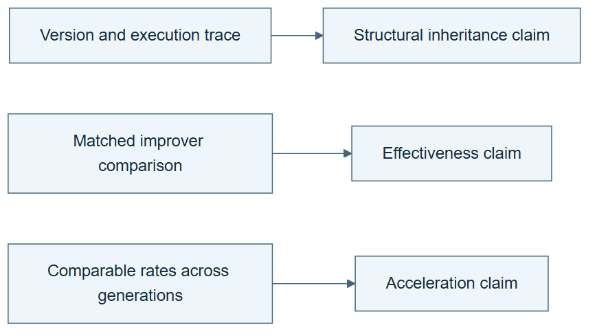

# 09.07 · State the result without overstating it

[Course](../../README.md) · [Theme](../README.md)

## What you will build

A final claim audit separating structural recursion, effective improvement, and acceleration.

## Why this matters

The strongest-looking label is less useful than a conclusion another researcher can verify.

## Before you start

Complete [09.06: Run bounded recursive generations](../step_06_bounded_generations/README.md). You need the concepts and the reports named below, not its old chat. If you start here directly, ask the tutor to prepare the listed starting state and explain the missing prerequisite first.

Open the coding agent at the repository root. Read [the tutor skill](../../skills/rsi-tutor/SKILL.md) and this lab's [brief](BRIEF.md). The agent creates a separate sibling workspace named <code>rsi-work/09-07</code> and reports its absolute path. It checks local Python and the [tool requirements](../../tools/README.md) before execution. You do not write code or configuration.

**Starting state:** The complete lineage, matched comparison, costs, failures, and boundary notes.

**Budget:** No fits. One evidence audit and one teach-back. Plan about 20–35 minutes of reading and discussion; this is an author estimate, not a measured student duration. Coding-agent inference may use a paid online service. Record its cost separately when available.

## How it works

Structural recursion means a changed improvement procedure enters later improvement work. Effective recursive improvement adds evidence that this change improves the improvement process under the comparison. Acceleration asks whether progress itself grows across generations after accounting for resources and bottlenecks. These are progressively stronger claims, not automatic consequences.




*Read the diagram:* Each claim needs its own evidence. Structural inheritance does not by itself establish benefit or acceleration.


## Run the lab

Start with this prompt. The tutor pauses for your prediction before it runs the next step.

```text
Read rsi/AGENTS.md and rsi/skills/rsi-tutor/SKILL.md.
Guide me through lab 09.07, State the result without overstating it, one step at a time.
Read its README and BRIEF. Prepare its separate workspace.
You write and run the implementation. Keep the reports and failures.
Ask me to predict the result before the experiment.
```

**Make a prediction:** Which of these claims would survive if the inherited improver made every later result worse?

### 1. Audit the evidence

Match each claim to its necessary observation.

```text
Use audit-rsi-claim on the complete experiment. Write CLAIM-AUDIT.md with supported claim, missing evidence, costs, context limits, negative results, and one plausible alternative explanation.
```

**Observe:** The conclusion may stop at structure or report no effective improvement.

### 2. Teach it back

Test whether the distinction transfers.

```text
Ask me to explain three new cases: repeated model search, persistent memory under a fixed updater, and an inherited improver that loses a matched comparison. Give hints before answers and record unattempted responses honestly.
```

**Observe:** The explanation identifies what changed and what evidence is missing.

## Check your result

Every claimed level has a corresponding artifact and measurement. Acceleration is not inferred from two favorable points. The audit states public-data and context limits.

Ask the agent to open the actual files and show the command exit status. A written description of a run is not a run. Keep a short <code>LAB-NOTE.md</code> with your prediction, measured observation, explanation, and one limit. The tutor must mark skipped learner responses as skipped.

## Try one change

Remove the inheritance trace from a copy of the evidence pack. Identify which claim becomes unsupported even if the final task score stays high.

## If something goes wrong

If the expected artifact is missing, inspect the last command and its exit status before running again. If a check fails, preserve the failing result and diagnose that check; do not weaken it to obtain a pass.

Say “Stop this lab” to stop further work. Ask the agent to save <code>PROGRESS.md</code> with the last completed step and remaining budget. To resume, have it read that file and inspect active processes first. A reset creates a new sibling workspace; it does not erase failures or alter the source data. See the [recovery rules](../../tools/README.md) for interrupted tool runs.

## Key takeaways

- Structure, benefit, and acceleration need different evidence.
- A negative result can still demonstrate a real mechanism.
- Precise limits make a claim more useful to others.

## Check your understanding

Answer before opening the explanation. You can ask the tutor for a hint.

1. Can harmful recursion still be structurally recursive?
2. What does a high final task score alone establish?
3. Why are two rising points weak acceleration evidence?
4. What is a useful next experiment?

<details>
<summary>Hint</summary>

Trace what changed, what stayed fixed, and which observation supports the conclusion. A filename or a confident explanation is not enough evidence.

</details>

<details>
<summary>Explained answers</summary>

1. Yes. The inherited procedure can change later improvement work while degrading its results.

2. Performance of that retained artifact under its evaluation conditions, not the quality of the improver.

3. They do not establish a sustained rate change or rule out resource and task differences.

4. The smallest controlled comparison that addresses the most important missing evidence identified in the audit.

</details>

## What's next

Use this framework to read current research and rebuild its mechanisms on small tasks. Continue to [10.01: Use a framework without turning it into a ladder](../../10_research_studio/00_reading_frontier_research/step_01_framework/README.md).
