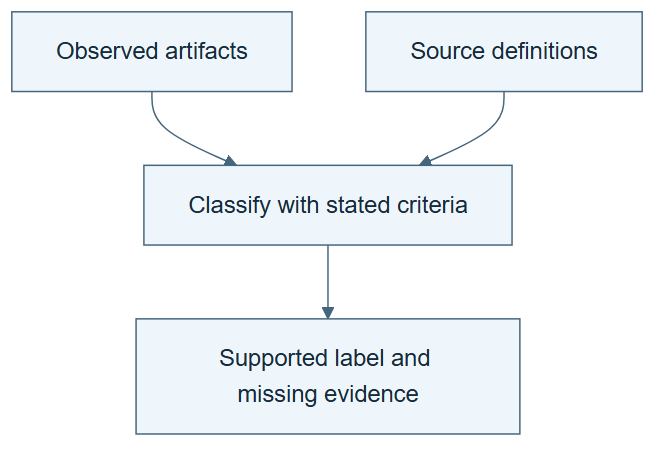

# 10.01 · Use a framework without turning it into a ladder

[Course](../../../README.md) · [Theme](../../README.md)

## What you will build

A source-linked classification of three mechanisms from your own experiments.

## Why this matters

Different authors use different levels and definitions. A label is useful only with its stated criteria.

## Before you start

Complete [09.07: State the result without overstating it](../../../09_recursive_self_improvement/step_07_claim/README.md). You need the concepts and the reports named below, not its old chat. If you start here directly, ask the tutor to prepare the listed starting state and explain the missing prerequisite first.

Open the coding agent at the repository root. Read [the tutor skill](../../../skills/rsi-tutor/SKILL.md) and this lab's [brief](BRIEF.md). The agent creates a separate sibling workspace named <code>rsi-work/10-01</code> and reports its absolute path. It checks local Python and the [tool requirements](../../../tools/README.md) before execution. You do not write code or configuration.

**Starting state:** Your claim audit from 09.07 and the primary paper.

**Budget:** No fits. Read the framework and audit three cases. Plan about 40–60 minutes of reading and discussion; this is an author estimate, not a measured student duration. Coding-agent inference may use a paid online service. Record its cost separately when available.

## How it works

Begin with your artifacts, then apply the paper’s definitions. Keep execution changes, strategy changes, retained experience, deployment changes, and inherited improver changes distinct. Do not equate this framework’s level numbers with another lab’s terminology.



*Read the diagram:* Apply each source’s definitions to actual artifacts. Equal level numbers from different frameworks need not mean the same thing.

## Run the lab

Start with this prompt. The tutor pauses for your prediction before it runs the next step.

```text
Read rsi/AGENTS.md and rsi/skills/rsi-tutor/SKILL.md.
Guide me through lab 10.01, Use a framework without turning it into a ladder, one step at a time.
Read its README and BRIEF. Prepare its separate workspace.
You write and run the implementation. Keep the reports and failures.
Ask me to predict the result before the experiment.
```

**Make a prediction:** Can a system satisfy a structural criterion while failing a performance comparison?

### 1. Read the criteria

Anchor terminology to the source.

```text
Read the paper’s definitions and relevant examples. Create FRAMEWORK.md with a short paraphrase, section reference, and evidence needed for each distinction. Do not copy the paper’s full text.
```

**Observe:** The mapping uses the paper’s actual criteria.

### 2. Classify your evidence

Make the framework answer a concrete question.

```text
Apply the framework to fixed retries, saved memory, and your inherited improver experiment. For each cite your own artifacts and state the strongest supported claim.
```

**Observe:** A label follows evidence rather than replacing it.

## Check your result

The audit separates structural and effective improvement. Missing evidence remains visible. Level numbers are not mixed across sources.

Ask the agent to open the actual files and show the command exit status. A written description of a run is not a run. Keep a short <code>LAB-NOTE.md</code> with your prediction, measured observation, explanation, and one limit. The tutor must mark skipped learner responses as skipped.

## Try one change

Apply Weco’s differently defined level terminology to the same cases in a separate column. Explain why equal numbers need not mean equal mechanisms.

## If something goes wrong

If the expected artifact is missing, inspect the last command and its exit status before running again. If a check fails, preserve the failing result and diagnose that check; do not weaken it to obtain a pass.

Say “Stop this lab” to stop further work. Ask the agent to save <code>PROGRESS.md</code> with the last completed step and remaining budget. To resume, have it read that file and inspect active processes first. A reset creates a new sibling workspace; it does not erase failures or alter the source data. See the [recovery rules](../../../tools/README.md) for interrupted tool runs.

## Key takeaways

- Taxonomies are definitions with scope.
- Mechanism and effectiveness need separate evidence.
- Cross-paper comparisons require a mapping, not matching numbers.

## Research connection

[The Last AI Built by Humans](https://arxiv.org/abs/2609.11873), first submitted 10 September 2026; consult the dated source record for revisions.

**Activity type: source audit.** You inspect and compare evidence from primary sources. This activity does not execute or reproduce the paper’s system.

## Check your understanding

Answer before opening the explanation. You can ask the tutor for a hint.

1. Why read definitions before comparing levels?
2. Can structural recursion fail to help?
3. What should classify a classroom run?
4. Is the framework itself experimental proof for your system?

<details>
<summary>Hint</summary>

Trace what changed, what stayed fixed, and which observation supports the conclusion. A filename or a confident explanation is not enough evidence.

</details>

<details>
<summary>Explained answers</summary>

1. Authors can assign different meanings to similar labels.

2. Yes. An inherited procedural change can be ineffective or harmful.

3. Its actual changed components, inheritance, comparisons, and evidence boundaries.

4. No. It supplies criteria; your system still needs its own evidence.

</details>

## What's next

Trace a current announcement to its original evidence. Continue to [10.02: Audit a frontier announcement](../step_02_announcements/README.md).
