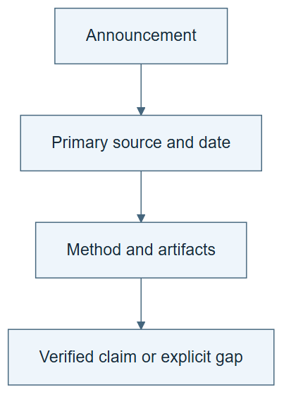

# 10.02 · Audit a frontier announcement

[Course](../../../README.md) · [Theme](../../README.md)

**You are here:** Theme 10, Research studio → lab 2 of 38. [Find this theme in the course map](../../../COURSE-MAP.md#theme-10) · [Whole-course mindmap](../../../COURSE-MAP.md#whole-course-mindmap).

## What you will build

A claim card traced from an original announcement to available methods and artifacts.

## Why this matters

An announcement, a preprint, a benchmark entry, and an independent reproduction support different conclusions.

## Before you start

Complete [10.01: Use a framework without turning it into a ladder](../step_01_framework/README.md). You need the concepts and the reports named below, not its old chat. If you start here directly, ask the tutor to prepare the listed starting state and explain the missing prerequisite first.

Open the coding agent at the repository root. Read [the tutor skill](../../../skills/rsi-tutor/SKILL.md) and this lab's [brief](BRIEF.md). The agent creates a separate sibling workspace named <code>rsi-work/10-02</code> and reports its absolute path. It checks local Python and the [tool requirements](../../../tools/README.md) before execution. You do not write code or configuration.

**Starting state:** The current research inventory and one official lab post or original author thread.

**Budget:** No fits. Search only the preceding month; inspect one complete claim trail. Plan about 40–60 minutes of reading and discussion; this is an author estimate, not a measured student duration. Coding-agent inference may use a paid online service. Record its cost separately when available.

## How it works

Record who made the claim, when it first appeared, what was measured, and what the linked evidence contains. Original X posts can be valid announcement sources. A blocked thread stays unverified; a repost is not a substitute for its missing content.

**A concrete example.** An author reposts a July report in September. The post is recent, but the experiment is still July work unless a substantive new result is linked. Conversely, a September methods revision may matter even when the title stays the same. Your claim card records both events and identifies what actually changed.


*The quotation is invented for teaching and is not attributed to a real author or lab. The 20 August–20 September 2026 window is the authoring example; roll it forward to the preceding month when you run the lab. Inspect available links and record missing ones. A blocked thread does not invalidate a separately accessible paper, but its contents remain unread. A reproduction has its own methods and limitations. Document the original release and any substantive revision separately from repost and crawl dates.*

[Open the illustration at full size](../../../assets/illustrations/announcement-evidence-trail-v2.png).

<details>
<summary>See the step diagram</summary>



*Read the diagram:* Follow a claim back to its original evidence. A social announcement and a reproduced experiment are different endpoints.

</details>

## Run the lab

Start with this prompt. The tutor pauses for your prediction before it runs the next step.

```text
Read rsi/AGENTS.md and
rsi/skills/rsi-tutor/SKILL.md.
Guide me through lab 10.02, Audit a frontier
announcement, one step at a time.
Read its README and BRIEF. Prepare its
separate workspace.
You write and run the implementation. Keep
the reports and failures.
Ask me to predict the result before the
experiment.
```

**Make a prediction:** Does a recent repost make an older experiment a new release?

### 1. Find the original

Keep discovery time-bounded.

```text
Search the preceding month with explicit
dates for one frontier-lab or author RSI
announcement, including original X threads
where available. Verify identity,
affiliation, canonical URL, first date, and
linked work. Save exact queries and access
gaps.
```

**Observe:** Publication and crawl dates are separated.

### 2. Trace the evidence

Read beyond the headline.

```text
Create CLAIM-CARD.md linking the
announcement, methods, evaluation, code
availability, and limitations. Distinguish
reported performance from a result you
actually ran. Use audit-rsi-claim.
```

**Observe:** The card states what can and cannot be checked.

## Check your result

Every technical claim has a primary source or is marked unresolved. No inaccessible post is presented as read. The date window is explicit.

### Open these outputs

The agent keeps these in your lab workspace or records the original experiment path when reusing evidence.

| Output | What to inspect |
|---|---|
| Dated search record | Retains exact queries, source identity, access failures, and the preceding-month window. |
| CLAIM-CARD.md | Links the original announcement, methods, evaluation, available code, and unresolved claims. |
| Headline-to-evidence comparison | Names a condition or limitation omitted by the short announcement. |

Ask the agent to open the actual files and show the command exit status. A written description of a run is not a run. Keep a short <code>LAB-NOTE.md</code> with your prediction, measured observation, explanation, and one limit. The tutor must mark skipped learner responses as skipped.

## Try one change

Compare the headline with an ablation or limitation in its linked paper. Explain whether the headline omits a condition.

## If something goes wrong

If an X thread is blocked, record its canonical URL and access failure; inspect linked primary materials separately. Do not attribute a repost’s wording to the original author without checking. If search results show only a crawl date, read the paper’s submission history or the original post date before admitting it as new work.

Say “Stop this lab” to stop further work. Ask the agent to save <code>PROGRESS.md</code> with the last completed step and remaining budget. To resume, have it read that file and inspect active processes first. A reset creates a new sibling workspace; it does not erase failures or alter the source data. See the [recovery rules](../../../tools/README.md) for interrupted tool runs.

## Key takeaways

- Discovery and verification are different steps.
- Social-only announcements can be recorded without upgrading their evidence.
- A bounded search is not an exhaustive survey.

## Research connection

[Dated research inventory](../../../research/README.md) and the original primary sources it links.

**Activity type: source audit.** You inspect and compare evidence from primary sources. This activity does not execute or reproduce the paper’s system.

## Check your understanding

Answer before opening the explanation. You can ask the tutor for a hint.

1. Which date establishes novelty?
2. What if an author thread is inaccessible?
3. Is a lab report an independent reproduction?
4. What makes a useful claim card?

<details>
<summary>Hint</summary>

Trace who said it, when it was first said, what changed, and what evidence is available. Those are four separate fields.

</details>

<details>
<summary>Explained answers</summary>

1. The original release or a substantive revision date, not a crawl or repost date.

2. Record the canonical link and access failure; verify linked primary material separately.

3. No. It is evidence reported by that lab.

4. A traceable claim, method, evaluation boundary, resource scope, and explicit uncertainty.

</details>

## What's next

Study exploration and memory as distinct parts of an improving agent. Continue to [10.03: Choose experiments that reduce uncertainty](../../01_memory_and_exploration/step_03_exploration/README.md).
