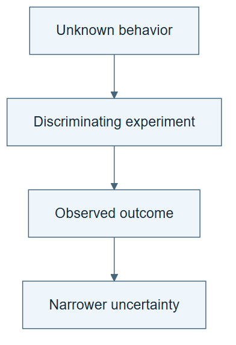

# 10.03 · Choose experiments that reduce uncertainty

[Course](../../../README.md) · [Theme](../../README.md)

**You are here:** Theme 10, Research studio → lab 3 of 38. [Find this theme in the course map](../../../COURSE-MAP.md#theme-10) · [Whole-course mindmap](../../../COURSE-MAP.md#whole-course-mindmap).

## What you will build

A small exploration plan that moves from broad probes to a focused ML question.

## Why this matters

A fixed benchmark list can hide what the agent still does not understand about a new environment.

## Before you start

Complete [10.02: Audit a frontier announcement](../../00_reading_frontier_research/step_02_announcements/README.md). You need the concepts and the reports named below, not its old chat. If you start here directly, ask the tutor to prepare the listed starting state and explain the missing prerequisite first.

Open the coding agent at the repository root. Read [the tutor skill](../../../skills/rsi-tutor/SKILL.md) and this lab's [brief](BRIEF.md). The agent keeps this lab's notes in <code>rsi-work/10-03</code>, outside the repository, and reports the absolute path. If the lab continues an earlier experiment, keep that experiment in its original workspace with its existing budget and locks. A new notes folder does not reset an experiment. The agent checks local Python and the [tool requirements](../../../tools/README.md) before execution. You do not write code or configuration.

**Starting state:** Bike regression with no retained task-specific memory. Use selection data only.

**Budget:** Three small fits maximum. Plan about 40–60 minutes of reading and discussion; this is an author estimate, not a measured student duration. Coding-agent inference may use a paid online service. Record its cost separately when available.

## How it works

The classroom exercise first probes two distinct limitations, then spends the last attempt on one uncertainty. Broad coverage and targeted investigation have different purposes. Keep the choice rule visible; exploration is not permission to change the task metric.

**A concrete example.** The constant baseline asks how far a model can get without input variation. The calendar model asks whether hour and date structure explain useful variation. The third recipe should address a remaining uncertainty exposed by their errors. Repeating the same deterministic calendar fit does not answer a new feature question, though a separately declared repeat can check reproducibility.


*The course predicts hourly bike rentals. Calendar and weather labels are examples from permitted groups, not the complete schema; weather category is not a precipitation measurement. The constant baseline learns its mean from training data. Choose the third recipe from actual selection errors before fitting, and record its question and cost. Observed weather is allowed by this teaching contract; it does not establish that the same inputs would be available in a real forecast. The exploration rule itself can remain fixed.*

[Open the illustration at full size](../../../assets/illustrations/broad-probes-focused-test-v2.png).

<details>
<summary>See the step diagram</summary>



*Read the diagram:* Choose an experiment for the uncertainty it can resolve. A likely high score is not always the most informative next observation.

</details>

## Run the lab

Start with this prompt. The tutor pauses for your prediction before it runs the next step.

```text
Read rsi/AGENTS.md and
rsi/skills/rsi-tutor/SKILL.md.
Guide me through lab 10.03, Choose
experiments that reduce uncertainty, one
step at a time.
Read its README and BRIEF. Prepare its
separate workspace.
You write and run the implementation. Keep
the reports and failures.
Ask me to predict the result before the
experiment.
```

**Make a prediction:** Would three nearly identical fits reveal as much as two contrasting probes and one targeted follow-up?

### 1. Choose broad probes

State what each attempt teaches.

```text
Plan a constant baseline and a calendar
linear model. For each state the uncertainty
it addresses. Freeze the task and three-fit
budget.
```

**Observe:** The probes ask different questions.

### 2. Focus the final attempt

Use observed outcomes to allocate work.

```text
Run the probes, inspect selection errors,
and choose one final permitted recipe to
test a specific unresolved hypothesis.
Record the decision before fitting.
```

**Observe:** The final action follows evidence from exploration.

## Check your result

The plan distinguishes broad and focused work. All attempts and costs are retained. No final test information guides exploration.

### Open these outputs

The agent keeps these in your lab workspace or records the original experiment path when reusing evidence.

| Output | What to inspect |
|---|---|
| Three-attempt exploration plan | States the different uncertainty addressed by each initial probe. |
| Probe traces and final proposal | Record the third hypothesis before its fit and link it to observed selection errors. |
| Exploration report | Retains failures, known cost, and the information gained within the three-fit ceiling. |

Ask the agent to open the actual files and show the command exit status. A written description of a run is not a run. Keep a short <code>LAB-NOTE.md</code> with your prediction, measured observation, explanation, and one limit. The tutor must mark skipped learner responses as skipped.

## Try one change

Spend the third attempt on a duplicate recipe in a labelled comparison. Explain what information it can and cannot add.

## If something goes wrong

If the third choice was justified only after its score appeared, preserve that ordering and label the explanation as retrospective. If a duplicate recipe is refused, retain the refusal; do not vary an irrelevant label to evade duplicate detection. Use existing repeats or reasoning for the counterexample, without adding a fourth fit.

Say “Stop this lab” to stop further work. Ask the agent to save <code>PROGRESS.md</code> with the last completed step and remaining budget. To resume, have it read that file and inspect active processes first. A reset creates a new sibling workspace; it does not erase failures or alter the source data. See the [recovery rules](../../../tools/README.md) for interrupted tool runs.

## Key takeaways

- Exploration has an information goal.
- Focused follow-up should state the uncertainty it tests.
- More attempts are not automatically more useful experience.

## Research connection

[RSIAgent](https://arxiv.org/abs/2609.15364), Sibo Zhu and colleagues, Aether AI, UC San Diego, and UIUC; 14 September 2026.

**Activity type: mechanism exercise.** You execute a small classroom mechanism. Its task, models, and budget differ from the source. Local observations do not reproduce the paper’s headline result.

## Check your understanding

Answer before opening the explanation. You can ask the tutor for a hint.

1. What changes during this lab?
2. Does that alone establish RSI?
3. Why record the question before fitting?
4. What is lost by duplicate deterministic probes?

<details>
<summary>Hint</summary>

Complete “this result would distinguish ___ from ___” before running an exploratory action. More scores do not automatically mean more information.

</details>

<details>
<summary>Explained answers</summary>

1. The choice of task-level experiment based on observed development feedback.

2. No. The exploration procedure can remain fixed.

3. It makes the information goal falsifiable and prevents hindsight rewriting.

4. They add little about new mechanisms, though they may test repeatability.

</details>

## What's next

Separate outcome verification from the actor’s memory-writing responsibility. Continue to [10.04: Verify the outcome, then let the actor write memory](../step_04_actor_memory/README.md).
