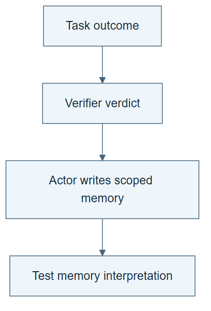

# 10.04 · Verify the outcome, then let the actor write memory

[Course](../../../README.md) · [Theme](../../README.md)

**You are here:** Theme 10, Research studio → lab 4 of 38. [Find this theme in the course map](../../../COURSE-MAP.md#theme-10) · [Whole-course mindmap](../../../COURSE-MAP.md#whole-course-mindmap).

## What you will build

An outcome check and a separate actor-authored memory update.

## Why this matters

Changing who writes the lesson changes the mechanism being taught.

## Before you start

Complete [10.03: Choose experiments that reduce uncertainty](../step_03_exploration/README.md). You need the concepts and the reports named below, not its old chat. If you start here directly, ask the tutor to prepare the listed starting state and explain the missing prerequisite first.

Open the coding agent at the repository root. Read [the tutor skill](../../../skills/rsi-tutor/SKILL.md) and this lab's [brief](BRIEF.md). The agent keeps this lab's notes in <code>rsi-work/10-04</code>, outside the repository, and reports the absolute path. If the lab continues an earlier experiment, keep that experiment in its original workspace with its existing budget and locks. A new notes folder does not reset an experiment. The agent checks local Python and the [tool requirements](../../../tools/README.md) before execution. You do not write code or configuration.

**Starting state:** The exploration traces and a valid output checker.

**Budget:** No fits. Verify one result and test one memory statement. Plan about 40–60 minutes of reading and discussion; this is an author estimate, not a measured student duration. Coding-agent inference may use a paid online service. Record its cost separately when available.

## How it works

RSIAgent separates outcome verification from actor-owned memory updates. The verifier does not author or approve the memory wording. Our exercise preserves that responsibility split while using a small ML trace.

**A concrete example.** The checker confirms that the calendar model’s MAE matches its saved predictions. The actor then writes “calendar fields always beat weather.” The verified number does not support that broad lesson: the compared models and conditions matter. The result can be valid while its inferred memory is wrong.


*The verdict concerns the task outcome. The actor still has to interpret it and can write an overbroad lesson. The notebook fields are our teaching aid, not a required paper format. This figure adapts RSIAgent’s responsibility split to the laptop ML exercise. It does not reproduce the paper’s environments or establish that the memory-writing procedure improved. Frozen evaluation memory is read without updates.*

[Open the illustration at full size](../../../assets/illustrations/actor-memory-v2.png).

<details>
<summary>See the step diagram</summary>



*Read the diagram:* The verifier checks the outcome. The actor writes memory; the verdict does not approve the wording of that memory.

</details>

## Run the lab

Start with this prompt. The tutor pauses for your prediction before it runs the next step.

```text
Read rsi/AGENTS.md and
rsi/skills/rsi-tutor/SKILL.md.
Guide me through lab 10.04, Verify the
outcome, then let the actor write memory,
one step at a time.
Read its README and BRIEF. Prepare its
separate workspace.
You write and run the implementation. Keep
the reports and failures.
Ask me to predict the result before the
experiment.
```

**Make a prediction:** Can a correct outcome verdict be followed by an incorrect lesson?

### 1. Verify only the outcome

Keep the verifier’s role narrow.

```text
Run the checker on one exploration outcome.
Save its verdict and evidence without asking
it to write a lesson.
```

**Observe:** The outcome record states what succeeded or failed.

### 2. Write and inspect memory

Keep authorship explicit.

```text
As the task actor, write one bounded lesson
from the trace and verdict. Save MEMORY.md
with authorship and supporting evidence.
Test a counterexample to its wording using
an existing case. Do not relabel this as
verifier-approved memory.
```

**Observe:** A valid outcome can still lead to an overgeneralized lesson.

## Check your result

The verifier checks the result; the actor writes memory. Memory quality is inspected separately. No invented approval is recorded.

### Open these outputs

The agent keeps these in your lab workspace or records the original experiment path when reusing evidence.

| Output | What to inspect |
|---|---|
| Outcome verdict | Checks one actual result without authoring its lesson. |
| Actor-owned MEMORY.md | Names the author, scope, supporting trace, and retained statement. |
| Counterexample inspection | Tests the memory wording separately from the original metric check. |

Ask the agent to open the actual files and show the command exit status. A written description of a run is not a run. Keep a short <code>LAB-NOTE.md</code> with your prediction, measured observation, explanation, and one limit. The tutor must mark skipped learner responses as skipped.

## Try one change

Write an overbroad “always use the winning model” note and identify a case outside its evidence.

## If something goes wrong

If the note says verifier-approved memory, inspect what the verifier actually checked and correct the attribution. A role name in one chat does not create independent authority. If the counterexample requires an unbudgeted fit, use an existing case or leave the additional experiment proposed; this activity has no fit allowance.

Say “Stop this lab” to stop further work. Ask the agent to save <code>PROGRESS.md</code> with the last completed step and remaining budget. To resume, have it read that file and inspect active processes first. A reset creates a new sibling workspace; it does not erase failures or alter the source data. See the [recovery rules](../../../tools/README.md) for interrupted tool runs.

## Key takeaways

- Outcome validity and lesson validity differ.
- Preserve authorship when adapting a paper.
- A memory needs scope and supporting evidence.

## Research connection

[RSIAgent](https://arxiv.org/abs/2609.15364), Sibo Zhu and colleagues, Aether AI, UC San Diego, and UIUC; 14 September 2026.

**Activity type: mechanism exercise.** You execute a small classroom mechanism. Its task, models, and budget differ from the source. Local observations do not reproduce the paper’s headline result.

## Check your understanding

Answer before opening the explanation. You can ask the tutor for a hint.

1. Who authors memory in this mechanism?
2. Does a correct verdict validate every inferred lesson?
3. Why record the distinction?
4. What does the laptop adaptation omit?

<details>
<summary>Hint</summary>

Ask whether the evidence validates a measurement or a general rule. A correct measurement can support several competing explanations.

</details>

<details>
<summary>Explained answers</summary>

1. The actor, after outcome verification.

2. No. The interpretation can overgeneralize or misattribute the cause.

3. It affects credit assignment and what the experiment actually reproduces.

4. The paper’s full environments, exploration scale, models, and reported evaluation.

</details>

## What's next

Freeze memory before measuring its benefit. Continue to [10.05: Evaluate with memory frozen](../step_05_frozen_memory/README.md).
