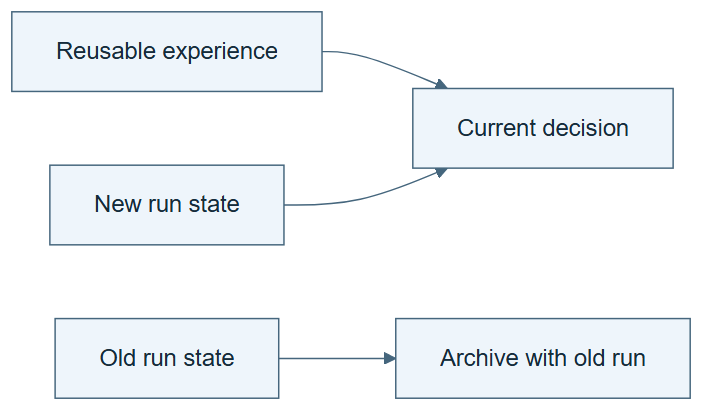

# 10.06 · Separate working state from reusable experience

[Course](../../../README.md) · [Theme](../../README.md)

**You are here:** Theme 10, Research studio → lab 6 of 38. [Find this theme in the course map](../../../COURSE-MAP.md#theme-10) · [Whole-course mindmap](../../../COURSE-MAP.md#whole-course-mindmap).

## What you will build

Two memory stores with different lifetimes and update rules.

## Why this matters

A current candidate ID is useful state but a poor general lesson. Mixing the two makes future instructions stale.

## Before you start

Complete [10.05: Evaluate with memory frozen](../step_05_frozen_memory/README.md). You need the concepts and the reports named below, not its old chat. If you start here directly, ask the tutor to prepare the listed starting state and explain the missing prerequisite first.

Open the coding agent at the repository root. Read [the tutor skill](../../../skills/rsi-tutor/SKILL.md) and this lab's [brief](BRIEF.md). The agent keeps this lab's notes in <code>rsi-work/10-06</code>, outside the repository, and reports the absolute path. If the lab continues an earlier experiment, keep that experiment in its original workspace with its existing budget and locks. A new notes folder does not reset an experiment. The agent checks local Python and the [tool requirements](../../../tools/README.md) before execution. You do not write code or configuration.

**Starting state:** A completed ML trace and a partially completed new run.

**Budget:** No fits. Two retrieval checks. Plan about 40–60 minutes of reading and discussion; this is an author estimate, not a measured student duration. Coding-agent inference may use a paid online service. Record its cost separately when available.

## How it works

Working state records the current run: active candidate, pending check, remaining budget. Reusable experience records a scoped procedure learned from prior work. The exercise separates them and checks that a new run does not inherit old spent-state values as if they were current.

**A concrete example.** “Candidate trial-003 awaits verification” belongs to one run. “Join predictions to targets by row identity” can be a reusable rule when supported by evidence. The next run can inherit the second statement, but its candidate ID and remaining attempts must come from its own ledger.


*Run A, run B, and the remaining-attempt values are constructed fixtures. They do not authorize fits in this no-fit lab. The green and red markers show expected retrieval decisions that the learner must verify. Replace generic evidence labels with actual source-run IDs and artifact links. An old candidate can remain in its historical record without becoming the new run's active candidate. Useful retrieval still needs correct application; keeping a lesson alone establishes no performance gain.*

[Open the illustration at full size](../../../assets/illustrations/working-state-and-experience-v1.png).

<details>
<summary>See the step diagram</summary>



*Read the diagram:* Working state belongs to this run. Scoped experience can inform another run without carrying over stale candidate IDs or budgets.

</details>

## Run the lab

Start with this prompt. The tutor pauses for your prediction before it runs the next step.

```text
Read rsi/AGENTS.md and
rsi/skills/rsi-tutor/SKILL.md.
Guide me through lab 10.06, Separate working
state from reusable experience, one step at
a time.
Read its README and BRIEF. Prepare its
separate workspace.
You write and run the implementation. Keep
the reports and failures.
Ask me to predict the result before the
experiment.
```

**Make a prediction:** Should the next task inherit the previous task’s “one attempt remaining” note?

### 1. Separate the stores

Give each artifact a clear lifetime.

```text
Create WORKING.md for the current run and
EXPERIENCE.md for one reusable lesson. Label
source run, scope, and update rule. Keep raw
traces unchanged.
```

**Observe:** State and knowledge are distinguishable.

### 2. Test retrieval

Check what transfers to a new run.

```text
Create a new task context. Retrieve the
relevant experience but initialize state
from the new contract. Test a stale
candidate-ID fixture and require a mismatch
report.
```

**Observe:** A prior lesson transfers without importing stale run identity.

## Check your result

The new state reflects the new task. Experience retains its evidence and scope. Stale identities are rejected.

### Open these outputs

The agent keeps these in your lab workspace or records the original experiment path when reusing evidence.

| Output | What to inspect |
|---|---|
| WORKING.md | Contains current run identity, active candidate, pending action, and budget. |
| EXPERIENCE.md | Contains a reusable lesson with scope and evidence links. |
| Two retrieval checks | Show useful transfer and rejection of a stale run-specific identity. |

Ask the agent to open the actual files and show the command exit status. A written description of a run is not a run. Keep a short <code>LAB-NOTE.md</code> with your prediction, measured observation, explanation, and one limit. The tutor must mark skipped learner responses as skipped.

## Try one change

Merge both stores in a labelled copy and identify one ambiguous instruction that results.

## If something goes wrong

If a retrieved summary changes the current budget, compare its source-run ID with the active contract. Do not edit the ledger to fit old prose. If a general lesson contains an absolute path into an old workspace, separate the principle from the historical example and keep the original evidence link.

Say “Stop this lab” to stop further work. Ask the agent to save <code>PROGRESS.md</code> with the last completed step and remaining budget. To resume, have it read that file and inspect active processes first. A reset creates a new sibling workspace; it does not erase failures or alter the source data. See the [recovery rules](../../../tools/README.md) for interrupted tool runs.

## Key takeaways

- Memory types have different lifetimes.
- Experience should not overwrite current state.
- Retrieval must preserve task identity.

## Research connection

[Recuris](https://arxiv.org/abs/2608.24876), 25 August 2026.

**Activity type: mechanism exercise.** You execute a small classroom mechanism. Its task, models, and budget differ from the source. Local observations do not reproduce the paper’s headline result.

## Check your understanding

Answer before opening the explanation. You can ask the tutor for a hint.

1. Which store holds remaining attempts?
2. Which store can hold a reusable diagnosis rule?
3. Does retaining experience guarantee benefit?
4. Why keep raw traces separate?

<details>
<summary>Hint</summary>

Ask whether a statement should still be true after the run ID changes. Its lifetime helps determine where it belongs.

</details>

<details>
<summary>Explained answers</summary>

1. Current working state, tied to a specific run.

2. Experience, with scope and evidence.

3. No. Retrieval and application can still be wrong.

4. They preserve the original evidence when summaries change or omit details.

</details>

## What's next

Build a discovery history that can later support replay. Continue to [10.07: Build a tree of attempted solutions](../../02_dream_rsi/step_07_discovery_tree/README.md).
