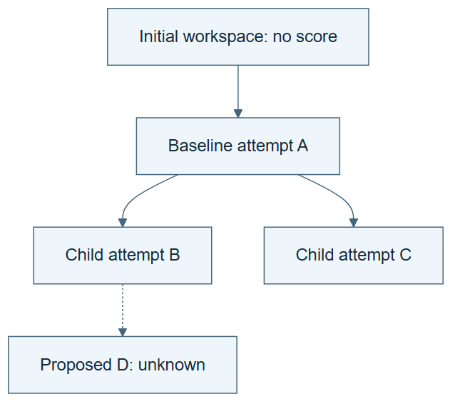

# 10.07 · Build a tree of attempted solutions

[Course](../../../README.md) · [Theme](../../README.md)

**You are here:** Theme 10, Research studio → lab 7 of 38. [Find this theme in the course map](../../../COURSE-MAP.md#theme-10) · [Whole-course mindmap](../../../COURSE-MAP.md#whole-course-mindmap).

## What you will build

A small discovery tree whose nodes link to actual ML trial outcomes.

## Why this matters

A flat best-score list hides which proposals descended from which observations.

## Before you start

Complete [10.06: Separate working state from reusable experience](../../01_memory_and_exploration/step_06_working_and_experience/README.md). You need the concepts and the reports named below, not its old chat. If you start here directly, ask the tutor to prepare the listed starting state and explain the missing prerequisite first.

Open the coding agent at the repository root. Read [the tutor skill](../../../skills/rsi-tutor/SKILL.md) and this lab's [brief](BRIEF.md). The agent creates a separate sibling workspace named <code>rsi-work/10-07</code> and reports its absolute path. It checks local Python and the [tool requirements](../../../tools/README.md) before execution. You do not write code or configuration.

**Starting state:** A fresh bike workspace and a three-attempt search plan.

**Budget:** Three fits maximum; preserve proposal and fit costs separately. Plan about 40–60 minutes of reading and discussion; this is an author estimate, not a measured student duration. Coding-agent inference may use a paid online service. Record its cost separately when available.

## How it works

Start with an unscored initial-workspace node R. Represent each attempted recipe as a descendant with a parent, action, outcome, and cost. The tree records realized work. A possible branch that was never executed has no measured outcome. This classroom structure prepares the replay exercise without pretending to recreate the original benchmark.

**A concrete example.** Root R represents the initial workspace and has no score. Node A is a measured baseline only after its execution. B adds calendar structure after inspecting A. C tests a different permitted recipe, also motivated by A. An imagined child D of B has no execution report. The discovery tree may include D as a proposal, but its score must remain unknown.


*This is a record layout to fill from actual execution. A, B, and C consume at most three attempted fits, including failures. D's generic attachment icon is only a placeholder for a proposal record; its explicit no-fit label means no execution evidence exists. Record proposal costs even for ideas never fitted. The unscored R matches the source distinction between an initial workspace and trial outcomes. This simplified recipe-ancestry tree does not implement Dream-RSI's full online node-eligibility, concurrency, or replay transition rules.*

[Open the illustration at full size](../../../assets/illustrations/discovery-tree-evidence-v1.png).

<details>
<summary>See the step diagram</summary>



*Read the diagram:* R is an unscored workspace. A, B, and C record attempted fits; D remains an unexecuted proposal. Fill outcomes only from actual trial records.

</details>

## Run the lab

Start with this prompt. The tutor pauses for your prediction before it runs the next step.

```text
Read rsi/AGENTS.md and
rsi/skills/rsi-tutor/SKILL.md.
Guide me through lab 10.07, Build a tree of
attempted solutions, one step at a time.
Read its README and BRIEF. Prepare its
separate workspace.
You write and run the implementation. Keep
the reports and failures.
Ask me to predict the result before the
experiment.
```

**Make a prediction:** Can an unvisited branch be assigned the score of a similar visited branch?

### 1. Define the tree

Make lineage explicit.

```text
Plan unscored workspace root R, baseline
attempt A beneath R, and two recipe changes
B and C derived from A. Create a discovery
table with node ID, parent, recipe, result
path, and cost. Leave outcomes blank until
execution.
```

**Observe:** Unexecuted nodes remain unmeasured.

### 2. Populate it with runs

Link nodes to evidence.

```text
Run the three recipes within budget. Fill
the tree from actual predictions and
reports. Render the tree and mark rejected
or failed nodes distinctly.
```

**Observe:** Each measured node has a corresponding execution artifact.

## Check your result

Parent links and trial identities agree. Failed attempts remain in the tree. No unexplored outcome is fabricated.

### Open these outputs

The agent keeps these in your lab workspace or records the original experiment path when reusing evidence.

| Output | What to inspect |
|---|---|
| Discovery table and rendered tree | Identify nodes, parent links, recipes, execution status, and result paths. |
| Three actual trial records | Supply measured outcomes and costs for the visited nodes. |
| Coverage statement | Separates proposed branches, failed attempts, and successfully measured outcomes. |

Ask the agent to open the actual files and show the command exit status. A written description of a run is not a run. Keep a short <code>LAB-NOTE.md</code> with your prediction, measured observation, explanation, and one limit. The tutor must mark skipped learner responses as skipped.

## Try one change

Add an unexecuted branch to the diagram and show it as unknown rather than assigning a schematic score.

## If something goes wrong

If a node has a score but no matching predictions or report, classify it as unsupported until its source is found. If a failed fit is silently absent, restore the attempted node and its cost. Do not copy a nearby node’s score into an unvisited branch merely because its recipe looks similar.

Say “Stop this lab” to stop further work. Ask the agent to save <code>PROGRESS.md</code> with the last completed step and remaining budget. To resume, have it read that file and inspect active processes first. A reset creates a new sibling workspace; it does not erase failures or alter the source data. See the [recovery rules](../../../tools/README.md) for interrupted tool runs.

## Key takeaways

- A discovery tree preserves search history.
- Only executed branches have measured outcomes.
- Lineage and cost matter beyond the winning score.

## Research connection

[Dream-RSI](https://arxiv.org/abs/2609.14858), 14 September 2026; [official project](https://www.dream-rsi.com/).

**Activity type: mechanism exercise.** You execute a small classroom mechanism. Its task, models, and budget differ from the source. Local observations do not reproduce the paper’s headline result.

## Check your understanding

Answer before opening the explanation. You can ask the tutor for a hint.

1. What does a node represent?
2. Why keep parent links?
3. Can the tree prove a counterfactual outcome?
4. Is this a paper reproduction?

<details>
<summary>Hint</summary>

For each plotted number, follow its link back to one executed trial. An attractive tree is still only a drawing without those links.

</details>

<details>
<summary>Explained answers</summary>

1. The root denotes the initial workspace. Other nodes record attempted recipes or explicitly unexecuted proposals; measured outcomes require actual execution.

2. They show which prior work informed or generated a proposal.

3. No. Unvisited branches remain unknown.

4. No. It is a small mechanism exercise with different tasks and resources.

</details>

## What's next

Use the recorded tree to compare replay policies and expose their coverage limit. Continue to [10.08: Replay only what the history can answer](../step_08_replay/README.md).
