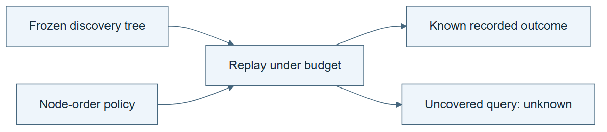

# 10.08 · Replay only what the history can answer

[Course](../../../README.md) · [Theme](../../README.md)

**You are here:** Theme 10, Research studio → lab 8 of 38. [Find this theme in the course map](../../../COURSE-MAP.md#theme-10) · [Whole-course mindmap](../../../COURSE-MAP.md#whole-course-mindmap).

## What you will build

Two replay policies evaluated on a recorded discovery tree, with explicit missing coverage.

## Why this matters

Replay can save environment executions, but it cannot reveal outcomes that were never recorded.

## Before you start

Complete [10.07: Build a tree of attempted solutions](../step_07_discovery_tree/README.md). You need the concepts and the reports named below, not its old chat. If you start here directly, ask the tutor to prepare the listed starting state and explain the missing prerequisite first.

Open the coding agent at the repository root. Read [the tutor skill](../../../skills/rsi-tutor/SKILL.md) and this lab's [brief](BRIEF.md). The agent creates a separate sibling workspace named <code>rsi-work/10-08</code> and reports its absolute path. It checks local Python and the [tool requirements](../../../tools/README.md) before execution. You do not write code or configuration.

**Starting state:** The frozen discovery tree from 10.07.

**Budget:** No new model fits. Two replay policies and one unsupported query. Plan about 40–60 minutes of reading and discussion; this is an author estimate, not a measured student duration. Coding-agent inference may use a paid online service. Record its cost separately when available.

## How it works

Dream-RSI uses replay over realized discovery structure. Our replay tool walks recorded nodes under a budget and returns known outcomes. A request outside that structure returns unknown. Proposal generation and policy evaluation can still cost resources even when no environment fit is repeated.

**A concrete example.** A history contains measured nodes A, B, and C. Policy 1 spends its replay budget on A then B; policy 2 reaches C. Their ranking depends on these recorded outcomes and costs. A request for an unseen forest branch returns unknown. Assigning it C’s score would turn replay into invented evidence.


*The left panel is the record before another run. Replay can reuse its supported outcomes and failure status; it cannot supply D’s missing result. The right panel shows the additional execution needed to extend that record. This is a classroom mechanism inspired by Dream-RSI, not a reproduction of its benchmark or a claim that all counterfactual policies are covered.*

[Open the illustration at full size](../../../assets/illustrations/replay-boundary-v2.png).

<details>
<summary>See the step diagram</summary>



*Read the diagram:* Replay can answer only questions covered by recorded work. It does not create new environment outcomes.

</details>

## Run the lab

Start with this prompt. The tutor pauses for your prediction before it runs the next step.

```text
Read rsi/AGENTS.md and
rsi/skills/rsi-tutor/SKILL.md.
Guide me through lab 10.08, Replay only what
the history can answer, one step at a time.
Read its README and BRIEF. Prepare its
separate workspace.
You write and run the implementation. Keep
the reports and failures.
Ask me to predict the result before the
experiment.
```

**Make a prediction:** Can replay alone decide whether a brand-new model family would win?

### 1. Generate the replay tool

Define its evidence boundary.

```text
Generate a local replay tool that reads the
frozen tree and accepts a node-order policy
and cost budget. It may return only recorded
outcomes. An absent edge or node must return
unknown.
```

**Observe:** The replay cannot invent environment evidence.

### 2. Compare policies

Separate selection from new execution.

```text
Replay two node-order policies. Count
environment fits saved and
policy-computation cost separately. Query
one absent branch and retain its unknown
result.
```

**Observe:** A replay winner is selected within the recorded coverage.

## Check your result

No new fit occurs. Unsupported paths are unknown. Cost reporting does not equate zero repeated fits with zero total cost.

### Open these outputs

The agent keeps these in your lab workspace or records the original experiment path when reusing evidence.

| Output | What to inspect |
|---|---|
| Frozen history and replay tool | Permit only recorded nodes, edges, outcomes, and declared cost accounting. |
| Two replay traces | Show each policy’s visited sequence and retained known result. |
| Unsupported-query record | Returns unknown for the missing branch without invoking a fit. |

Ask the agent to open the actual files and show the command exit status. A written description of a run is not a run. Keep a short <code>LAB-NOTE.md</code> with your prediction, measured observation, explanation, and one limit. The tutor must mark skipped learner responses as skipped.

## Try one change

Change the historical tree’s coverage by removing a node. Explain how the policy ranking can change without any new real-world evidence.

## If something goes wrong

If replay unexpectedly launches training, stop and inspect the execution boundary. If a policy selects an absent edge, keep the unsupported result instead of filling it with a prediction. If it examines all outcomes before choosing, disclose that information access; the replay should match the claimed policy’s observation rules.

Say “Stop this lab” to stop further work. Ask the agent to save <code>PROGRESS.md</code> with the last completed step and remaining budget. To resume, have it read that file and inspect active processes first. A reset creates a new sibling workspace; it does not erase failures or alter the source data. See the [recovery rules](../../../tools/README.md) for interrupted tool runs.

## Key takeaways

- Replay reuses evidence within its support.
- Unobserved branches remain unresolved.
- Replay-selected policies need online confirmation.

## Research connection

[Dream-RSI](https://arxiv.org/abs/2609.14858), 14 September 2026; [official project](https://www.dream-rsi.com/).

**Activity type: replay.** You reuse outcomes from recorded executions. Replay cannot establish outcomes for unvisited branches or reproduce the source benchmark.

## Check your understanding

Answer before opening the explanation. You can ask the tutor for a hint.

1. What is saved by replay?
2. What may still cost resources?
3. What should an absent branch return?
4. Why can replay overfit?

<details>
<summary>Hint</summary>

Replay can change how known work is selected. It cannot reveal what an unexecuted experiment would have measured.

</details>

<details>
<summary>Explained answers</summary>

1. Repeated environment executions for outcomes already represented in the history.

2. Policy proposals, model inference, replay computation, and checking.

3. Unknown or unsupported, not a guessed score.

4. The policy can specialize to the limited recorded tree and its selection conditions.

</details>

## What's next

Return online to test the selected policy on new work. Continue to [10.09: Test the replay winner on fresh work](../step_09_online/README.md).
