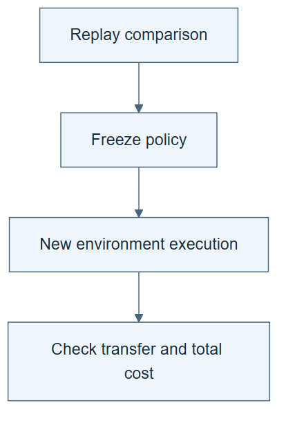

# 10.09 · Test the replay winner on fresh work

[Course](../../../README.md) · [Theme](../../README.md)

**You are here:** Theme 10, Research studio → lab 9 of 38. [Find this theme in the course map](../../../COURSE-MAP.md#theme-10) · [Whole-course mindmap](../../../COURSE-MAP.md#whole-course-mindmap).

## What you will build

An online confirmation comparison after replay selection.

## Why this matters

A policy that exploits a recorded tree may fail when new branches must actually be explored.

## Before you start

Complete [10.08: Replay only what the history can answer](../step_08_replay/README.md). You need the concepts and the reports named below, not its old chat. If you start here directly, ask the tutor to prepare the listed starting state and explain the missing prerequisite first.

Open the coding agent at the repository root. Read [the tutor skill](../../../skills/rsi-tutor/SKILL.md) and this lab's [brief](BRIEF.md). The agent creates a separate sibling workspace named <code>rsi-work/10-09</code> and reports its absolute path. It checks local Python and the [tool requirements](../../../tools/README.md) before execution. You do not write code or configuration.

**Starting state:** A frozen replay-selected policy and its baseline; new development task conditions declared before running.

**Budget:** Four fits total, two per policy. Include prior replay-selection overhead in the full ledger. Plan about 40–60 minutes of reading and discussion; this is an author estimate, not a measured student duration. Coding-agent inference may use a paid online service. Record its cost separately when available.

## How it works

Freeze the selected policy, then give it and the baseline comparable new work. The online outcome is new evidence. Keep replay-selection cost and online cost distinct but include both when discussing overall efficiency.

**A concrete example.** A policy selected from a history dominated by calendar models may prioritize them on new work. A newly declared regression condition can reward different structure. The online run tests those actual choices. If the policy loses, the earlier replay result can remain correct within its recorded coverage.



*Read the diagram:* A policy selected by replay still needs a fresh online check. Discovery and fresh evaluation answer different questions.

## Run the lab

Start with this prompt. The tutor pauses for your prediction before it runs the next step.

```text
Read rsi/AGENTS.md and
rsi/skills/rsi-tutor/SKILL.md.
Guide me through lab 10.09, Test the replay
winner on fresh work, one step at a time.
Read its README and BRIEF. Prepare its
separate workspace.
You write and run the implementation. Keep
the reports and failures.
Ask me to predict the result before the
experiment.
```

**Make a prediction:** Could a replay winner lose online even if the replay implementation is correct?

### 1. Freeze the policies

Prevent online results from rewriting selection history.

```text
Record policy versions and a new comparison
task before execution. State what makes the
cases new relative to the replay tree.
```

**Observe:** Selection and confirmation phases are separated.

### 2. Run online

Measure actual environment outcomes.

```text
Run both policies under matched two-fit
budgets. Compare retained quality, failures,
and total known cost including replay
preparation. State whether the task change
limits comparability.
```

**Observe:** The online result may disagree with replay.

## Check your result

New outcomes are produced by actual fits. Policies remain frozen during confirmation. The conclusion reports both phases and their costs.

### Open these outputs

The agent keeps these in your lab workspace or records the original experiment path when reusing evidence.

| Output | What to inspect |
|---|---|
| Frozen policy versions and new-work plan | Explain what is new relative to the replay history. |
| Four fit records | Give each policy the same two-fit allowance and preserve retained outcomes. |
| Two-phase cost and result report | Separates replay preparation from online execution without omitting either. |

Ask the agent to open the actual files and show the command exit status. A written description of a run is not a run. Keep a short <code>LAB-NOTE.md</code> with your prediction, measured observation, explanation, and one limit. The tutor must mark skipped learner responses as skipped.

## Try one change

Use online failures to propose a new policy version, then explain why it needs another fresh confirmation set.

## If something goes wrong

If the “fresh” task was used to choose the replay winner, treat it as development evidence. If the new condition changes the scientific target, write a new task contract before executing. If online feedback inspires an edit, save it as a new proposed policy; do not insert it into this frozen comparison.

Say “Stop this lab” to stop further work. Ask the agent to save <code>PROGRESS.md</code> with the last completed step and remaining budget. To resume, have it read that file and inspect active processes first. A reset creates a new sibling workspace; it does not erase failures or alter the source data. See the [recovery rules](../../../tools/README.md) for interrupted tool runs.

## Key takeaways

- Replay selection and online confirmation answer different questions.
- A frozen policy can fail outside recorded coverage.
- Preparation costs belong in efficiency comparisons.

## Research connection

[Dream-RSI](https://arxiv.org/abs/2609.14858), 14 September 2026; [official project](https://www.dream-rsi.com/).

**Activity type: mechanism exercise.** You execute a small classroom mechanism. Its task, models, and budget differ from the source. Local observations do not reproduce the paper’s headline result.

## Check your understanding

Answer before opening the explanation. You can ask the tutor for a hint.

1. What is new evidence here?
2. Can the policy adapt during a frozen comparison?
3. Does disagreement prove replay was buggy?
4. What claim remains if online confirmation fails?

<details>
<summary>Hint</summary>

Identify the first result that required a new environment execution. That is where replay ends and online evidence begins.

</details>

<details>
<summary>Explained answers</summary>

1. The actual outcomes of previously unexecuted online work.

2. Only if adaptation is part of the predeclared protocol; otherwise it changes the candidate being evaluated.

3. No. Limited coverage and distribution change can explain it.

4. The replay result within its recorded support, not a general online advantage.

</details>

## What's next

Localize harness failures before changing the whole system. Continue to [10.10: Localize a harness problem](../../03_modular_harness_evolution/step_10_localize/README.md).
