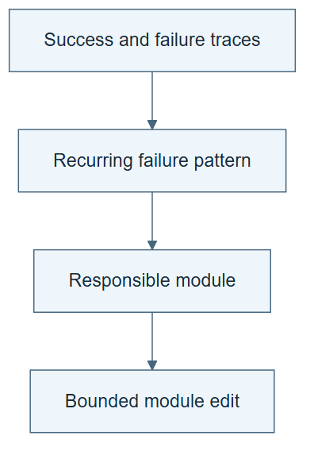

# 10.10 · Localize a harness problem

[Course](../../../README.md) · [Theme](../../README.md)

## What you will build

A failure diagnosis and one restricted edit to a harness component.

## Why this matters

Editing every instruction at once makes it hard to identify what fixed the problem.

## Before you start

Complete [10.09: Test the replay winner on fresh work](../../02_dream_rsi/step_09_online/README.md). You need the concepts and the reports named below, not its old chat. If you start here directly, ask the tutor to prepare the listed starting state and explain the missing prerequisite first.

Open the coding agent at the repository root. Read [the tutor skill](../../../skills/rsi-tutor/SKILL.md) and this lab's [brief](BRIEF.md). The agent creates a separate sibling workspace named <code>rsi-work/10-10</code> and reports its absolute path. It checks local Python and the [tool requirements](../../../tools/README.md) before execution. You do not write code or configuration.

**Starting state:** One successful and one failed ML workflow trace under the same task contract.

**Budget:** One component edit and two fixture checks; at most two fits. Plan about 40–60 minutes of reading and discussion; this is an author estimate, not a measured student duration. Coding-agent inference may use a paid online service. Record its cost separately when available.

## How it works

ModularRSI organizes changes across agent loop, tool use, observation, context, and task completion. In this exercise, contrasting traces identify one likely faulty component. Restrict the edit and keep neighboring components fixed so its consequences are easier to inspect.

**A concrete example.** A tool correctly reports seconds, but the summary interprets the value as minutes. Changing the estimator will not repair that interface error. Restrict the candidate edit to the observation-to-report step, then test the original unit mismatch and a case whose units were already handled correctly.



*Read the diagram:* Use repeated contrasting traces to localize a failure, then restrict the proposed edit to a declared module.

## Run the lab

Start with this prompt. The tutor pauses for your prediction before it runs the next step.

```text
Read rsi/AGENTS.md and
rsi/skills/rsi-tutor/SKILL.md.
Guide me through lab 10.10, Localize a
harness problem, one step at a time.
Read its README and BRIEF. Prepare its
separate workspace.
You write and run the implementation. Keep
the reports and failures.
Ask me to predict the result before the
experiment.
```

**Make a prediction:** If the tool output is correct but the agent misreads its units, which component deserves attention first?

### 1. Compare traces

Find the earliest relevant divergence.

```text
Compare a successful and failed trace. Map
each failure to loop, tool, observation,
context, or completion behavior. Choose one
component and cite the evidence.
```

**Observe:** The diagnosis targets a concrete interface or action.

### 2. Patch one component

Test a narrow intervention.

```text
Create a versioned patch to that component
only. Rerun the failing case and a
contrasting passing case. Save the
unchanged-component hashes and outcomes.
```

**Observe:** The patch can fix one case while exposing a regression elsewhere.

## Check your result

The edit stays within its declared component. The retained outcome includes both target and regression checks.

### Open these outputs

The agent keeps these in your lab workspace or records the original experiment path when reusing evidence.

| Output | What to inspect |
|---|---|
| Failure localization | Compares a successful and failed trace and identifies the earliest relevant divergence. |
| One component patch | Preserves the parent and unchanged neighboring components. |
| Target and regression outcomes | Show whether the patch repairs the fault without breaking the contrast. |

Ask the agent to open the actual files and show the command exit status. A written description of a run is not a run. Keep a short <code>LAB-NOTE.md</code> with your prediction, measured observation, explanation, and one limit. The tutor must mark skipped learner responses as skipped.

## Try one change

Make the same change in two components in a labelled proposal and explain why attribution becomes harder.

## If something goes wrong

If the patch changes several components, split the proposed changes or record that attribution is no longer local. If the chosen component is named without trace evidence, revisit the diagnosis. A successful original case is a regression check, not proof that the patch generalizes to all tasks.

Say “Stop this lab” to stop further work. Ask the agent to save <code>PROGRESS.md</code> with the last completed step and remaining budget. To resume, have it read that file and inspect active processes first. A reset creates a new sibling workspace; it does not erase failures or alter the source data. See the [recovery rules](../../../tools/README.md) for interrupted tool runs.

## Key takeaways

- Contrasting traces help localize failures.
- Restricted edits improve interpretability.
- A local fix still needs regression checks.

## Research connection

[ModularRSI](https://arxiv.org/abs/2609.14857), 14 September 2026; [author repository](https://github.com/IQuestLab/ModularRSI).

**Activity type: mechanism exercise.** You execute a small classroom mechanism. Its task, models, and budget differ from the source. Local observations do not reproduce the paper’s headline result.

## Check your understanding

Answer before opening the explanation. You can ask the tutor for a hint.

1. Why inspect a successful trace too?
2. Does the component label prove causation?
3. Why keep neighboring components fixed?
4. Can a correct local patch harm integration?

<details>
<summary>Hint</summary>

Find the first place where a correct upstream fact becomes an incorrect downstream action. Start the repair hypothesis at that boundary.

</details>

<details>
<summary>Explained answers</summary>

1. It gives a concrete contrast for identifying the failure mechanism.

2. No. The patch and controlled checks test the diagnosis.

3. It reduces alternative explanations for the observed change.

4. Yes. Interfaces and assumptions can interact across components.

</details>

## What's next

Combine checked changes and test their interactions. Continue to [10.11: Integrate edits and test transfer](../step_11_integrate/README.md).
