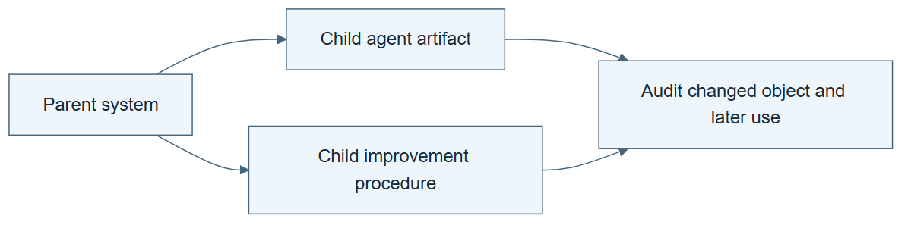

# 10.12 · Compare agent evolution and improver evolution

[Course](../../../README.md) · [Theme](../../README.md)

## What you will build

A lineage audit distinguishing changed agent code from changed improvement procedure.

## Why this matters

A family tree of increasingly capable agents can still leave the operator that creates descendants fixed.

## Before you start

Complete [10.11: Integrate edits and test transfer](../step_11_integrate/README.md). You need the concepts and the reports named below, not its old chat. If you start here directly, ask the tutor to prepare the listed starting state and explain the missing prerequisite first.

Open the coding agent at the repository root. Read [the tutor skill](../../../skills/rsi-tutor/SKILL.md) and this lab's [brief](BRIEF.md). The agent creates a separate sibling workspace named <code>rsi-work/10-12</code> and reports its absolute path. It checks local Python and the [tool requirements](../../../tools/README.md) before execution. You do not write code or configuration.

**Starting state:** Your local lineage and the primary historical method descriptions. Verify the DGM primary source before making detailed claims.

**Budget:** No fits. Audit two source diagrams and one local lineage. Plan about 40–60 minutes of reading and discussion; this is an author estimate, not a measured student duration. Coding-agent inference may use a paid online service. Record its cost separately when available.

## How it works

For every edge, ask which artifact changed and who produced the change. Then ask whether an altered improvement operator is inherited and used. Do not infer improver evolution merely from a system’s name or from multiple generations of agent code.




*Read the diagram:* A lineage must identify what each child changes. Agent changes and changes to the agent’s updater support different claims.


## Run the lab

Start with this prompt. The tutor pauses for your prediction before it runs the next step.

```text
Read rsi/AGENTS.md and rsi/skills/rsi-tutor/SKILL.md.
Guide me through lab 10.12, Compare agent evolution and improver evolution, one step at a time.
Read its README and BRIEF. Prepare its separate workspace.
You write and run the implementation. Keep the reports and failures.
Ask me to predict the result before the experiment.
```

**Make a prediction:** Could every node in an agent family tree be different while the improver stays identical?

### 1. Read the original mechanisms

Avoid relying on secondary labels.

```text
Use audit-rsi-claim to inspect the primary DGM and HyperAgents method descriptions. Record mutable surfaces, parent selection, evaluation, and inheritance. Mark any inaccessible detail unresolved.
```

**Observe:** The comparison is source-specific.

### 2. Map your lineage

Apply the same questions locally.

```text
Annotate each edge in your solver and improver lineage with the changed artifact and the procedure that generated it. Identify which edges support structural recursion.
```

**Observe:** Agent evolution and improver evolution can be distinguished.

## Check your result

Every historical technical assertion has a primary citation. The local classification is based on actual versions and traces.

Ask the agent to open the actual files and show the command exit status. A written description of a run is not a run. Keep a short <code>LAB-NOTE.md</code> with your prediction, measured observation, explanation, and one limit. The tutor must mark skipped learner responses as skipped.

## Try one change

Erase the improver-version column and explain which conclusions become ambiguous.

## If something goes wrong

If the expected artifact is missing, inspect the last command and its exit status before running again. If a check fails, preserve the failing result and diagnose that check; do not weaken it to obtain a pass.

Say “Stop this lab” to stop further work. Ask the agent to save <code>PROGRESS.md</code> with the last completed step and remaining budget. To resume, have it read that file and inspect active processes first. A reset creates a new sibling workspace; it does not erase failures or alter the source data. See the [recovery rules](../../../tools/README.md) for interrupted tool runs.

## Key takeaways

- A lineage needs typed changes.
- Repeated agent evolution can use a fixed operator.
- Inherited procedural change requires its own evidence.

## Research connection

[HyperAgents](https://ai.meta.com/research/publications/hyperagents/), Meta research, March 2026, and [Darwin Gödel Machine](https://arxiv.org/abs/2505.22954), Jenny Zhang and colleagues, first submitted 29 May 2025 and revised 12 March 2026. These are older foundations.

**Activity type: source audit.** You inspect and compare evidence from primary sources. This activity does not execute or reproduce the paper’s system.

## Check your understanding

Answer before opening the explanation. You can ask the tutor for a hint.

1. What does a family tree alone show?
2. Why track the operator on each edge?
3. Can source terminology replace inspection?
4. What remains necessary for effective RSI?

<details>
<summary>Hint</summary>

Trace what changed, what stayed fixed, and which observation supports the conclusion. A filename or a confident explanation is not enough evidence.

</details>

<details>
<summary>Explained answers</summary>

1. Ancestry among recorded versions, not necessarily what kind of component changed.

2. It identifies how descendants were produced and whether that method changed.

3. No. Similar names can describe different mutable surfaces.

4. A fair comparison showing that the inherited procedure improves later improvement work.

</details>

## What's next

Study a nested ML researcher and its outer improvement process. Continue to [10.13: Inspect an inner ML researcher](../../04_aide2/step_13_inner_research/README.md).
