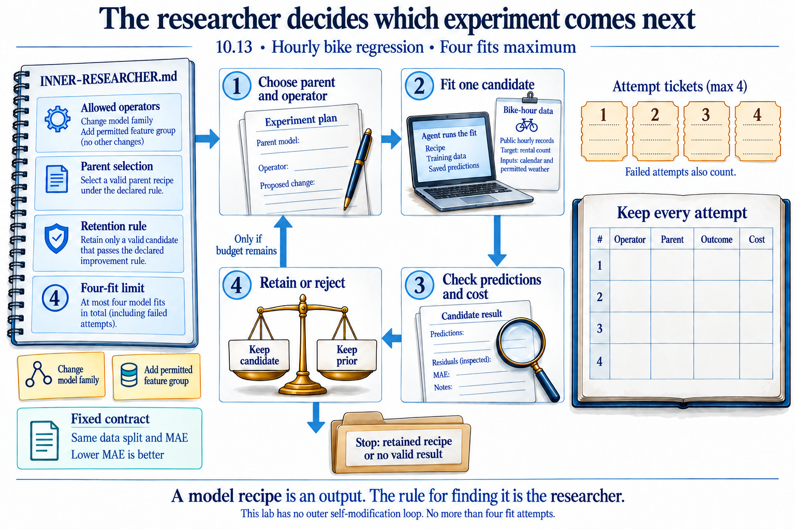
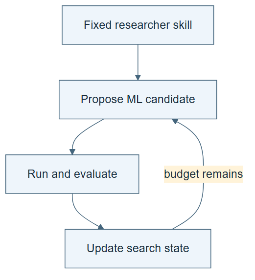

# 10.13 · Inspect an inner ML researcher

[Course](../../../README.md) · [Theme](../../README.md)

**You are here:** Theme 10, Research studio → lab 13 of 38. [Find this theme in the course map](../../../COURSE-MAP.md#theme-10) · [Whole-course mindmap](../../../COURSE-MAP.md#whole-course-mindmap).

## What you will build

A small inner researcher with explicit proposal operators and candidate selection.

## Why this matters

Nested improvement is easier to understand when the inner research task is concrete.

## Before you start

Complete [10.12: Compare agent evolution and improver evolution](../../03_modular_harness_evolution/step_12_lineage/README.md). You need the concepts and the reports named below, not its old chat. If you start here directly, ask the tutor to prepare the listed starting state and explain the missing prerequisite first.

Open the coding agent at the repository root. Read [the tutor skill](../../../skills/rsi-tutor/SKILL.md) and this lab's [brief](BRIEF.md). The agent keeps this lab's notes in <code>rsi-work/10-13</code>, outside the repository, and reports the absolute path. If the lab continues an earlier experiment, keep that experiment in its original workspace with its existing budget and locks. A new notes folder does not reset an experiment. The agent checks local Python and the [tool requirements](../../../tools/README.md) before execution. You do not write code or configuration.

**Starting state:** Bike regression, fixed evaluation, and a four-fit inner budget.

**Budget:** Four fits maximum in the inner search. Plan about 40–60 minutes of reading and discussion; this is an author estimate, not a measured student duration. Coding-agent inference may use a paid online service. Record its cost separately when available.

## How it works

The inner researcher proposes ML candidates, evaluates them, and chooses what to pursue. In our exercise, operators are readable actions such as change model family or add a permitted feature group. Their order and allocation define a research procedure that an outer process can later revise.

**A concrete example.** In the [recorded four-fit walkthrough](../../../evidence/2026-09-21/aide-labs/README.md), the researcher tries a median baseline, a linear model, a tree, and a permitted input change. It rejects the tree and applies the input change to the retained linear parent. Replaying another order reaches an unobserved recipe and returns unknown. The procedure explains how the search reached its result; four scores alone do not.



*The four tickets include failed attempts. Fill the ledger from actual execution and keep the retained recipe distinct from the best intermediate number. Calendar and permitted weather inputs follow the classroom hourly-bike contract; the figure adds no new features or dates. A fixed procedure can select different actions without rewriting itself. This local four-fit exercise does not reproduce the full AIDE² run.*

[Open the illustration at full size](../../../assets/illustrations/inner-ml-researcher-v2.png).

<details>
<summary>See the step diagram</summary>



*Read the diagram:* The inner researcher uses a fixed procedure to search ML candidates. Keep its search record and budget visible.

</details>

## Run the lab

Start with this prompt. The tutor pauses for your prediction before it runs the next step.

```text
Read rsi/AGENTS.md and
rsi/skills/rsi-tutor/SKILL.md.
Guide me through lab 10.13, Inspect an inner
ML researcher, one step at a time.
Read its README and BRIEF. Prepare its
separate workspace.
You write and run the implementation. Keep
the reports and failures.
Ask me to predict the result before the
experiment.
```

**Make a prediction:** Could changing the order of the same operators alter the best result under a small budget?

### 1. Define the operators

Expose the research procedure.

```text
Write INNER-RESEARCHER.md with permitted
proposal operators, parent selection,
retention, and a four-fit limit. Keep the
data and evaluator fixed.
```

**Observe:** The procedure is more than a list of scores.

### 2. Run the inner search

Save the complete search trace.

```text
Execute the declared researcher. Record each
operator, parent, candidate, outcome, and
cost. Retain the selected recipe and
rejected attempts.
```

**Observe:** The inner researcher produces a task solution under a fixed procedure.

## Check your result

The operator choices and budget are visible. The retained result is identifiable. The exercise is labelled a small adaptation of the nested-research idea.

### Open these outputs

The agent keeps these in your lab workspace or records the original experiment path when reusing evidence.

| Output | What to inspect |
|---|---|
| INNER-RESEARCHER.md | Defines proposal operators, parent selection, retention, and the four-fit limit. |
| Complete inner-search trace | Records each operator, candidate, predecessor, outcome, and cost. |
| Retained recipe | Identifies the actual selected solution rather than only the best-looking intermediate number. |

Ask the agent to open the actual files and show the command exit status. A written description of a run is not a run. Keep a short <code>LAB-NOTE.md</code> with your prediction, measured observation, explanation, and one limit. The tutor must mark skipped learner responses as skipped.

## Try one change

Replay the same known candidate outcomes under a different ordering and state where unobserved outcomes prevent a conclusion.

## If something goes wrong

If the agent supplies only four scores, recover the operator and decision trace before claiming a researcher comparison. If replaying a new order requires an unobserved branch, return unknown for that branch. Reordering known results cannot fabricate candidates that the original search never executed.

Say “Stop this lab” to stop further work. Ask the agent to save <code>PROGRESS.md</code> with the last completed step and remaining budget. To resume, have it read that file and inspect active processes first. A reset creates a new sibling workspace; it does not erase failures or alter the source data. See the [recovery rules](../../../tools/README.md) for interrupted tool runs.

## Key takeaways

- An inner researcher is itself a procedure.
- Operator allocation affects a bounded search.
- Its best task result does not measure an outer improver.

## Research connection

[Weco’s AIDE² report](https://www.weco.ai/blog/first-evidence-of-recursive-self-improvement), 14 July 2026. This is an explicitly requested older lab report, not a new September paper.

**Activity type: mechanism exercise.** You execute a small classroom mechanism. Its task, models, and budget differ from the source. Local observations do not reproduce the paper’s headline result.

## Check your understanding

Answer before opening the explanation. You can ask the tutor for a hint.

1. What is optimized in the inner task?
2. What is an operator here?
3. Why does order matter under a budget?
4. Is this the full AIDE² protocol?

<details>
<summary>Hint</summary>

Separate the model recipe from the rule that decides which recipe to try next. The outer process acts on the second object.

</details>

<details>
<summary>Explained answers</summary>

1. An ML solution under the frozen task and evaluator.

2. A declared way of proposing a candidate change.

3. Some candidates are reached only after particular prior choices and consumed resources.

4. No. It preserves a nested-search idea at a much smaller scale.

</details>

## What's next

Let an outer process propose a revision to that inner researcher. Continue to [10.14: Improve the inner researcher under a total budget](../step_14_outer_research/README.md).
