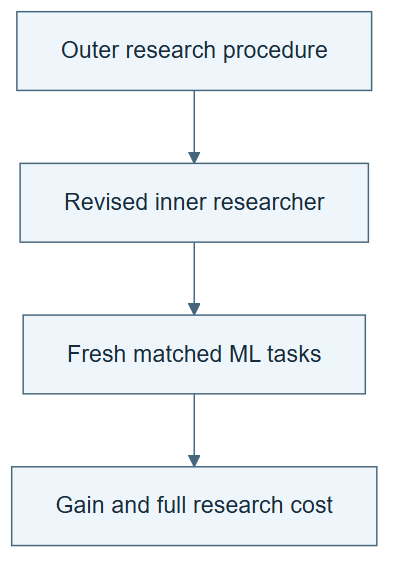

# 10.14 · Improve the inner researcher under a total budget

[Course](../../../README.md) · [Theme](../../README.md)

## What you will build

An outer comparison of two inner-researcher procedures.

## Why this matters

A better search procedure must be judged by the searches it produces, including the cost of evaluating it.

## Before you start

Complete [10.13: Inspect an inner ML researcher](../step_13_inner_research/README.md). You need the concepts and the reports named below, not its old chat. If you start here directly, ask the tutor to prepare the listed starting state and explain the missing prerequisite first.

Open the coding agent at the repository root. Read [the tutor skill](../../../skills/rsi-tutor/SKILL.md) and this lab's [brief](BRIEF.md). The agent creates a separate sibling workspace named <code>rsi-work/10-14</code> and reports its absolute path. It checks local Python and the [tool requirements](../../../tools/README.md) before execution. You do not write code or configuration.

**Starting state:** The inner researcher, one failure trace, and an unchanged external evaluator.

**Budget:** Two inner researchers with three fits each; include outer proposal and checking costs. Plan about 40–60 minutes of reading and discussion; this is an author estimate, not a measured student duration. Coding-agent inference may use a paid online service. Record its cost separately when available.

## How it works

The outer task changes the inner researcher’s procedure. It might revise which operator to try or when to stop exploring a branch. Evaluate parent and child inner researchers from the same starting state. Our small comparison does not reproduce Weco’s much larger run.

**A concrete example.** The parent spends all three comparison fits refining its first promising family. The proposed child reserves its last fit for a contrasting family. Freeze both procedures, then run each with three attempts from the same start. The child’s outcome includes the cost of any discarded exploration, not just its retained model.


*R0 and R1 are classroom identities. The middle comparison tests research procedures; the right comparison tests what they produce in the improver role. Neither has a preselected winner. The latter is the separate ignition question discussed in Weco’s July report; its ignition efficiency comparison was not statistically significant. This diagram explains the distinction; it does not reproduce the published run or establish ignition.*

[Open the illustration at full size](../../../assets/illustrations/nested-research-v2.png).

<details>
<summary>See the step diagram</summary>



*Read the diagram:* The outer experiment changes the inner researcher. Count the cost of discovering that change as well as its later use.

</details>

## Run the lab

Start with this prompt. The tutor pauses for your prediction before it runs the next step.

```text
Read rsi/AGENTS.md and
rsi/skills/rsi-tutor/SKILL.md.
Guide me through lab 10.14, Improve the
inner researcher under a total budget, one
step at a time.
Read its README and BRIEF. Prepare its
separate workspace.
You write and run the implementation. Keep
the reports and failures.
Ask me to predict the result before the
experiment.
```

**Make a prediction:** What cost is missing if only the winning inner search is counted?

### 1. Propose the outer change

Target research behavior.

```text
Use the inner trace to propose one change to
operator selection or budget allocation.
Preserve parent and child researcher
procedures and freeze the comparison before
execution.
```

**Observe:** The edited object is the researcher, not only a task candidate.

### 2. Compare researchers

Count the whole nested experiment.

```text
Run each inner researcher with three fits
from the same baseline. Compare retained
quality, failed work, proposal overhead, and
evaluation calls. Report unknown provider
costs.
```

**Observe:** The outer evaluation measures results produced by each researcher.

## Check your result

Starting artifacts and declared budgets match. All nested attempts remain in the ledger. The claim is limited to this comparison.

### Open these outputs

The agent keeps these in your lab workspace or records the original experiment path when reusing evidence.

| Output | What to inspect |
|---|---|
| Outer change proposal | Targets operator choice or allocation and preserves both inner-researcher versions. |
| Two three-fit searches | Start from matched artifacts and retain every nested attempt. |
| Nested cost and outcome report | Includes outer proposals, checks, losing searches, and unknown provider charges. |

Ask the agent to open the actual files and show the command exit status. A written description of a run is not a run. Keep a short <code>LAB-NOTE.md</code> with your prediction, measured observation, explanation, and one limit. The tutor must mark skipped learner responses as skipped.

## Try one change

Give the child twice the fit budget in a separate illustration and explain why that no longer isolates the procedure change.

## If something goes wrong

If the parent’s old four-fit result is compared with the child’s new three-fit result, the budgets are mismatched. Use the declared matched comparison or state the limitation. If an outer edit changes the metric, restore the fixed external objective before interpreting it as a procedure improvement.

Say “Stop this lab” to stop further work. Ask the agent to save <code>PROGRESS.md</code> with the last completed step and remaining budget. To resume, have it read that file and inspect active processes first. A reset creates a new sibling workspace; it does not erase failures or alter the source data. See the [recovery rules](../../../tools/README.md) for interrupted tool runs.

## Key takeaways

- Nested optimization adds an outer cost.
- Compare researchers from matching starts.
- A task-level gain and an improver-level gain are distinct.

## Research connection

[Weco’s AIDE² report](https://www.weco.ai/blog/first-evidence-of-recursive-self-improvement), 14 July 2026. This is an explicitly requested older lab report, not a new September paper.

**Activity type: mechanism exercise.** You execute a small classroom mechanism. Its task, models, and budget differ from the source. Local observations do not reproduce the paper’s headline result.

## Check your understanding

Answer before opening the explanation. You can ask the tutor for a hint.

1. What does the outer process edit?
2. Why count losing inner searches?
3. Does winning here prove ignition?
4. What if total resources cannot be matched?

<details>
<summary>Hint</summary>

Draw a box around each inner search, then count the cost of all boxes tried by the outer process. The winning box was not free to discover.

</details>

<details>
<summary>Explained answers</summary>

1. The inner researcher’s procedure.

2. They are part of the outer search required to select the revised researcher.

3. No. It does not yet show that the improved researcher is a better outer improver.

4. Report the mismatch and narrow the conclusion instead of claiming equal-cost superiority.

</details>

## What's next

Examine the harder question of whether a better researcher becomes a better improver. Continue to [10.15: Test the ignition claim separately](../step_15_ignition/README.md).
