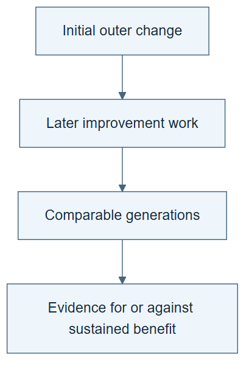

# 10.15 · Test the ignition claim separately

[Course](../../../README.md) · [Theme](../../README.md)

**You are here:** Theme 10, Research studio → lab 15 of 38. [Find this theme in the course map](../../../COURSE-MAP.md#theme-10) · [Whole-course mindmap](../../../COURSE-MAP.md#whole-course-mindmap).

## What you will build

A comparison plan for using old and new researchers as outer improvers.

## Why this matters

Being better at ML research does not automatically mean being better at improving ML researchers.

## Before you start

Complete [10.14: Improve the inner researcher under a total budget](../step_14_outer_research/README.md). You need the concepts and the reports named below, not its old chat. If you start here directly, ask the tutor to prepare the listed starting state and explain the missing prerequisite first.

Open the coding agent at the repository root. Read [the tutor skill](../../../skills/rsi-tutor/SKILL.md) and this lab's [brief](BRIEF.md). The agent keeps this lab's notes in <code>rsi-work/10-15</code>, outside the repository, and reports the absolute path. If the lab continues an earlier experiment, keep that experiment in its original workspace with its existing budget and locks. A new notes folder does not reset an experiment. The agent checks local Python and the [tool requirements](../../../tools/README.md) before execution. You do not write code or configuration.

**Starting state:** The parent and child inner researchers and their outer-comparison evidence.

**Budget:** Two small outer proposals and matched fixture evaluations; optional fits require a separate declared budget. Plan about 40–60 minutes of reading and discussion; this is an author estimate, not a measured student duration. Coding-agent inference may use a paid online service. Record its cost separately when available.

## How it works

Swap the role being tested. Give each researcher the same task of improving a researcher, with the same starting artifact and resources. Weco’s report distinguishes its demonstrated improvement claim from an ignition comparison that was not statistically significant. Keep that uncertainty in the audit.

**A concrete example.** The [recorded role exercise](../../../evidence/2026-09-21/aide-labs/README.md) projects each frozen researcher’s operator preference into an identical target procedure. Both targets pass two of three constructed decision cases, with opposite duplicate-proposal failures. No models are fitted. This narrow adapter makes the changed decision observable; it does not test general researcher-writing ability. The child’s earlier MAE win cannot answer this separate question.


*R0 and R1 are the producers; T0 is the object they revise. The pictured edits are examples subject to your declared allowed edits, not permission to change the evaluator. Fixtures execute the affected decisions without model fitting by default. Record both proposal and checking costs. Do not carry an earlier task-search score into this new comparison. Weco reported insufficient ignition evidence; this tiny role-transfer exercise cannot establish sustained recursive gains.*

[Open the illustration at full size](../../../assets/illustrations/ignition-role-transfer-v1.png).

<details>
<summary>See the step diagram</summary>



*Read the diagram:* An ignition claim concerns whether improvement can sustain further improvement. It needs a different comparison from one useful outer edit.

</details>

## Run the lab

Start with this prompt. The tutor pauses for your prediction before it runs the next step.

```text
Read rsi/AGENTS.md and
rsi/skills/rsi-tutor/SKILL.md.
Guide me through lab 10.15, Test the
ignition claim separately, one step at a
time.
Read its README and BRIEF. Prepare its
separate workspace.
You write and run the implementation. Keep
the reports and failures.
Ask me to predict the result before the
experiment.
```

**Make a prediction:** Can the researcher that wins on task search lose at designing a better search procedure?

### 1. Define the new outcome

Avoid reusing the old score as proof.

```text
Write IGNITION-PLAN.md comparing parent and
child as outer improvers. Define starting
researcher, allowed edits, evaluation cases,
total budget, and how improvement produced
will be measured.
```

**Observe:** The new comparison asks a different question.

### 2. Run a small role-transfer test

Inspect what the evidence can support.

```text
Have each frozen procedure produce one outer
proposal under matched conditions. Evaluate
on the same prespecified small fixtures.
Report structural differences, outcomes,
costs, and uncertainty. Label this a limited
mechanism exercise.
```

**Observe:** The outcome can be inconclusive without invalidating the earlier inner-research result.

## Check your result

The audit does not call the paper’s ignition result established. The classroom comparison uses a new outcome rather than recycling task scores.

### Open these outputs

The agent keeps these in your lab workspace or records the original experiment path when reusing evidence.

| Output | What to inspect |
|---|---|
| IGNITION-PLAN.md | Defines the new outer-improvement role, starting procedure, allowed changes, and matched fixtures. |
| Two outer proposals and fixture outcomes | Preserve both frozen proposers, context limits, costs, and all failures. |
| Ignition claim audit | Does not recycle inner-search scores as evidence about outer improvement ability. |

Ask the agent to open the actual files and show the command exit status. A written description of a run is not a run. Keep a short <code>LAB-NOTE.md</code> with your prediction, measured observation, explanation, and one limit. The tutor must mark skipped learner responses as skipped.

## Try one change

Construct an example where a strong optimizer always proposes overcomplicated procedures. Explain why task skill and improvement skill can diverge.

## If something goes wrong

If the fixtures merely score writing quality, redesign them to execute a decision affected by the proposed researcher change. Keep that limited procedural result separate from task-performance evidence. No extra model fits are authorized by this lab’s default budget; declare an extension before adding them.

Say “Stop this lab” to stop further work. Ask the agent to save <code>PROGRESS.md</code> with the last completed step and remaining budget. To resume, have it read that file and inspect active processes first. A reset creates a new sibling workspace; it does not erase failures or alter the source data. See the [recovery rules](../../../tools/README.md) for interrupted tool runs.

## Key takeaways

- Improvement ability is a capability to measure.
- Role transfer can fail.
- Uncertainty is part of the published evidence.

## Research connection

[Weco’s AIDE² report](https://www.weco.ai/blog/first-evidence-of-recursive-self-improvement), 14 July 2026. This is an explicitly requested older lab report, not a new September paper.

**Activity type: mechanism exercise.** You execute a small classroom mechanism. Its task, models, and budget differ from the source. Local observations do not reproduce the paper’s headline result.

## Check your understanding

Answer before opening the explanation. You can ask the tutor for a hint.

1. Why is ignition a separate question?
2. Can the earlier task score answer it?
3. How should a nonsignificant comparison be described?
4. What would strengthen the test?

<details>
<summary>Hint</summary>

Complete “better at what?” twice: once for the earlier researcher win and once for this outer-improvement test.

</details>

<details>
<summary>Explained answers</summary>

1. It asks whether improved research capability improves the process of generating further research improvements.

2. No. That score measures a different role and outcome.

3. As insufficient evidence for the claimed difference under that study, not proof of equality or success.

4. Prespecified repeated matched comparisons on fresh improvement tasks with complete cost accounting.

</details>

## What's next

Study task skills and meta-skills on different update schedules. Continue to [10.16: Improve task skills with a fixed pipeline](../../05_meta_skill_evolution/step_16_task_skills/README.md).
