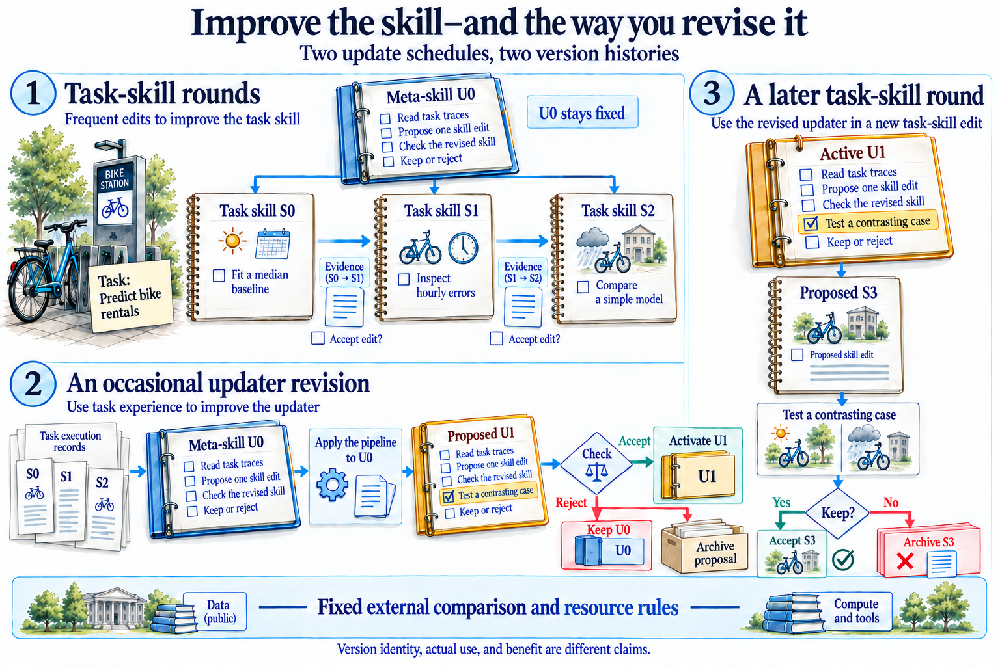

# Task skills and the skills that revise them

[Research studio](../README.md) · [Course](../../README.md)

Establish a task-skill update under one fixed meta-skill. Then use accumulated evidence to propose a less frequent updater revision and trace its effect on a later round. Keep the two version histories separate.

*The notebook lines are classroom examples, not complete skills. The updater edits procedures; the task skills direct experiments. Match Activate U1 to Active U1, then follow the same new rule into the later check. Acceptance is a possible path, not a guaranteed gain. The four-line updater is a teaching simplification of MetaSkill-Evolve’s July method. Keep the external comparison fixed and measure later behavior; a saved revision or a slower schedule alone does not establish benefit.*

[Open the illustration at full size](../../assets/illustrations/meta-skill-schedules-v3.png).

The upper row changes task skills under U0. The lower row makes U0 itself the input to its update pipeline. On the right, point to the inherited rule and the action it changes. Explain separately whether the revision was used and whether it helped.

**Start with:** Bring task-skill traces and the same fixed-evaluator discipline used in theme 09. Prepare missing prerequisite traces explicitly instead of inventing prior rounds.

- [10.16 · Improve task skills with a fixed pipeline](step_16_task_skills/README.md): A task-skill update pipeline with a frozen diagnosis, proposal, and selection procedure.
- [10.17 · Update the skill updater on a slower schedule](step_17_meta_skills/README.md): A two-timescale trace with task-skill updates and one inherited meta-skill revision.

**Carry forward:** Keep the fixed baseline, revised updater, schedule, and behavioral inheritance record. Distinguish the existence of the feedback path from evidence that it helps.

Read the source connection in each lab. The required path fits a laptop; actual large-model training is an optional, separately planned extension.
