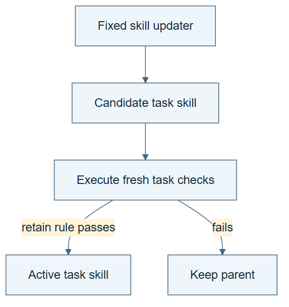

# 10.16 · Improve task skills with a fixed pipeline

[Course](../../../README.md) · [Theme](../../README.md)

**You are here:** Theme 10, Research studio → lab 16 of 38. [Find this theme in the course map](../../../COURSE-MAP.md#theme-10) · [Whole-course mindmap](../../../COURSE-MAP.md#whole-course-mindmap).

## What you will build

A task-skill update pipeline with a frozen diagnosis, proposal, and selection procedure.

## Why this matters

The task skill and the skill that improves it need separate identities before either can evolve.

## Before you start

Complete [10.15: Test the ignition claim separately](../../04_aide2/step_15_ignition/README.md). You need the concepts and the reports named below, not its old chat. If you start here directly, ask the tutor to prepare the listed starting state and explain the missing prerequisite first.

Open the coding agent at the repository root. Read [the tutor skill](../../../skills/rsi-tutor/SKILL.md) and this lab's [brief](BRIEF.md). The agent keeps this lab's notes in <code>rsi-work/10-16</code>, outside the repository, and reports the absolute path. If the lab continues an earlier experiment, keep that experiment in its original workspace with its existing budget and locks. A new notes folder does not reset an experiment. The agent checks local Python and the [tool requirements](../../../tools/README.md) before execution. You do not write code or configuration.

**Starting state:** A parent research skill, development traces, and a fixed updater.

**Budget:** One task-skill edit and two checks or fits. Plan about 40–60 minutes of reading and discussion; this is an author estimate, not a measured student duration. Coding-agent inference may use a paid online service. Record its cost separately when available.

## How it works

A meta-skill is a procedure for working on skills. Keep the meta-skill fixed while it proposes a task-skill revision. Record the resulting task behavior and the updater’s version. The exercise first establishes the nonrecursive baseline.

**A concrete example.** META-SKILL-v0 asks for one failure diagnosis, one task-skill edit, and a target/regression check. It produces TASK-SKILL-v1 but stays byte-identical itself. The word meta names what it operates on; it does not show that its own improvement method changed.


*The lock means the updater bytes must remain unchanged, which the agent checks before and after. The four responsibilities simplify the paper’s full pipeline. Regression case means a case that detects lost behavior, not necessarily an ML regression task. The two blank reports are child checks; saved parent evidence must be comparable before it can support a gain. A missing comparable parent result requires a revised claim or a separately declared budget, not hidden extra executions. Neither outcome is assumed.*

[Open the illustration at full size](../../../assets/illustrations/fixed-meta-skill-v2.png).

<details>
<summary>See the step diagram</summary>



*Read the diagram:* The fixed pipeline changes a task skill, tests it, and retains only an eligible revision.

</details>

## Run the lab

Start with this prompt. The tutor pauses for your prediction before it runs the next step.

```text
Read rsi/AGENTS.md and
rsi/skills/rsi-tutor/SKILL.md.
Guide me through lab 10.16, Improve task
skills with a fixed pipeline, one step at a
time.
Read its README and BRIEF. Prepare its
separate workspace.
You write and run the implementation. Keep
the reports and failures.
Ask me to predict the result before the
experiment.
```

**Make a prediction:** Which version should remain unchanged while task skills vary?

### 1. Freeze the pipeline

Make its responsibilities visible.

```text
Write META-SKILL-v0.md with diagnosis,
proposal, evaluation, and retention steps.
Define one permitted task-skill change and
its acceptance rule.
```

**Observe:** The updater is explicit and fixed.

### 2. Update the task skill

Measure the output of the pipeline.

```text
Run one task-skill revision through v0.
Execute a target and regression check. Save
parent, child, updater version, and
promotion decision.
```

**Observe:** The task skill can change while the pipeline stays the same.

## Check your result

Task and meta-skill versions are separate. Acceptance is based on executed evidence. No recursive claim is inferred from the prefix meta.

### Open these outputs

The agent keeps these in your lab workspace or records the original experiment path when reusing evidence.

| Output | What to inspect |
|---|---|
| META-SKILL-v0.md | Freezes the diagnosis, proposal, check, and retention procedure. |
| Task-skill parent and child | Expose the allowed edit and motivating evidence. |
| Two executed checks and decision | Connect the fixed updater to actual changed task behavior. |

Ask the agent to open the actual files and show the command exit status. A written description of a run is not a run. Keep a short <code>LAB-NOTE.md</code> with your prediction, measured observation, explanation, and one limit. The tutor must mark skipped learner responses as skipped.

## Try one change

Rename the updater without changing its behavior. Explain why a new name supplies no new mechanism.

## If something goes wrong

If the updater rewrites itself while creating the child, preserve the diff and separate that new experiment from this fixed baseline. If the child is accepted because its prose sounds better, run the declared behavioral checks before retaining it. Renaming a file does not substitute for a procedural change.

Say “Stop this lab” to stop further work. Ask the agent to save <code>PROGRESS.md</code> with the last completed step and remaining budget. To resume, have it read that file and inspect active processes first. A reset creates a new sibling workspace; it does not erase failures or alter the source data. See the [recovery rules](../../../tools/README.md) for interrupted tool runs.

## Key takeaways

- Meta-skills act on skills.
- A fixed meta-skill can support ordinary self-improvement.
- Naming a meta-level does not establish recursion.

## Research connection

[MetaSkill-Evolve](https://arxiv.org/abs/2607.05297), 6 July 2026. This older foundation is dated separately from the current-month sweep.

**Activity type: mechanism exercise.** You execute a small classroom mechanism. Its task, models, and budget differ from the source. Local observations do not reproduce the paper’s headline result.

## Check your understanding

Answer before opening the explanation. You can ask the tutor for a hint.

1. What does the meta-skill operate on?
2. What changes in this lab?
3. What establishes benefit?
4. Does a file named meta make a system recursive?

<details>
<summary>Hint</summary>

Name both the operator and its operand. In this lab the operand changes while the operator stays fixed.

</details>

<details>
<summary>Explained answers</summary>

1. Task-skill proposals and their evaluation procedure.

2. The task skill, subject to the fixed updater’s checks.

3. A valid comparison of actual behavior under the stated conditions.

4. No. Its role, inheritance, and execution determine the mechanism.

</details>

## What's next

Change the update pipeline on a slower schedule and test inheritance. Continue to [10.17: Update the skill updater on a slower schedule](../step_17_meta_skills/README.md).
