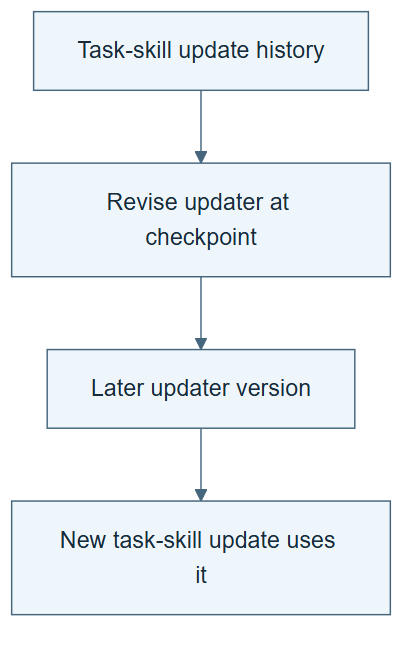

# 10.17 · Update the skill updater on a slower schedule

[Course](../../../README.md) · [Theme](../../README.md)

## What you will build

A two-timescale trace with task-skill updates and one inherited meta-skill revision.

## Why this matters

Changing every layer at every step makes attribution and evaluation difficult.

## Before you start

Complete [10.16: Improve task skills with a fixed pipeline](../step_16_task_skills/README.md). You need the concepts and the reports named below, not its old chat. If you start here directly, ask the tutor to prepare the listed starting state and explain the missing prerequisite first.

Open the coding agent at the repository root. Read [the tutor skill](../../../skills/rsi-tutor/SKILL.md) and this lab's [brief](BRIEF.md). The agent creates a separate sibling workspace named <code>rsi-work/10-17</code> and reports its absolute path. It checks local Python and the [tool requirements](../../../tools/README.md) before execution. You do not write code or configuration.

**Starting state:** Two task-skill update traces and the frozen meta-skill.

**Budget:** One meta-skill proposal, one later task-skill round, at most four fits total. Plan about 40–60 minutes of reading and discussion; this is an author estimate, not a measured student duration. Coding-agent inference may use a paid online service. Record its cost separately when available.

## How it works

Use several task-level outcomes to motivate a less frequent updater change. Freeze the revised updater during the next task-skill round. The schedule helps separate observations used to design the updater from outcomes used to evaluate its later behavior.

**A concrete example.** Several task-level outcomes expose a repeated omission: the updater tests only favorable cases. A slower meta-skill revision adds a contrasting check. Freeze that revised updater during the next task-skill round, then compare the decisions it produces with v0. Changing both layers after each result would obscure which change mattered.



*Read the diagram:* Task skills can change frequently while the updater changes less often. The new updater must govern a later skill revision.

## Run the lab

Start with this prompt. The tutor pauses for your prediction before it runs the next step.

```text
Read rsi/AGENTS.md and
rsi/skills/rsi-tutor/SKILL.md.
Guide me through lab 10.17, Update the skill
updater on a slower schedule, one step at a
time.
Read its README and BRIEF. Prepare its
separate workspace.
You write and run the implementation. Keep
the reports and failures.
Ask me to predict the result before the
experiment.
```

**Make a prediction:** What becomes ambiguous if the task skill, updater, and evaluator all change together?

### 1. Revise the updater

Use accumulated evidence at the right level.

```text
Review the two task-skill traces. Propose
one META-SKILL-v1 change, with expected
benefit, overhead, and a counterexample.
Keep the evaluator fixed.
```

**Observe:** The edit targets the update procedure.

### 2. Inherit and compare

Observe the slower change in later work.

```text
Run a later task-skill improvement round
using v1. Record the changed instruction
that affects its action. Compare with v0
under matched small conditions and state
remaining uncertainty.
```

**Observe:** The meta-skill revision enters actual subsequent improvement.

## Check your result

The update schedule and inheritance are explicit. Structural recursion and measured effectiveness are reported separately.

### Open these outputs

The agent keeps these in your lab workspace or records the original experiment path when reusing evidence.

| Output | What to inspect |
|---|---|
| Accumulated trace review | Uses existing update traces with their actual updater identities and outcomes. |
| META-SKILL-v1.md and schedule | Record the one updater edit, its intended effect, overhead, and limit. |
| Later matched improvement record | Shows inheritance, behavior under each updater, at most four fits, and separate structure/benefit conclusions. |

Ask the agent to open the actual files and show the command exit status. A written description of a run is not a run. Keep a short <code>LAB-NOTE.md</code> with your prediction, measured observation, explanation, and one limit. The tutor must mark skipped learner responses as skipped.

## Try one change

Change the update frequency in a labelled simulation and explain the tradeoff between responsiveness, cost, and attribution.

## If something goes wrong

If only one prior update trace exists, locate a suitable earlier trace or explicitly prepare the missing starting state before freezing this protocol. Do not invent a second run. If the active updater changes during its evaluation, preserve the event and narrow attribution. A version hash alone cannot prove its changed instruction governed the later action.

Say “Stop this lab” to stop further work. Ask the agent to save <code>PROGRESS.md</code> with the last completed step and remaining budget. To resume, have it read that file and inspect active processes first. A reset creates a new sibling workspace; it does not erase failures or alter the source data. See the [recovery rules](../../../tools/README.md) for interrupted tool runs.

## Key takeaways

- Different layers can use different update schedules.
- Freeze a layer while evaluating its effect.
- Inheritance needs behavioral evidence.

## Research connection

[MetaSkill-Evolve](https://arxiv.org/abs/2607.05297), 6 July 2026. This older foundation is dated separately from the current-month sweep.

**Activity type: mechanism exercise.** You execute a small classroom mechanism. Its task, models, and budget differ from the source. Local observations do not reproduce the paper’s headline result.

## Check your understanding

Answer before opening the explanation. You can ask the tutor for a hint.

1. Why update the meta-skill less often here?
2. Is slower always better?
3. What must remain stable for the comparison?
4. What if v1 is used but performs worse?

<details>
<summary>Hint</summary>

Place task-skill updates and meta-skill updates on separate timelines. Mark when each candidate is frozen and when its later behavior is measured.

</details>

<details>
<summary>Explained answers</summary>

1. It lets several task-level observations inform one procedural change and makes attribution easier.

2. No. It can delay useful adaptation; the schedule is a design choice to test.

3. Task conditions, evaluation rules, and declared resource accounting.

4. The trace can demonstrate structural recursion while failing to show effective improvement.

</details>

## What's next

Apply these ideas to autonomous scientific work, beginning with a testable hypothesis. Continue to [10.18: Turn a limitation into a scientific hypothesis](../../06_scientist_two/step_18_hypothesis/README.md).
