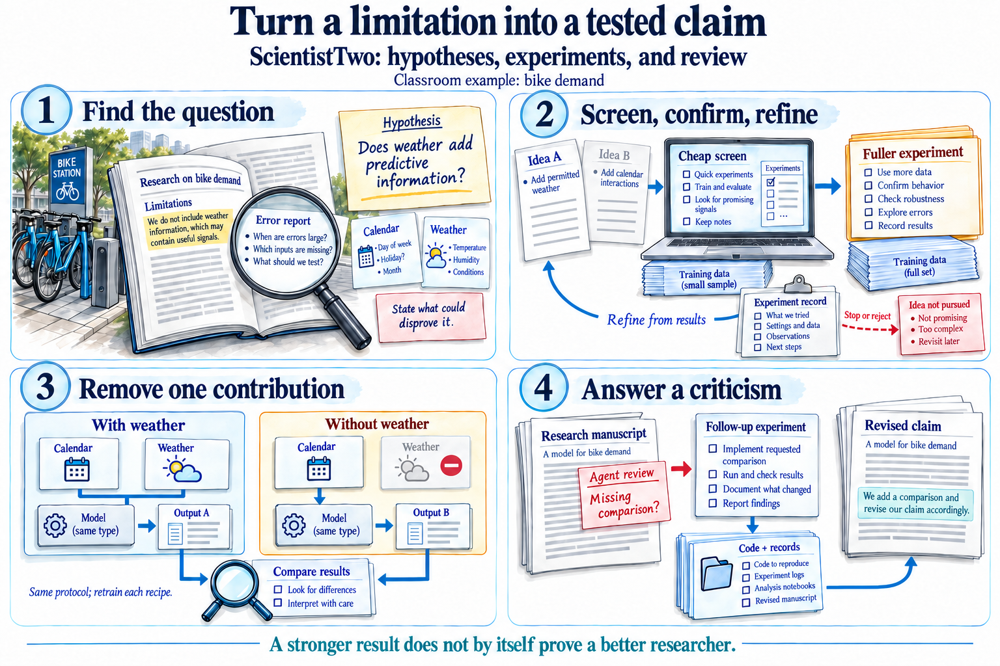
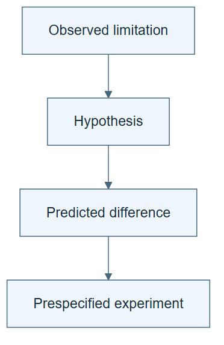

# 10.18 · Turn a limitation into a scientific hypothesis

[Course](../../../README.md) · [Theme](../../README.md)

**You are here:** Theme 10, Research studio → lab 18 of 38. [Find this theme in the course map](../../../COURSE-MAP.md#theme-10) · [Whole-course mindmap](../../../COURSE-MAP.md#whole-course-mindmap).

## What you will build

A baseline, a testable hypothesis, and a prespecified experiment.

## Why this matters

An interesting idea becomes a research question when you can state what evidence would support or contradict it.

## Before you start

Complete [10.17: Update the skill updater on a slower schedule](../../05_meta_skill_evolution/step_17_meta_skills/README.md). You need the concepts and the reports named below, not its old chat. If you start here directly, ask the tutor to prepare the listed starting state and explain the missing prerequisite first.

Open the coding agent at the repository root. Read [the tutor skill](../../../skills/rsi-tutor/SKILL.md) and this lab's [brief](BRIEF.md). The agent keeps this lab's notes in <code>rsi-work/10-18</code>, outside the repository, and reports the absolute path. If the lab continues an earlier experiment, keep that experiment in its original workspace with its existing budget and locks. A new notes folder does not reset an experiment. The agent checks local Python and the [tool requirements](../../../tools/README.md) before execution. You do not write code or configuration.

**Starting state:** The bike baseline and selection error slices. No final outcomes.

**Budget:** Two fits: baseline and one intervention. Plan about 40–60 minutes of reading and discussion; this is an author estimate, not a measured student duration. Coding-agent inference may use a paid online service. Record its cost separately when available.

## How it works

ScientistTwo motivates a research workflow built around hypotheses and experiments. Our classroom question is narrow: does adding permitted weather information help a fixed linear recipe beyond calendar inputs? This is a prediction study, not a causal claim about weather.

**A concrete example.** The [recorded hypothesis test](../../../evidence/2026-09-21/scientist-labs/README.md) repeats the fixed linear recipe with calendar-only and calendar-plus-weather inputs. Selection MAE falls from 109.81 to 99.18, exceeding the declared 5% threshold. The author already knew these development data. The result supports a conditional predictive observation, not a causal effect of changing weather or a claim of blind discovery.



*This is a bike-task adaptation of the research stages. The pictured paper and records are illustrative. Each ablation recipe is fitted again; only its permitted feature group changes. Use development evidence for screening and refinement. A review can lead to a narrower or rejected claim, and agent review is not conference acceptance. The illustration does not demonstrate frontier discovery or an improved research procedure.*

[Open the illustration at full size](../../../assets/illustrations/scientific-claim-v2.png).

<details>
<summary>See the step diagram</summary>



*Read the diagram:* Turn an observed limitation into a falsifiable hypothesis before changing the experiment.

</details>

## Run the lab

Start with this prompt. The tutor pauses for your prediction before it runs the next step.

```text
Read rsi/AGENTS.md and
rsi/skills/rsi-tutor/SKILL.md.
Guide me through lab 10.18, Turn a
limitation into a scientific hypothesis, one
step at a time.
Read its README and BRIEF. Prepare its
separate workspace.
You write and run the implementation. Keep
the reports and failures.
Ask me to predict the result before the
experiment.
```

**Make a prediction:** What observation would make you reject the proposed explanation?

### 1. Write the hypothesis

Connect a limitation to a measurable consequence.

```text
Create HYPOTHESIS.md with observed
limitation, proposed mechanism,
intervention, metric, baseline, expected
result, alternative explanation, and
rejection condition. Use the fixed bike
contract.
```

**Observe:** The hypothesis could be wrong.

### 2. Run the experiment

Produce evidence for the stated question.

```text
Fit linear/calendar and linear/all under
matching settings. Save predictions, slice
errors, costs, and a conclusion tied to the
predeclared question.
```

**Observe:** The conclusion addresses the intervention rather than a broad intelligence claim.

## Check your result

The hypothesis precedes results. One declared factor changes. A failed hypothesis remains a valid research outcome.

### Open these outputs

The agent keeps these in your lab workspace or records the original experiment path when reusing evidence.

| Output | What to inspect |
|---|---|
| HYPOTHESIS.md | Records the observation, mechanism, intervention, alternative, and rejection condition before results. |
| Two matched fits | Differ only in the declared feature group and retain predictions and slice errors. |
| Scoped conclusion | Reports whether the expected difference appeared, including an unfavorable result. |

Ask the agent to open the actual files and show the command exit status. A written description of a run is not a run. Keep a short <code>LAB-NOTE.md</code> with your prediction, measured observation, explanation, and one limit. The tutor must mark skipped learner responses as skipped.

## Try one change

Rewrite “weather improves demand prediction” as a conditional statement tied to this task, model, period, and metric.

## If something goes wrong

If the agent changes the estimator as well as the features, the result cannot isolate the proposed contribution. Preserve it as a different comparison. If an observed-weather field is called a forecast, correct the claim: this dataset does not supply historical weather forecasts available at a prior prediction time.

Say “Stop this lab” to stop further work. Ask the agent to save <code>PROGRESS.md</code> with the last completed step and remaining budget. To resume, have it read that file and inspect active processes first. A reset creates a new sibling workspace; it does not erase failures or alter the source data. See the [recovery rules](../../../tools/README.md) for interrupted tool runs.

## Key takeaways

- A hypothesis predicts an observable difference.
- A baseline defines the comparison.
- Predictive evidence is not automatically causal evidence.

## Research connection

[ScientistTwo](https://arxiv.org/abs/2609.19644), Jaehyun Nam, Jinsung Yoon, Yanzhou Pan, Yubo Wang, Rui Meng, Parthasarathy Ranganathan, and Tomas Pfister; Google Cloud AI Research and University of Waterloo; 17 September 2026.

**Activity type: mechanism exercise.** You execute a small classroom mechanism. Its task, models, and budget differ from the source. Local observations do not reproduce the paper’s headline result.

## Check your understanding

Answer before opening the explanation. You can ask the tutor for a hint.

1. Why include an alternative explanation?
2. What is the intervention?
3. Does this reproduce autonomous scientific discovery?
4. What makes a negative result useful?

<details>
<summary>Hint</summary>

Name the one factor changed, then list the conditions that stayed fixed. Your conclusion should be no broader than that comparison.

</details>

<details>
<summary>Explained answers</summary>

1. It prevents treating one favorable outcome as uniquely proving the proposed mechanism.

2. Adding the permitted weather feature group while holding the linear recipe and evaluation fixed.

3. No. It is a small mechanism exercise with a supplied task and limited search.

4. It rules out or narrows a hypothesis under the tested conditions.

</details>

## What's next

Screen ideas cheaply, then use ablations to test contributions. Continue to [10.19: Screen ideas and test their contributions](../step_19_screen_ablate/README.md).
