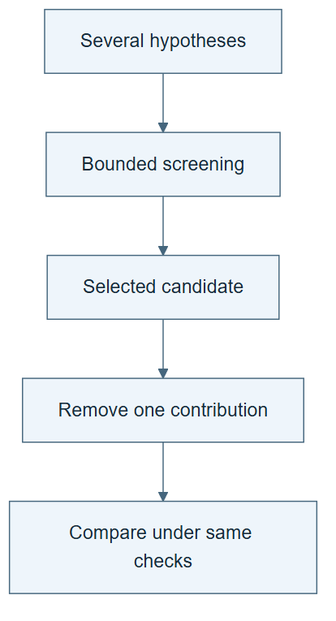

# 10.19 · Screen ideas and test their contributions

[Course](../../../README.md) · [Theme](../../README.md)

## What you will build

A small screening table followed by a controlled ablation.

## Why this matters

Testing every idea at full scale is costly. Cheap screening can help, but it can also select for the wrong proxy.

## Before you start

Complete [10.18: Turn a limitation into a scientific hypothesis](../step_18_hypothesis/README.md). You need the concepts and the reports named below, not its old chat. If you start here directly, ask the tutor to prepare the listed starting state and explain the missing prerequisite first.

Open the coding agent at the repository root. Read [the tutor skill](../../../skills/rsi-tutor/SKILL.md) and this lab's [brief](BRIEF.md). The agent creates a separate sibling workspace named <code>rsi-work/10-19</code> and reports its absolute path. It checks local Python and the [tool requirements](../../../tools/README.md) before execution. You do not write code or configuration.

**Starting state:** Two candidate hypotheses and a fixed development protocol.

**Budget:** Four fits maximum: two screening runs and two confirmation runs. Plan about 40–60 minutes of reading and discussion; this is an author estimate, not a measured student duration. Coding-agent inference may use a paid online service. Record its cost separately when available.

## How it works

Screening uses a cheaper test to choose which idea deserves more work. Confirmation then tests the chosen idea under the declared fuller conditions. An ablation removes the proposed component. Keep screening and confirmation results distinct; a cheap proxy is not automatically the final objective.

**A concrete example.** A cheap screen on a small, earlier training subset may favor a simple model. The fuller development comparison can favor another idea because more data supports it. That disagreement is a result about the screen’s usefulness, not a reason to hide the cheaper run.



*Read the diagram:* Screening selects promising ideas. Ablation then asks which part contributes under a controlled comparison.

## Run the lab

Start with this prompt. The tutor pauses for your prediction before it runs the next step.

```text
Read rsi/AGENTS.md and
rsi/skills/rsi-tutor/SKILL.md.
Guide me through lab 10.19, Screen ideas and
test their contributions, one step at a
time.
Read its README and BRIEF. Prepare its
separate workspace.
You write and run the implementation. Keep
the reports and failures.
Ask me to predict the result before the
experiment.
```

**Make a prediction:** Could the idea that wins a small-data screen lose on the full training period?

### 1. Declare the screen

Specify what the cheap test can establish.

```text
Plan two small development-only screening
experiments. State subset selection, metric,
cost limit, and the rule for advancing one
idea. Have the agent generate a separate
screening runner; the supplied general tool
keeps its training partition fixed. Preserve
the original data and contracts, fit
preprocessing only on the declared training
subset, and keep final data untouched.
```

**Observe:** The proxy and its limitations are explicit.

### 2. Confirm and ablate

Test the selected contribution.

```text
Run the selected idea and its ablation under
matching fuller conditions within the total
fit budget. Compare with the screen and
record ranking changes.
```

**Observe:** The full comparison can overturn screening.

## Check your result

The screen does not consume final evaluation. Confirmation and ablation use matched conditions. All ideas and costs are retained.

### Open these outputs

The agent keeps these in your lab workspace or records the original experiment path when reusing evidence.

| Output | What to inspect |
|---|---|
| Screening plan and runner | Freeze subset membership, preprocessing boundaries, advancement rule, and four-fit total. |
| Two screening records | Retain both ideas, proxy outcomes, and costs. |
| Confirmation and ablation | Use matching fuller conditions for the selected idea and its removed-component version. |

Ask the agent to open the actual files and show the command exit status. A written description of a run is not a run. Keep a short <code>LAB-NOTE.md</code> with your prediction, measured observation, explanation, and one limit. The tutor must mark skipped learner responses as skipped.

## Try one change

Select on the fastest screen only and explain why that could miss an idea whose benefit appears at a larger data scale.

## If something goes wrong

If the supplied runtime refuses a changed partition, keep its contract intact. The agent must generate the separate screening runner described in the plan. If the subset omits a necessary category or class, diagnose that before interpreting model quality. Count discarded screen candidates in the total research cost.

Say “Stop this lab” to stop further work. Ask the agent to save <code>PROGRESS.md</code> with the last completed step and remaining budget. To resume, have it read that file and inspect active processes first. A reset creates a new sibling workspace; it does not erase failures or alter the source data. See the [recovery rules](../../../tools/README.md) for interrupted tool runs.

## Key takeaways

- Cheap screens are allocation tools.
- A proxy can rank ideas incorrectly.
- Ablations test a component’s contribution.

## Research connection

[ScientistTwo](https://arxiv.org/abs/2609.19644), Jaehyun Nam, Jinsung Yoon, Yanzhou Pan, Yubo Wang, Rui Meng, Parthasarathy Ranganathan, and Tomas Pfister; Google Cloud AI Research and University of Waterloo; 17 September 2026.

**Activity type: mechanism exercise.** You execute a small classroom mechanism. Its task, models, and budget differ from the source. Local observations do not reproduce the paper’s headline result.

## Check your understanding

Answer before opening the explanation. You can ask the tutor for a hint.

1. Why use screening?
2. What is its main risk?
3. What does an ablation remove?
4. Can the screening winner be reported as confirmed?

<details>
<summary>Hint</summary>

A screen chooses where to spend resources. Ask whether its cheaper conditions preserve the distinction that matters in the fuller test.

</details>

<details>
<summary>Explained answers</summary>

1. To allocate limited research resources among ideas.

2. The cheap proxy may not preserve the ranking under the target conditions.

3. The specific proposed component while keeping the comparison otherwise similar.

4. Only after the declared confirmation actually runs and supports that claim.

</details>

## What's next

Turn a review criticism into another test instead of a more confident paragraph. Continue to [10.20: Answer a criticism with evidence](../step_20_review_rebuttal/README.md).
