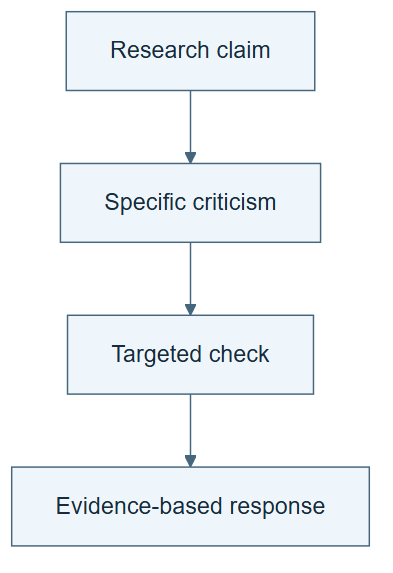

# 10.20 · Answer a criticism with evidence

[Course](../../../README.md) · [Theme](../../README.md)

**You are here:** Theme 10, Research studio → lab 20 of 38. [Find this theme in the course map](../../../COURSE-MAP.md#theme-10) · [Whole-course mindmap](../../../COURSE-MAP.md#whole-course-mindmap).

## What you will build

A review, a follow-up experiment, and an evidence-based response.

## Why this matters

A rebuttal should resolve an uncertainty, not merely defend the original wording.

## Before you start

Complete [10.19: Screen ideas and test their contributions](../step_19_screen_ablate/README.md). You need the concepts and the reports named below, not its old chat. If you start here directly, ask the tutor to prepare the listed starting state and explain the missing prerequisite first.

Open the coding agent at the repository root. Read [the tutor skill](../../../skills/rsi-tutor/SKILL.md) and this lab's [brief](BRIEF.md). The agent creates a separate sibling workspace named <code>rsi-work/10-20</code> and reports its absolute path. It checks local Python and the [tool requirements](../../../tools/README.md) before execution. You do not write code or configuration.

**Starting state:** The hypothesis report and ablation results.

**Budget:** One follow-up comparison, at most two fits. Plan about 40–60 minutes of reading and discussion; this is an author estimate, not a measured student duration. Coding-agent inference may use a paid online service. Record its cost separately when available.

## How it works

A reviewer can identify a missing baseline, confound, or unsupported generalization. Convert one valid criticism into an experiment. Automated review is useful feedback but is not a real conference acceptance decision. ScientistTwo’s automated assessment must be read with that distinction.

**A concrete example.** The report says weather helps, but the reviewer notices that the weather arm also used a different estimator. A useful response compares the feature groups with one fixed estimator. If the gain disappears, the revised claim should say so. A longer defense of the first result would leave the confound unresolved.



*Read the diagram:* A criticism leads to a targeted check. The response should cite its result, including a result that weakens the claim.

## Run the lab

Start with this prompt. The tutor pauses for your prediction before it runs the next step.

```text
Read rsi/AGENTS.md and
rsi/skills/rsi-tutor/SKILL.md.
Guide me through lab 10.20, Answer a
criticism with evidence, one step at a time.
Read its README and BRIEF. Prepare its
separate workspace.
You write and run the implementation. Keep
the reports and failures.
Ask me to predict the result before the
experiment.
```

**Make a prediction:** What criticism can be resolved with an experiment rather than a wording change?

### 1. Review the claim

Identify one consequential weakness.

```text
Use audit-rsi-claim to review the research
note. Separate a factual error, an
unsupported inference, and a useful next
experiment. Label the review as
agent-generated in the current context.
```

**Observe:** The review’s source and limits are clear.

### 2. Respond through a test

Let new evidence change the conclusion.

```text
Choose one criticism, predeclare a two-fit
follow-up, and execute it. Write RESPONSE.md
linking the new result and the revised
claim. If the criticism stands, say so.
```

**Observe:** The response can narrow the original conclusion.

## Check your result

The response cites actual new evidence or identifies an unresolved issue. No automated score is presented as human peer acceptance.

### Open these outputs

The agent keeps these in your lab workspace or records the original experiment path when reusing evidence.

| Output | What to inspect |
|---|---|
| Agent-generated review | Separates a factual error, unsupported inference, and testable concern. |
| Predeclared follow-up and at most two fits | Target the chosen criticism without using final feedback for selection. |
| RESPONSE.md | Links new evidence to a corrected or narrower claim and preserves unresolved concerns. |

Ask the agent to open the actual files and show the command exit status. A written description of a run is not a run. Keep a short <code>LAB-NOTE.md</code> with your prediction, measured observation, explanation, and one limit. The tutor must mark skipped learner responses as skipped.

## Try one change

Write a response that only restates the original claim. Explain which uncertainty remains unchanged.

## If something goes wrong

If the follow-up does not distinguish the reviewer’s explanation from yours, revise its plan before running. If the evidence supports the criticism, concede it. Keep the shared-context review label; a role switch does not create blinded review or a real conference decision.

Say “Stop this lab” to stop further work. Ask the agent to save <code>PROGRESS.md</code> with the last completed step and remaining budget. To resume, have it read that file and inspect active processes first. A reset creates a new sibling workspace; it does not erase failures or alter the source data. See the [recovery rules](../../../tools/README.md) for interrupted tool runs.

## Key takeaways

- Review can reveal a missing experiment.
- A rebuttal can concede or narrow a claim.
- Automated evaluation and real peer review are different evidence.

## Research connection

[ScientistTwo](https://arxiv.org/abs/2609.19644), Jaehyun Nam, Jinsung Yoon, Yanzhou Pan, Yubo Wang, Rui Meng, Parthasarathy Ranganathan, and Tomas Pfister; Google Cloud AI Research and University of Waterloo; 17 September 2026.

**Activity type: mechanism exercise.** You execute a small classroom mechanism. Its task, models, and budget differ from the source. Local observations do not reproduce the paper’s headline result.

## Check your understanding

Answer before opening the explanation. You can ask the tutor for a hint.

1. What makes a criticism actionable?
2. Must a rebuttal prove the reviewer wrong?
3. Does an agent reviewer create independent evidence?
4. Can an automated acceptance score be called conference acceptance?

<details>
<summary>Hint</summary>

Complete “this experiment would resolve the criticism because ___.” If the blank contains only another assertion, the uncertainty remains.

</details>

<details>
<summary>Explained answers</summary>

1. It identifies a concrete uncertainty or error that evidence or a precise correction can address.

2. No. It should establish the most accurate conclusion.

3. Not automatically, especially when it shares context and assumptions.

4. No. Those are different events and decision processes.

</details>

## What's next

Use a result as the next baseline, then inspect what actually improved. Continue to [10.21: Distinguish better discoveries from a better scientist](../step_21_successive_results/README.md).
