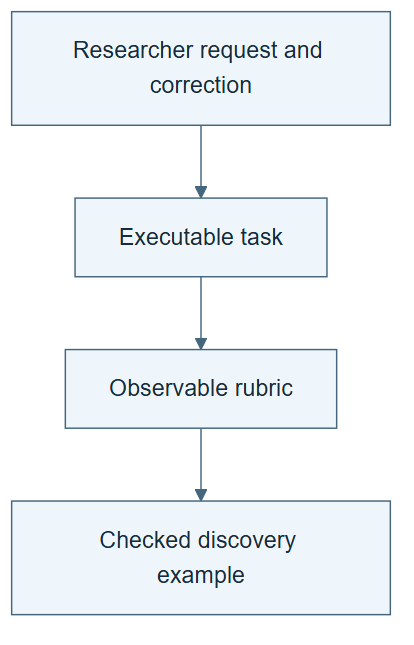

# 10.22 · Turn a researcher correction into a task

[Course](../../../README.md) · [Theme](../../README.md)

**You are here:** Theme 10, Research studio → lab 22 of 38. [Find this theme in the course map](../../../COURSE-MAP.md#theme-10) · [Whole-course mindmap](../../../COURSE-MAP.md#whole-course-mindmap).

## What you will build

A task and rubric derived from a labelled researcher-request fixture.

## Why this matters

Human feedback is most useful when the system can connect it to an artifact and an observable requirement.

## Before you start

Complete [10.21: Distinguish better discoveries from a better scientist](../../06_scientist_two/step_21_successive_results/README.md). You need the concepts and the reports named below, not its old chat. If you start here directly, ask the tutor to prepare the listed starting state and explain the missing prerequisite first.

Open the coding agent at the repository root. Read [the tutor skill](../../../skills/rsi-tutor/SKILL.md) and this lab's [brief](BRIEF.md). The agent creates a separate sibling workspace named <code>rsi-work/10-22</code> and reports its absolute path. It checks local Python and the [tool requirements](../../../tools/README.md) before execution. You do not write code or configuration.

**Starting state:** A supplied classroom fixture: “Compare these wine models; do not hide failure on rare high-quality wines.” Use your existing predictions.

**Budget:** No fits. One rubric and two report checks. Plan about 40–60 minutes of reading and discussion; this is an author estimate, not a measured student duration. Coding-agent inference may use a paid online service. Record its cost separately when available.

## How it works

ScienceBuddy connects scientific interactions and artifacts to improvement work. Our fixture uses familiar classification evidence. A rubric turns the correction into checks: state the label threshold, report both class recalls, preserve predictions, and avoid claiming accuracy alone establishes quality. It is a teaching fixture, not a real scientist interaction.

**A concrete example.** In the [executed reporting exercise](../../../evidence/2026-09-20/sciencebuddy-laptop/README.md), the majority model has 87.15% ordinary accuracy but zero recall on high-quality wines. The logistic model has lower ordinary accuracy, 73.67%, but minority recall of 75.61%. A rubric that checks class-wise evidence exposes what the larger accuracy number hides. Removing minority recall from an otherwise complete report makes the check fail.



*Read the diagram:* A human correction becomes a learning opportunity only after its task, evidence, and acceptance rubric are explicit.

## Run the lab

Start with this prompt. The tutor pauses for your prediction before it runs the next step.

```text
Read rsi/AGENTS.md and
rsi/skills/rsi-tutor/SKILL.md.
Guide me through lab 10.22, Turn a
researcher correction into a task, one step
at a time.
Read its README and BRIEF. Prepare its
separate workspace.
You write and run the implementation. Keep
the reports and failures.
Ask me to predict the result before the
experiment.
```

**Make a prediction:** Which part of the request can become an executable check?

### 1. Extract the requirement

Retain the human-origin distinction.

```text
Save the quoted classroom request as a
labelled synthetic fixture. Create TASK.md
and RUBRIC.md with observable criteria and
evidence needed for each. Do not present it
as an actual expert interview.
```

**Observe:** The correction becomes a testable requirement.

### 2. Test the rubric

Compare a complete and incomplete report.

```text
Check one report containing both class
recalls and a copy omitting minority recall.
Generate any needed checker and retain both
verdicts.
```

**Observe:** The rubric detects the omission it was designed to catch.

## Check your result

Fixture origin is explicit. Criteria connect to observable evidence. The test does not claim domain-expert validation.

### Open these outputs

The agent keeps these in your lab workspace or records the original experiment path when reusing evidence.

| Output | What to inspect |
|---|---|
| Labelled request fixture and TASK.md | State that the request was constructed for teaching. |
| RUBRIC.md and checker | Bind each requirement to observable evidence. |
| Complete/incomplete report verdicts | Show the omission being detected without another model fit. |

Ask the agent to open the actual files and show the command exit status. A written description of a run is not a run. Keep a short <code>LAB-NOTE.md</code> with your prediction, measured observation, explanation, and one limit. The tutor must mark skipped learner responses as skipped.

## Try one change

Read a small GWAS example at the conceptual level: genetic variants are tested for association with a trait. Explain why statistical association is not a causal or clinical recommendation and why domain review is still needed.

## If something goes wrong

If the checker accepts a report because it contains the word recall, make it inspect the actual value and its evidence source. Do not fill missing numbers from a plausible guess. If the example crosses into unfamiliar scientific interpretation, separate the limited automated check from the domain judgment it cannot supply.

Say “Stop this lab” to stop further work. Ask the agent to save <code>PROGRESS.md</code> with the last completed step and remaining budget. To resume, have it read that file and inspect active processes first. A reset creates a new sibling workspace; it does not erase failures or alter the source data. See the [recovery rules](../../../tools/README.md) for interrupted tool runs.

## Key takeaways

- A correction should connect to an artifact and a check.
- Human, synthetic, and model-generated feedback have different provenance.
- A runnable rubric covers only its declared criteria.

## Research connection

[ScienceBuddy](https://arxiv.org/abs/2609.17523), Shuhan Xue, Jianyuan Zhong, Ziyuan Nan, and colleagues; 15 September 2026. The full author list and affiliations are on the primary paper.

**Activity type: mechanism exercise.** You execute a small classroom mechanism. Its task, models, and budget differ from the source. Local observations do not reproduce the paper’s headline result.

## Check your understanding

Answer before opening the explanation. You can ask the tutor for a hint.

1. What is the human-grounded idea?
2. Is this fixture real expert feedback?
3. Why include evidence requirements in a rubric?
4. Does a simple rubric replace scientific expertise?

<details>
<summary>Hint</summary>

For every rubric item, name the artifact a skeptical reader would open. A requirement without observable evidence is difficult to check.

</details>

<details>
<summary>Explained answers</summary>

1. Convert a researcher’s actual task context and corrections into observable improvement targets.

2. No. It is a clearly labelled classroom construction.

3. Otherwise a report can claim compliance without supplying the underlying result.

4. No. Domain validity may require expert judgment, replication, or measurement.

</details>

## What's next

Change the harness while keeping language-model weights fixed. Continue to [10.23: Adapt the harness to the rubric](../step_23_harness_adaptation/README.md).
