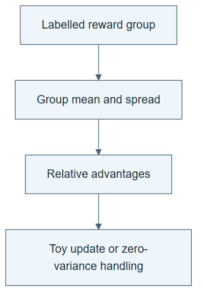

# 10.24 · See what grouped rewards contribute

[Course](../../../README.md) · [Theme](../../README.md)

**You are here:** Theme 10, Research studio → lab 24 of 38. [Find this theme in the course map](../../../COURSE-MAP.md#theme-10) · [Whole-course mindmap](../../../COURSE-MAP.md#whole-course-mindmap).

## What you will build

A tiny numerical grouped-reward update illustration with an explicit limit statement.

## Why this matters

The phrase “GRPO learning” can hide the distinction between scoring outputs and updating a policy.

## Before you start

Complete [10.23: Adapt the harness to the rubric](../step_23_harness_adaptation/README.md). You need the concepts and the reports named below, not its old chat. If you start here directly, ask the tutor to prepare the listed starting state and explain the missing prerequisite first.

Open the coding agent at the repository root. Read [the tutor skill](../../../skills/rsi-tutor/SKILL.md) and this lab's [brief](BRIEF.md). The agent creates a separate sibling workspace named <code>rsi-work/10-24</code> and reports its absolute path. It checks local Python and the [tool requirements](../../../tools/README.md) before execution. You do not write code or configuration.

**Starting state:** Four synthetic rollout rewards: 0, 0, 1, 1. A small generated calculation; no pretrained model.

**Budget:** One CPU numerical calculation and two edge cases; no LLM training. Plan about 40–60 minutes of reading and discussion; this is an author estimate, not a measured student duration. Coding-agent inference may use a paid online service. Record its cost separately when available.

## How it works

A rollout is one sampled attempt. A reward scores it. In a grouped-relative illustration, subtract the group mean and divide by its standard deviation plus a small stabilizer. Above-average attempts receive positive advantages; below-average attempts receive negative ones. Real GRPO adds token probabilities, policy ratios, clipping, a reference/KL treatment as specified by the implementation, sampling, and optimization. This calculation is not that training system.

**A concrete example.** For rewards 0, 0, 1, 1, the mean and population spread are both 0.5, giving advantages close to -1, -1, 1, 1 with the small stabilizer. In the [executed toy update](../../../evidence/2026-09-20/sciencebuddy-laptop/10-24/INTERPRETATION.md), correct rewards increase expected true reward from 0.5 to 0.549834. One incorrect reward increases the probability of a wrong action, yet total expected true reward still rises to 0.527178. Inspect local and aggregate effects separately. Equal rewards produce no update.



*Read the diagram:* The numerical exercise turns a group of rewards into relative advantages. This is not an LLM training run or full GRPO.

## Run the lab

Start with this prompt. The tutor pauses for your prediction before it runs the next step.

```text
Read rsi/AGENTS.md and
rsi/skills/rsi-tutor/SKILL.md.
Guide me through lab 10.24, See what grouped
rewards contribute, one step at a time.
Read its README and BRIEF. Prepare its
separate workspace.
You write and run the implementation. Keep
the reports and failures.
Ask me to predict the result before the
experiment.
```

**Make a prediction:** What happens when all four rewards are identical?

### 1. Calculate advantages

Expose the signal behind the update.

```text
Generate a small CPU tool for rewards
0,0,1,1. Print mean, population standard
deviation, normalized advantages, and a
labelled toy categorical-policy update.
Define the toy objective and learning rate.
Save code and output.
```

**Observe:** Relative reward supplies a direction, not a guarantee of better future behavior.

### 2. Test edge cases

Make the limits concrete.

```text
Repeat with all-equal rewards and one
incorrectly scored rollout. Show zero
centered signal in the equal case and how a
wrong reward can push the toy policy in the
wrong direction. Label every result
numerical illustration.
```

**Observe:** Reward quality controls the direction of learning.

## Check your result

The calculation is reproducible and handles zero variance. No LLM checkpoint is claimed. The report lists missing pieces of real training.

### Open these outputs

The agent keeps these in your lab workspace or records the original experiment path when reusing evidence.

| Output | What to inspect |
|---|---|
| Calculation source and initial output | Show mean, population standard deviation, normalized advantages, toy objective, and learning rate. |
| Equal-reward and wrong-reward cases | Expose zero preference signal and harmful reward direction. |
| Training-gap note | Names missing token-level optimization and source-specific GRPO details; no LLM checkpoint is claimed. |

Ask the agent to open the actual files and show the command exit status. A written description of a run is not a run. Keep a short <code>LAB-NOTE.md</code> with your prediction, measured observation, explanation, and one limit. The tutor must mark skipped learner responses as skipped.

## Try one change

Use the scale skill to draft, without launching, a real training checklist: source implementation, model license, rollout data, reward validation, GPU memory, optimizer, checkpoints, and held-out evaluation.

## If something goes wrong

If equal rewards produce NaN, inspect the zero-variance handling and preserve the failed calculation. If a toy probability update produces negative values or probabilities that do not sum to one, use an explicitly defined normalized parameterization. A working categorical illustration still does not implement the full paper training procedure.

Say “Stop this lab” to stop further work. Ask the agent to save <code>PROGRESS.md</code> with the last completed step and remaining budget. To resume, have it read that file and inspect active processes first. A reset creates a new sibling workspace; it does not erase failures or alter the source data. See the [recovery rules](../../../tools/README.md) for interrupted tool runs.

## Key takeaways

- Rewards and advantages are different quantities.
- An update follows the supplied reward signal, even when it is wrong.
- A toy calculation does not reproduce GRPO training.

## Research connection

[ScienceBuddy](https://arxiv.org/abs/2609.17523), Shuhan Xue, Jianyuan Zhong, Ziyuan Nan, and colleagues; 15 September 2026. The full author list and affiliations are on the primary paper.

**Activity type: numerical illustration.** You calculate a small worked example. This is not LLM training or a reproduction of the paper’s reported result.

## Check your understanding

Answer before opening the explanation. You can ask the tutor for a hint.

1. Why subtract the group mean?
2. What if all rewards are equal?
3. Does positive advantage guarantee a correct scientific answer?
4. What distinguishes actual LLM training here?

<details>
<summary>Hint</summary>

Distinguish a score, a relative advantage, and a parameter update. They are connected operations, not interchangeable names.

</details>

<details>
<summary>Explained answers</summary>

1. It expresses each attempt’s reward relative to the group rather than using only its raw magnitude.

2. Centered advantages are zero in this illustration, so there is no within-group preference signal.

3. No. It depends on the reward’s validity and the comparison group.

4. Parameter optimization over sampled token trajectories under the full declared objective and training setup.

</details>

## What's next

Track harness and model versions together across coupled cycles. Continue to [10.25: Track model–harness pairs across cycles](../step_25_coevolution/README.md).
