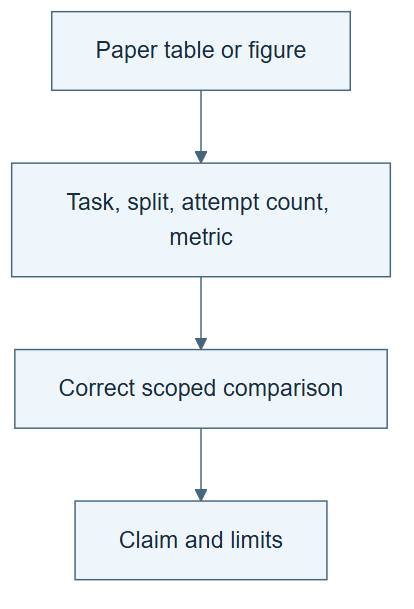

# 10.26 · Read the ScienceBuddy results precisely

[Course](../../../README.md) · [Theme](../../README.md)

**You are here:** Theme 10, Research studio → lab 26 of 38. [Find this theme in the course map](../../../COURSE-MAP.md#theme-10) · [Whole-course mindmap](../../../COURSE-MAP.md#whole-course-mindmap).

## What you will build

A result audit that separates single-attempt accuracy, multi-attempt coverage, and feedback provenance.

## Why this matters

Similar-looking percentages can describe different experiments and support different claims.

## Before you start

Complete [10.25: Track model–harness pairs across cycles](../step_25_coevolution/README.md). You need the concepts and the reports named below, not its old chat. If you start here directly, ask the tutor to prepare the listed starting state and explain the missing prerequisite first.

Open the coding agent at the repository root. Read [the tutor skill](../../../skills/rsi-tutor/SKILL.md) and this lab's [brief](BRIEF.md). The agent creates a separate sibling workspace named <code>rsi-work/10-26</code> and reports its absolute path. It checks local Python and the [tool requirements](../../../tools/README.md) before execution. You do not write code or configuration.

**Starting state:** The primary paper’s method, evaluation, and results sections; your numerical and harness exercises.

**Budget:** No training or fits. One source-linked audit and arithmetic check. Plan about 40–60 minutes of reading and discussion; this is an author estimate, not a measured student duration. Coding-agent inference may use a paid online service. Record its cost separately when available.

## How it works

The paper reports held-out single-attempt accuracy rising from 42.2% to 73.3% across three coupled cycles: a 31.1 percentage-point gain. That is not a 31.1% relative increase. Keep this result separate from validation-only harness changes and multi-attempt coverage. Distinguish real researcher interactions, simulated procedural feedback, and rubric-derived training rewards.

**A concrete example.** Moving from 42.2% to 73.3% is a gain of 31.1 percentage points. Relative to the starting value, it is about 73.7%. Neither arithmetic result makes a four-attempt coverage score comparable with single-attempt accuracy. The number of opportunities and the data split belong beside the percentage.



*Read the diagram:* Read each result with its protocol. Single-attempt accuracy and multi-attempt coverage cannot be exchanged.

## Run the lab

Start with this prompt. The tutor pauses for your prediction before it runs the next step.

```text
Read rsi/AGENTS.md and
rsi/skills/rsi-tutor/SKILL.md.
Guide me through lab 10.26, Read the
ScienceBuddy results precisely, one step at
a time.
Read its README and BRIEF. Prepare its
separate workspace.
You write and run the implementation. Keep
the reports and failures.
Ask me to predict the result before the
experiment.
```

**Make a prediction:** Would pass-at-four coverage be directly comparable with single-attempt accuracy?

### 1. Reconstruct the comparison

Read definitions beside numbers.

```text
Create RESULTS-AUDIT.md with each selected
metric, split, number of attempts, baseline,
final value, feedback source, and paper
section. Recompute percentage-point and
relative changes with a small tool.
```

**Observe:** The same number can mean different things under different denominators.

### 2. Audit the mechanism claim

Separate changed and fixed components.

```text
Map the reported harness and weight changes,
coupled cycles, and fixed reflector.
Contrast the full study with your laptop
exercises. State what you did not reproduce
and what would require GPU training.
```

**Observe:** The classroom record and paper record remain distinct.

## Check your result

The audit reports 31.1 percentage points correctly. It does not mix coverage, validation, and held-out single-attempt metrics. Feedback sources are not all called human.

### Open these outputs

The agent keeps these in your lab workspace or records the original experiment path when reusing evidence.

| Output | What to inspect |
|---|---|
| RESULTS-AUDIT.md | Records source version, metric, split, attempts, baseline, final value, and feedback origin. |
| Arithmetic check | Separates percentage-point difference from relative change. |
| Mechanism and reproduction boundary | Maps changed harness/model components, fixed components, and unexecuted training. |

Ask the agent to open the actual files and show the command exit status. A written description of a run is not a run. Keep a short <code>LAB-NOTE.md</code> with your prediction, measured observation, explanation, and one limit. The tutor must mark skipped learner responses as skipped.

## Try one change

Rewrite an overbroad headline as a source-scoped statement including task family, metric, and reported-evidence status.

## If something goes wrong

If two numbers come from different tables, check their metric and split definitions before subtracting them. If the paper version changed, retain both citations rather than silently mixing revisions. Human-origin requests do not make every later reward or simulated interaction human feedback.

Say “Stop this lab” to stop further work. Ask the agent to save <code>PROGRESS.md</code> with the last completed step and remaining budget. To resume, have it read that file and inspect active processes first. A reset creates a new sibling workspace; it does not erase failures or alter the source data. See the [recovery rules](../../../tools/README.md) for interrupted tool runs.

## Key takeaways

- Metric definitions belong beside results.
- Human-grounded systems can also use synthetic and model-derived feedback.
- Co-evolution does not imply that every component changes.

## Research connection

[ScienceBuddy](https://arxiv.org/abs/2609.17523), Shuhan Xue, Jianyuan Zhong, Ziyuan Nan, and colleagues; 15 September 2026. The full author list and affiliations are on the primary paper.

**Activity type: source audit.** You inspect and compare evidence from primary sources. This activity does not execute or reproduce the paper’s system.

## Check your understanding

Answer before opening the explanation. You can ask the tutor for a hint.

1. What is the percentage-point change?
2. Why is pass-at-four different?
3. Did the laptop lab reproduce the training result?
4. Why identify the fixed reflector?

<details>
<summary>Hint</summary>

Read a percentage as a complete sentence: percentage of what, on which cases, under how many attempts, and reported by whom?

</details>

<details>
<summary>Explained answers</summary>

1. 73.3 minus 42.2 equals 31.1 percentage points.

2. It allows multiple attempts and measures coverage under that opportunity, not one-attempt accuracy.

3. No. It ran harness checks and numerical or synthetic illustrations.

4. It prevents claiming that every improvement component recursively changed.

</details>

## What's next

Compare ways of storing experience and refining reusable procedures. Continue to [10.27: Keep traces, knowledge, and active skills separate](../../08_skills_and_procedures/step_27_wiki/README.md).
