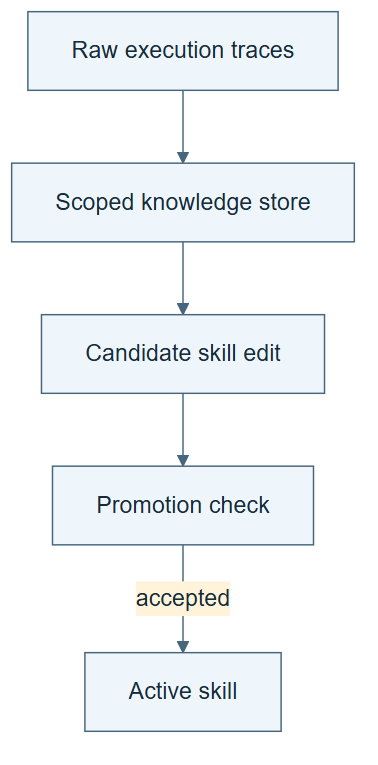

# 10.27 · Keep traces, knowledge, and active skills separate

[Course](../../../README.md) · [Theme](../../README.md)

**You are here:** Theme 10, Research studio → lab 27 of 38. [Find this theme in the course map](../../../COURSE-MAP.md#theme-10) · [Whole-course mindmap](../../../COURSE-MAP.md#whole-course-mindmap).

## What you will build

Three stores with different retention rules, including a rejected skill edit whose lesson survives.

## Why this matters

Rejecting a procedure does not require forgetting what its experiment taught you.

## Before you start

Complete [10.26: Read the ScienceBuddy results precisely](../../07_sciencebuddy/step_26_audit_results/README.md). You need the concepts and the reports named below, not its old chat. If you start here directly, ask the tutor to prepare the listed starting state and explain the missing prerequisite first.

Open the coding agent at the repository root. Read [the tutor skill](../../../skills/rsi-tutor/SKILL.md) and this lab's [brief](BRIEF.md). The agent creates a separate sibling workspace named <code>rsi-work/10-27</code> and reports its absolute path. It checks local Python and the [tool requirements](../../../tools/README.md) before execution. You do not write code or configuration.

**Starting state:** One failed task-skill proposal, raw trace, and current accepted skill.

**Budget:** Two fixture checks; no new fit required. Plan about 40–60 minutes of reading and discussion; this is an author estimate, not a measured student duration. Coding-agent inference may use a paid online service. Record its cost separately when available.

## How it works

WikiSkill separates raw experience, a persistent knowledge layer, and active skills. The classroom exercise keeps a factual notebook update even when a proposed active-skill edit fails. During the controlled task run, the actor reads only its allowed active skill; the improver can consult the notebook.

**A concrete example.** A proposed rule says to skip a data check that appeared redundant. A later fixture exposes a failure, so the active skill keeps the check. The notebook can still retain “this removal failed under condition C,” with a link to the trace. Rejecting the edit need not erase the evidence.



*Read the diagram:* Raw traces, a knowledge store, and active instructions have different roles. Rejected instruction edits need not erase the trace.

## Run the lab

Start with this prompt. The tutor pauses for your prediction before it runs the next step.

```text
Read rsi/AGENTS.md and
rsi/skills/rsi-tutor/SKILL.md.
Guide me through lab 10.27, Keep traces,
knowledge, and active skills separate, one
step at a time.
Read its README and BRIEF. Prepare its
separate workspace.
You write and run the implementation. Keep
the reports and failures.
Ask me to predict the result before the
experiment.
```

**Make a prediction:** Can a failed proposal add useful knowledge without becoming the active procedure?

### 1. Separate the artifacts

Give each store its own job.

```text
Create immutable TRACE.md, a source-linked
NOTEBOOK.md, and ACTIVE-SKILL.md. Use a real
failed proposal. State which role may read
each during this exercise.
```

**Observe:** Evidence, interpretation, and active instructions are distinct.

### 2. Reject without forgetting

Test the retention rule.

```text
Propose one atomic active-skill edit and
evaluate it on two cases. If it fails,
retain the old active skill while keeping a
scoped notebook note about the failure.
Record access limits and actual reads.
```

**Observe:** Knowledge can survive a rejected procedure change.

## Check your result

The rejected skill is not active. The notebook retains evidence-linked learning. Role access is labelled as an instruction unless technically enforced.

### Open these outputs

The agent keeps these in your lab workspace or records the original experiment path when reusing evidence.

| Output | What to inspect |
|---|---|
| TRACE.md, NOTEBOOK.md, and ACTIVE-SKILL.md | Separate original events, scoped interpretation, and accepted instructions. |
| Two candidate checks | Retain the evidence behind promotion or rejection. |
| Read/access record | States what the actor and improver actually saw and whether restrictions were technically enforced. |

Ask the agent to open the actual files and show the command exit status. A written description of a run is not a run. Keep a short <code>LAB-NOTE.md</code> with your prediction, measured observation, explanation, and one limit. The tutor must mark skipped learner responses as skipped.

## Try one change

Let the task actor read the notebook in a separate condition and explain why it changes the evaluated inference interface.

## If something goes wrong

If the rejected instruction remains in the active skill, restore the accepted version without deleting the failed child. If the actor already saw the notebook, label that exposure. An instruction that says not to read a file cannot establish an isolated information boundary by itself.

Say “Stop this lab” to stop further work. Ask the agent to save <code>PROGRESS.md</code> with the last completed step and remaining budget. To resume, have it read that file and inspect active processes first. A reset creates a new sibling workspace; it does not erase failures or alter the source data. See the [recovery rules](../../../tools/README.md) for interrupted tool runs.

## Key takeaways

- Different stores can have different acceptance rules.
- A failed change can leave useful evidence.
- The inference interface must be fixed during comparison.

## Research connection

[WikiSkill](https://arxiv.org/abs/2608.27454), 27 August 2026.

**Activity type: mechanism exercise.** You execute a small classroom mechanism. Its task, models, and budget differ from the source. Local observations do not reproduce the paper’s headline result.

## Check your understanding

Answer before opening the explanation. You can ask the tutor for a hint.

1. Why preserve raw traces?
2. Does a notebook update require skill promotion?
3. Why distinguish role access?
4. Is an instruction-only restriction access control?

<details>
<summary>Hint</summary>

Ask which store records what happened, which records what was learned, and which controls the next action. Their acceptance rules can differ.

</details>

<details>
<summary>Explained answers</summary>

1. They remain the original evidence when summaries or active rules change.

2. No. A scoped observation can be retained while its proposed procedural edit is rejected.

3. Different information changes behavior and can confound the comparison.

4. No. Technical isolation needs actual permission or process boundaries.

</details>

## What's next

Represent procedures as graphs and distinguish them from domain ontologies. Continue to [10.28: Refine a procedure graph](../step_28_procedural_graph/README.md).
