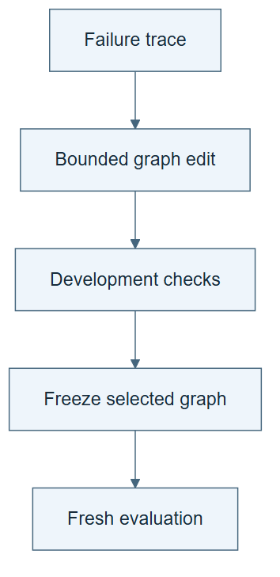

# 10.28 · Refine a procedure graph

[Course](../../../README.md) · [Theme](../../README.md)

**You are here:** Theme 10, Research studio → lab 28 of 38. [Find this theme in the course map](../../../COURSE-MAP.md#theme-10) · [Whole-course mindmap](../../../COURSE-MAP.md#whole-course-mindmap).

## What you will build

A small procedure graph with one tested transition edit and retained rejected proposals.

## Why this matters

A long instruction document can obscure the next relevant action. A graph can make local decisions explicit.

## Before you start

Complete [10.27: Keep traces, knowledge, and active skills separate](../step_27_wiki/README.md). You need the concepts and the reports named below, not its old chat. If you start here directly, ask the tutor to prepare the listed starting state and explain the missing prerequisite first.

Open the coding agent at the repository root. Read [the tutor skill](../../../skills/rsi-tutor/SKILL.md) and this lab's [brief](BRIEF.md). The agent keeps this lab's notes in <code>rsi-work/10-28</code>, outside the repository, and reports the absolute path. If the lab continues an earlier experiment, keep that experiment in its original workspace with its existing budget and locks. A new notes folder does not reset an experiment. The agent checks local Python and the [tool requirements](../../../tools/README.md) before execution. You do not write code or configuration.

**Starting state:** The ML workflow graph, success and failure traces, and domain ontology.

**Budget:** One graph edit and four fixture cases: target, regression, fresh evaluation, and semantic error. Run parent and child on each of the first two cases, then the retained graph on each remaining case: six traversals total. Use a fit stub; no training. Plan about 40–60 minutes of reading and discussion; this is an author estimate, not a measured student duration. Coding-agent inference may use a paid online service. Record its cost separately when available.

## How it works

A procedural graph represents actions and transitions. Our exercise gives the executor the current node and relevant local guidance, then proposes one transition repair from traces. The domain ontology still describes entities and meaning. These are different graphs. Freeze the selected procedure before a fresh evaluation.

**A concrete example.** In the [recorded author exercise](../../../evidence/2026-09-21/procedure-graph/README.md), the parent graph sends a nonnumeric hour to the fit stub. One edge edit sends it to diagnosis instead. The valid calendar case still reaches reporting. After freezing the child, a distinct calendar case passes, while a numeric target component passes the type check but fails the unchanged domain rule. Four fixture comparisons use six graph traversals and no model fits. These are constructed deterministic checks in one author context, not blinded transfer or measured language-model adaptation.


*The left map explains conditional routing; the notebook isolates an example bug and its proposed repair. Test the target failure and a regression case before retaining a graph, then freeze that version for the fresh case. A rejected edit leaves the prior graph in place. The fourth fixture checks meaning: a target component can have the expected numeric type and still be forbidden as an input. The graph and domain rule have distinct jobs. All four fixtures use a fit stub; the figure records no successful test or model training.*

[Open the illustration at full size](../../../assets/illustrations/procedure-graph-v1.png).

<details>
<summary>See the step diagram</summary>



*Read the diagram:* A procedure graph specifies actions and transitions. Freeze the selected graph before testing it on fresh cases.

</details>

## Run the lab

Start with this prompt. The tutor pauses for your prediction before it runs the next step.

```text
Read rsi/AGENTS.md and
rsi/skills/rsi-tutor/SKILL.md.
Guide me through lab 10.28, Refine a
procedure graph, one step at a time.
Read its README and BRIEF. Prepare its
separate workspace.
You write and run the implementation. Keep
the reports and failures.
Ask me to predict the result before the
experiment.
```

**Make a prediction:** Can changing a transition fix a workflow without changing any domain definition?

### 1. Localize the procedure

Show only guidance needed for the next action.

```text
Generate a small procedure runner from the
existing workflow. At each node expose its
inputs, action, stop condition, and
neighboring transitions. Keep the domain
facts separate.
```

**Observe:** The runner follows an execution structure, not an ontology.

### 2. Refine one transition

Test the change before promotion.

```text
Use one success and one failure to propose a
transition edit. Run the target and
regression selection fixtures, preserve
rejected edits, freeze the chosen graph, and
test a fresh fixture. Use a fit stub
throughout. Reserve the fourth check for the
semantic-error fixture below.
```

**Observe:** Selection performance and fresh-test performance remain distinct.

## Check your result

The edited graph actually runs. Its test result is not replaced by the best intermediate selection score. Ontology and procedure remain separate.

### Open these outputs

The agent keeps these in your lab workspace or records the original experiment path when reusing evidence.

| Output | What to inspect |
|---|---|
| Executable procedure graph | Exposes current-node inputs, action, completion condition, and transitions. |
| Parent/child graph and two selection checks | Show the targeted transition repair and regression behavior. |
| Frozen fresh-case and semantic-error checks | Complete the four-fixture budget with no model training. |

Ask the agent to open the actual files and show the command exit status. A written description of a run is not a run. Keep a short <code>LAB-NOTE.md</code> with your prediction, measured observation, explanation, and one limit. The tutor must mark skipped learner responses as skipped.

## Try one change

For the fourth check, introduce a validly typed but semantically wrong feature and execute the domain check. Explain why a procedure graph still needs meaning rules.

## If something goes wrong

If the diagram changes but the runner follows the old route, the edit has not reached execution. If a fit starts during these fixtures, inspect the stub. If a field is structurally valid but derived from the target, keep the ontology check active; a well-routed invalid experiment is still invalid.

Say “Stop this lab” to stop further work. Ask the agent to save <code>PROGRESS.md</code> with the last completed step and remaining budget. To resume, have it read that file and inspect active processes first. A reset creates a new sibling workspace; it does not erase failures or alter the source data. See the [recovery rules](../../../tools/README.md) for interrupted tool runs.

## Key takeaways

- Procedural graphs organize actions.
- Ontologies describe domain meaning.
- Graph edits need selection and fresh evaluation.

## Research connection

[Procedural Graphs](https://arxiv.org/abs/2609.09153), 8 September 2026.

**Activity type: mechanism exercise.** You execute a small classroom mechanism. Its task, models, and budget differ from the source. Local observations do not reproduce the paper’s headline result.

## Check your understanding

Answer before opening the explanation. You can ask the tutor for a hint.

1. Is a procedure graph an ontology?
2. What does local guidance change?
3. Why keep rejected graph edits?
4. Which graph version should be evaluated finally?

<details>
<summary>Hint</summary>

A procedure edge answers “what next?” A domain relation answers “what does this mean?” Find one example of each in your run.

</details>

<details>
<summary>Explained answers</summary>

1. No. They can share objects but encode different relationships and purposes.

2. The information presented for the current execution decision.

3. They record search costs and prevent repeating known failures.

4. The frozen retained version, not whichever intermediate version later looks best.

</details>

## What's next

Apply reflection and skill revision to a small visual interface task. Continue to [10.29: Repair a skill for an experiment-results page](../step_29_gui/README.md).
