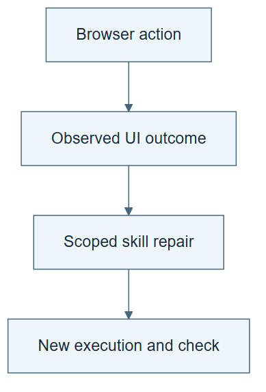

# 10.29 · Repair a skill for an experiment-results page

[Course](../../../README.md) · [Theme](../../README.md)

**You are here:** Theme 10, Research studio → lab 29 of 38. [Find this theme in the course map](../../../COURSE-MAP.md#theme-10) · [Whole-course mindmap](../../../COURSE-MAP.md#whole-course-mindmap).

## What you will build

A local results page, one interaction trace, and a revised inspection skill.

## Why this matters

GUI work adds observation and action errors that a text-only success claim can hide.

## Before you start

Complete [10.28: Refine a procedure graph](../step_28_procedural_graph/README.md). You need the concepts and the reports named below, not its old chat. If you start here directly, ask the tutor to prepare the listed starting state and explain the missing prerequisite first.

Open the coding agent at the repository root. Read [the tutor skill](../../../skills/rsi-tutor/SKILL.md) and this lab's [brief](BRIEF.md). The agent creates a separate sibling workspace named <code>rsi-work/10-29</code> and reports its absolute path. It checks local Python and the [tool requirements](../../../tools/README.md) before execution. You do not write code or configuration.

**Starting state:** Existing experiment results. The agent generates a static local page with a candidate table and one filter.

**Budget:** Two short UI attempts; no new ML fits. Requires a browser-capable agent for live execution. Plan about 40–60 minutes of reading and discussion; this is an author estimate, not a measured student duration. Coding-agent inference may use a paid online service. Record its cost separately when available.

## How it works

EvoSkill-GUI motivates separating reusable skills from task traces and critique. Our local page avoids accounts and external side effects. The critic receives the visible instruction and action evidence. It should not be given private executor reasoning or an answer key and then called blind.

**A concrete example.** The top row has the lowest displayed error, but its detail view says it used a forbidden target-derived input. Selecting it without opening the warning is a task failure. A revised inspection skill should verify validity before optimizing the score. Both attempts use the same page and hidden warning.


*The enlarged warning is a reader callout to information already present on the page. It was not observed in the pictured failed attempt and must not be added to that attempt’s critic packet. Supply only the declared visible trace, not the skill package or answer key. Use a separate critic context where available; otherwise label the shared context. The rule-check ticks name operations, not recorded passes. Compare the critic’s verdict with the executable result. This EvoSkill-inspired classroom task allows two actual UI attempts and no new model fits; the illustration is not an execution record.*

[Open the illustration at full size](../../../assets/illustrations/gui-skill-repair-v1.png).

<details>
<summary>See the step diagram</summary>



*Read the diagram:* Observe an actual page action and its result. A revised GUI skill needs another execution to establish that the repair works.

</details>

## Run the lab

Start with this prompt. The tutor pauses for your prediction before it runs the next step.

```text
Read rsi/AGENTS.md and
rsi/skills/rsi-tutor/SKILL.md.
Guide me through lab 10.29, Repair a skill
for an experiment-results page, one step at
a time.
Read its README and BRIEF. Prepare its
separate workspace.
You write and run the implementation. Keep
the reports and failures.
Ask me to predict the result before the
experiment.
```

**Make a prediction:** Could a critic mark a task complete even when the visible page shows the wrong candidate?

### 1. Create and attempt the task

Make the interface small and inspectable.

```text
Generate a local static experiment-results
page from real saved metrics. Add a filter
and candidate detail view, with an invalid
candidate’s warning visible only in its
detail view from the first attempt onward.
Ask the browser-capable agent to select the
best valid candidate under the fixed rule
and record visible actions.
```

**Observe:** The trace can be checked against the page state.

### 2. Critique and revise

Give the critic a defined evidence packet.

```text
Provide the task and visible action trace to
a separate critic context if available;
otherwise label shared context. Compare its
verdict with an executable
selected-candidate check. Revise one skill
instruction and retry once.
```

**Observe:** A critic’s approval can be wrong and must be checked.

## Check your result

The page uses actual data. Live interaction is distinguished from reading HTML or a simulation. Missing browser capability is reported rather than claiming completion.

### Open these outputs

The agent keeps these in your lab workspace or records the original experiment path when reusing evidence.

| Output | What to inspect |
|---|---|
| Local page and source metrics | Show real candidate values, filter behavior, and the detail warning. |
| Two visible interaction traces | Record actual browser actions and final selected candidate. |
| Critique, skill revision, and executable check | Keep the critic’s verdict separate from the selected-candidate condition. |

Ask the agent to open the actual files and show the command exit status. A written description of a run is not a run. Keep a short <code>LAB-NOTE.md</code> with your prediction, measured observation, explanation, and one limit. The tutor must mark skipped learner responses as skipped.

## Try one change

Inspect the two saved UI attempts. Determine whether each inspected the warning hidden in the detail view before selecting. Do not add a third UI attempt to improve the presentation.

## If something goes wrong

If the host cannot operate a browser, keep the page and checker as prepared artifacts and mark live UI execution unavailable. Reading HTML is a different check. If the critic received the answer key or shared the executor’s context, record it. Do not add repeated attempts until the page appears successful.

Say “Stop this lab” to stop further work. Ask the agent to save <code>PROGRESS.md</code> with the last completed step and remaining budget. To resume, have it read that file and inspect active processes first. A reset creates a new sibling workspace; it does not erase failures or alter the source data. See the [recovery rules](../../../tools/README.md) for interrupted tool runs.

## Key takeaways

- Visible UI state is evidence.
- Critics have information boundaries and can make mistakes.
- A reusable skill should target the observed interaction failure.

## Research connection

[Reflect, Revise, Reuse / EvoSkill-GUI](https://arxiv.org/abs/2609.17653), 15 September 2026.

**Activity type: mechanism exercise.** You execute a small classroom mechanism. Its task, models, and budget differ from the source. Local observations do not reproduce the paper’s headline result.

## Check your understanding

Answer before opening the explanation. You can ask the tutor for a hint.

1. Why use a local page?
2. Is HTML parsing a live GUI attempt?
3. Does critic approval prove success?
4. What if a separate critic context is unavailable?

<details>
<summary>Hint</summary>

Inspect what was visible and what was actually selected. A success message from either role is weaker than the page state and task check.

</details>

<details>
<summary>Explained answers</summary>

1. It provides a small, repeatable GUI task without external account actions.

2. No. It can be a useful check but is a different execution mode.

3. No. Compare it with task evidence and an independent executable condition where possible.

4. Label the shared-context exercise and avoid claiming blinded evaluation.

</details>

## What's next

Optimize research cost while preserving a declared quality requirement. Continue to [10.30: Reduce cost without hiding quality loss](../../09_efficient_harnesses/step_30_cost_quality/README.md).
