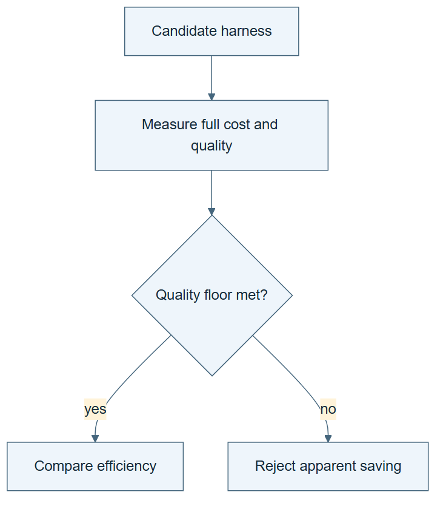

# 10.30 · Reduce cost without hiding quality loss

[Course](../../../README.md) · [Theme](../../README.md)

**You are here:** Theme 10, Research studio → lab 30 of 38. [Find this theme in the course map](../../../COURSE-MAP.md#theme-10) · [Whole-course mindmap](../../../COURSE-MAP.md#whole-course-mindmap).

## What you will build

A quality-and-cost comparison of two small harness variants.

## Why this matters

A shorter trace is useful only if it still performs the required work reliably.

## Before you start

Complete [10.29: Repair a skill for an experiment-results page](../../08_skills_and_procedures/step_29_gui/README.md). You need the concepts and the reports named below, not its old chat. If you start here directly, ask the tutor to prepare the listed starting state and explain the missing prerequisite first.

Open the coding agent at the repository root. Read [the tutor skill](../../../skills/rsi-tutor/SKILL.md) and this lab's [brief](BRIEF.md). The agent keeps this lab's notes in <code>rsi-work/10-30</code>, outside the repository, and reports the absolute path. If the lab continues an earlier experiment, keep that experiment in its original workspace with its existing budget and locks. A new notes folder does not reset an experiment. The agent checks local Python and the [tool requirements](../../../tools/README.md) before execution. You do not write code or configuration.

**Starting state:** A baseline harness, two task fixtures, and a predeclared quality tolerance.

**Budget:** Two variants, at most two fits each, plus one checker-removal fixture with a fit stub. Include proposal and checking overhead. Plan about 40–60 minutes of reading and discussion; this is an author estimate, not a measured student duration. Coding-agent inference may use a paid online service. Record its cost separately when available.

## How it works

SoL-Pi motivates harness search for efficiency subject to quality requirements. Our exercise removes redundant report work, then checks whether the retained evidence remains complete. Define acceptable quality before comparing cost. Lower token use alone does not establish recursive cost compounding.

**A concrete example.** A harness writes the same metrics into three near-identical reports. Consolidating them may save work while retaining one verifiable record. Removing the result checker also saves work, but can violate the quality floor. The two removals need different acceptance decisions even if both shorten the trace.


*This classroom change removes redundant report work; it is not an implementation of SoL-Pi’s four mechanisms. Both variants must meet the declared quality requirement before an efficiency conclusion is allowed. Fill the ledger with actual observations, include proposal and checking overhead, and keep unknown usage unknown. The failure tray represents recorded attempts whose costs remain in the ledger. The separate fit-stub example fails because required evidence is absent. The figure contains no measured saving or recursive compounding result.*

[Open the illustration at full size](../../../assets/illustrations/quality-cost-v1.png).

<details>
<summary>See the step diagram</summary>



*Read the diagram:* A cheaper harness is eligible only if it still meets the declared quality requirement.

</details>

## Run the lab

Start with this prompt. The tutor pauses for your prediction before it runs the next step.

```text
Read rsi/AGENTS.md and
rsi/skills/rsi-tutor/SKILL.md.
Guide me through lab 10.30, Reduce cost
without hiding quality loss, one step at a
time.
Read its README and BRIEF. Prepare its
separate workspace.
You write and run the implementation. Keep
the reports and failures.
Ask me to predict the result before the
experiment.
```

**Make a prediction:** Which report step can be removed without losing evidence needed for acceptance?

### 1. Set the acceptance rule

Prevent cost savings from weakening the task.

```text
Write QUALITY-COST.md with required
evidence, allowed quality tolerance, failure
handling, and measured cost fields. Propose
one removal of redundant work.
```

**Observe:** The quality floor precedes the optimization.

### 2. Compare variants

Count the work needed to obtain each result.

```text
Run baseline and candidate on matched
fixtures or tasks. Compare quality, missing
evidence, tool calls, wall time, and
available agent usage. Include the cost of
proposing and evaluating the change.
```

**Observe:** A cheaper invalid result is rejected.

## Check your result

The acceptance rule is unchanged. All relevant costs are included or marked unknown. The conclusion is limited to measured efficiency.

### Open these outputs

The agent keeps these in your lab workspace or records the original experiment path when reusing evidence.

| Output | What to inspect |
|---|---|
| QUALITY-COST.md | Freezes required evidence, tolerance, failure handling, and cost units. |
| Matched variant results | Retain known costs and missing measurements across both task fixtures. |
| Checker-removal counterexample | Uses a fit stub and exposes the lost acceptance evidence without another model fit. |

Ask the agent to open the actual files and show the command exit status. A written description of a run is not a run. Keep a short <code>LAB-NOTE.md</code> with your prediction, measured observation, explanation, and one limit. The tutor must mark skipped learner responses as skipped.

## Try one change

Run one labelled fixture with a necessary checker removed and a fit stub in place of training. Compare its missing evidence with the declared quality floor. Explain why the apparent saving is not a valid win.

## If something goes wrong

If only fit time is available, report fit-time efficiency rather than total cost superiority. If a shorter run omits required evidence, treat that as a failed quality condition. Do not adjust tolerance after learning which candidate is cheaper. Include the work spent designing and checking the edit.

Say “Stop this lab” to stop further work. Ask the agent to save <code>PROGRESS.md</code> with the last completed step and remaining budget. To resume, have it read that file and inspect active processes first. A reset creates a new sibling workspace; it does not erase failures or alter the source data. See the [recovery rules](../../../tools/README.md) for interrupted tool runs.

## Key takeaways

- Efficiency is conditional on a quality requirement.
- Search overhead belongs in the cost.
- One cheaper harness does not prove compounding RSI.

## Research connection

[SoL-Pi](https://arxiv.org/abs/2609.20519), 17 September 2026.

**Activity type: mechanism exercise.** You execute a small classroom mechanism. Its task, models, and budget differ from the source. Local observations do not reproduce the paper’s headline result.

## Check your understanding

Answer before opening the explanation. You can ask the tutor for a hint.

1. Why predeclare tolerance?
2. Does fewer tokens always mean less total cost?
3. What should happen to missing evidence?
4. What would demonstrate recursive cost compounding?

<details>
<summary>Hint</summary>

State the quality requirement first. Then ask which cost can fall while that requirement continues to hold.

</details>

<details>
<summary>Explained answers</summary>

1. Otherwise a quality loss can be excused after seeing a cost reduction.

2. No. More tool work, retries, or failures can offset the saving.

3. Treat it under the acceptance rule, not as a free speedup.

4. Inherited improvements to the cost-improvement process with repeated measured downstream benefits.

</details>

## What's next

Audit systems that generate and improve harness infrastructure. Continue to [10.31: Compare harness generation and harness improvement](../step_31_harness_builders/README.md).
